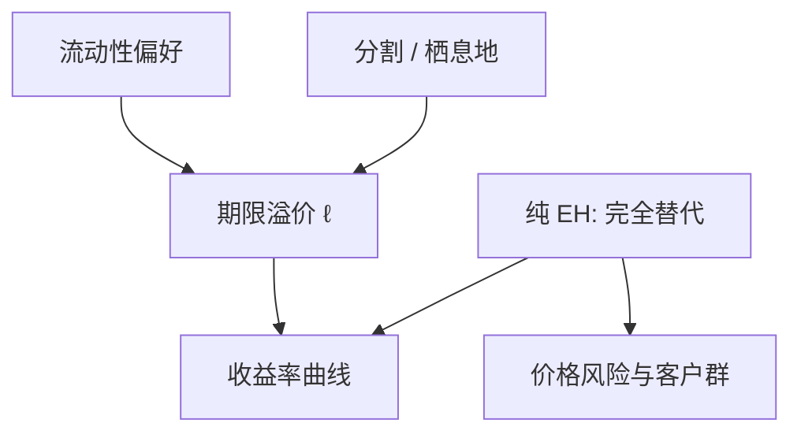

# 流动性溢价与栖息地

    
长期利率不必等于预期短期的平均：出借人偏爱较近的到期，借款人偏爱较远的到期，缺口由期限溢价填上；客户群还可以钉住自己的栖息地。

    <footer>—— Hicks, Value and Capital, 1939；Culbertson, QJE 1957；Modigliani and Sutch, AER 1966</footer>

[上一课](/econ/eh-term-structure)把纯预期假说写成滚动与锁定的无套利会计，并标明期限溢价来自 $m$ 与债券回报的协方差。本课缺口是：**溢价从哪一类偏好与分割里来**，以及为何不同到期不能被当成完全替代品。这仍是收益率曲线上的均衡语言，不是国债的盘口、特殊券或限价簿。

## 问题

纯 EH 要求投资者在到期之间自由滚动，只关心期望短期路径。Hicks（1939）立刻拒绝这条完全替代：长期债券价格对利率更敏感，风险厌恶的出借人更愿意停在短端；厂商与政府却常要锁长端融资。若两边的栖息地错开，远期可以系统高于预期即期——流动性溢价。Culbertson（1957）把错开写得更硬：各到期是分割市场，供给在哪一段，哪一段的收益率就被当地的供需决定，平均关系可以断。

Modigliani 与 Sutch（1966）折中为**偏好栖息地**：投资者有喜欢的到期，但可以被溢价诱出栖息地，替代不完全而不是完全没有。缺口是把这三句钉成对 EH 的均衡补丁，而不是把国债微观结构提前写进本栏。

Hicks 的「流动性」是价格风险（久期），不是买卖价差。Culbertson 的分割是客户群与供给按到期错开。不要把 on-the-run、可交割最便宜、回购特殊券读进 1939/1957。

## 方法

在 EH 的会计上加一项随到期而变的溢价。对数线性后仍可写

$$
y_{nt}=\frac{1}{n}\sum_{k=0}^{n-1}\mathrm{E}_t[y_{1,t+k}]+\ell^{(n)}_t,
$$

纯 EH 是 $\ell^{(n)}=0$；Hicks 式流动性偏好使 $\ell^{(n)}$ 随 $n$ 上升且通常为正；分割假说允许 $\ell^{(n)}$ 随该段供需符号翻转；栖息地则说 $\ell^{(n)}$ 是把边缘投资者从偏好到期拉开的补偿，可随相对供给移动。

SDF 语言没有换：$\ell^{(n)}$ 仍是债券超额与 $m$ 的协方差。本课补的是**为什么**协方差可以按到期排列，而不是再推一遍 $P_n=\mathrm{E}[m^{(n)}]$。

政策含义在均衡层：扭转操作、期限供给若能改变相对栖息地，就可以移动 $\ell^{(n)}$ 而不必改变短端路径。这是后课非常规政策要动的那一块，本课只标明渠道，不估计溢价序列。

## 机制

机制是不完全替代。若所有人只按期望滚动，任意到期的超额供给会被套利抹平到 EH。一旦有人把某段到期当消费或监管约束（保险负债、银行账簿、养老的久期匹配），他们成为该段的边际定价者；要把他们拉到别段，必须付溢价。Hicks 强调的是出借人的价格风险；栖息地强调的是负债结构。两者都让「向上倾斜 ⇒ 市场预期加息」这句话不可靠：倾斜里可以全是 $\ell$。

[有效市场](/econ/emh)在这里仍只约束可预测成分必须被记成风险或栖息地补偿，而不是免费的利率投机。可预测不否证有效，只否证 $\ell=0$ 的那一版 EH。

### 栖息地不是盘口厚度

国债「谁在哪一段买」可以讲养老、保险、外国官方——这是宏观客户群，仍是均衡栖息地。盘口上某一档的挂单量、on-the-run 价差、拍卖后的 when-issued，是量化栏的协议与特殊券，本课不写。不要把 Modigliani–Sutch 的供给效应翻译成限价簿深度。

CIR（1981）已警告：到期收益率、持有期回报、远期，在 Jensen 不等式下不是同一句 EH。栖息地补丁加在哪一种写法上，必须声明；本课沿用上一课的会计版本：远期 = 风险中性期望即期。

## 边界

不要在本栏做 Fama–Bliss 或宣布「栖息地被证实」——超额持有期回报对远期–即期利差的回归是债券实证。也不要把流动性溢价写成买卖价差的加总：Hicks 的词先于微观结构文献。非常规政策扭 $\ell^{(n)}$ 属于[零下限](/econ/zlb-unconventional)，本课只留下相对供给这一通道。

下一课是金融栏收束：[到限价簿](/econ/to-limit-order-book)。曲线上的 $y_n$ 与 $\ell^{(n)}$ 仍是理论价格；交易所里的成交是簿事件。

倒挂可以是预期短利率下降，也可以是长端栖息地溢价骤降。不要用「倒挂预示衰退」代替假说。偏好栖息地扭曲的是平均关系，不是某一档的时间优先。

纯 EH 是完全替代。Hicks 加价格风险。Culbertson 让各段供需局部决定。Modigliani–Sutch 让溢价把人从栖息地拉出。三句都停在均衡，不进入撮合引擎。

不要把「流动性溢价」翻译成买卖价差加总后再塞进 $y_n$。价差是协议成本，在量化栏；本课的 $\ell^{(n)}$ 是对利率风险与不完全替代的补偿。下一课才承认：连 $y_n$ 都还没有交易程序。

## 小结

- EH 之后：期限溢价来自价格风险与不完全替代，不必是「长期更不流动」的同义反复。
- Hicks 流动性偏好、Culbertson 分割、Modigliani–Sutch 栖息地，是对 $\ell^{(n)}$ 的三种均衡语言。
- 相对供给可以移动溢价；这不是国债微观结构，也不是限价簿。
- 出处：Hicks, *Value and Capital*；Culbertson, *QJE* 1957；Modigliani and Sutch, *AER* 1966。
