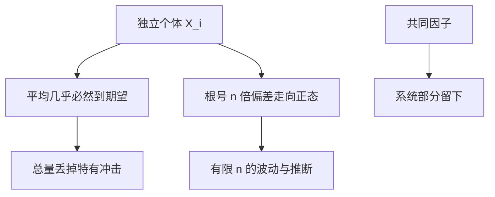

# 大数定律与中心极限

独立个体的平均几乎必然钉在期望上；波动的尺度是 $1/\sqrt{n}$，标准化之后走向正态。

<footer>—— 据 Durrett, Probability: Theory and Examples, 选章；Wooldridge, Econometric Analysis of Cross Section and Panel Data, 开篇整理</footer>

上一课[条件期望](/econ/conditional-expectation-econ)处理「给定信息之后的均值」。宏观加总、大市场、抽样推断问的是另一件事：许多类似的随机项加在一起，还剩多少随机性。缺口是大数定律（LLN）与中心极限定理（CLT）。本课只留后课用的陈述：个体风险可否被加总冲掉、估计量为何不退化成常数。不写成概率论章节汇编，也不做计量识别。

## 问题

$X_i$ 独立同分布、$\mathbb{E}|X_1|\lt \infty$，则 $\bar X_n\to\mathbb{E}X_1$ 几乎必然（Kolmogorov 强 LLN）。有限二阶矩时，弱 LLN 用 Chebyshev 即可：$\mathrm{Var}(\bar X_n)=\sigma^2/n\to 0$。宏观含意：连续统或大量独立家庭的人均消费收敛到期望，个体冲击不进入总量。相关不能任意：完全相关时平均仍是一个冲击；弱相关、混合条件下 LLN 仍可成立，完全保险或共同因子则留下系统部分。后课风险分担、不完全市场会用这条对照，本课先把独立情形钉死。

CLT：$\mathbb{E}X_1^2\lt \infty$ 时 $\sqrt{n}(\bar X_n-\mu)\Rightarrow N(0,\sigma^2)$。加总后的剩余不确定性按 $1/\sqrt{n}$ 缩小，形状变正态。计量里估计量的标准误来自这里。宏观若只关心确定性等价总量，LLN 够用；若关心有限 $N$ 经济的波动尺度，CLT 给阶。

### LLN 不是「样本大了就等于期望」的口号

几乎必然收敛允许一个零测的坏 $\omega$，有限 $n$ 仍有偏差。没有矩，LLN 可失败（Cauchy 没有均值）。同分布可放松到独立不同分布的三角阵，但方差要均匀可积一类条件。把任意时间序列的样本均值直接当期望，忽略单位根与强依赖，是后课宏观计量的陷阱，不是本课批准的用法。

连续统经济把下标换成 $[0,1]$ 上的积分。严谨做法要用本质定律或 Fubini，把 idiosyncratic 冲掉。口头「积分掉个体冲击」默认的就是 LLN。

## 方法

独立是最强假设。条件独立、鞅差序列有对应的 LLN/CLT，后课理性预期残差正交时常走鞅差 CLT。本课只要求会认：需要哪条矩、是否独立、收敛是 a.s. 还是依分布。依分布（CLT）不给出路径最终贴住均值，只给出 $n$ 大时的近似律；强 LLN 才说路径贴住。

与条件期望的衔接：$\mathbb{E}[X_i\mid Z]$ 仍随机。对 $i$ 加总时，若给定 $Z$ 条件独立，条件 LLN 把平均钉在 $\mathbb{E}[X\mid Z]$ 上，总量仍随 $Z$ 动。共同冲击 = 条件均值那一层，不被 $n$ 冲掉。这是「加总只能消灭特有风险」的概率写法。

## 机制

独立让方差相加、交叉项期望为零，平均的方差以 $1/n$ 下降。Chebyshev 把方差变成概率界，这是弱 LLN。强 LLN 要用截尾与 Borel–Cantelli，本课不证。CLT 来自特征函数展开：标准化和的对数特征函数走到 $-t^2\sigma^2/2$。经济学用结论：特有风险可分、推断要 $\sqrt{n}$ 率。

均衡里若价格已经依赖于经验分布，个体不再真正独立（通过价格耦合）。大市场极限用 LLN 把经验分布换成期望分布，得到确定性价格；有限 $N$ 的随机价格是另一层。本课只提供极限工具，不写核等价或均值场博弈。

正态近似在厚尾、小 $n$、强偏斜时差。有限四阶矩给出 Berry–Esseen 型误差阶，主干不必记常数。

## 边界

不证特征函数，不把 GARCH、单位根、聚类标准误写进来。不要用 CLT 给 CAPM 横截面回归当实证课。下一课离开「许多拷贝的平均」，改比较**两条分布**：随机占优。那是偏好与风险课的数学入口，不是推断。

后课默认：独立特有冲击在加总中消失；共同冲击留下；$\sqrt{n}$ 给出抽样波动的阶。

## 小结

- 强 LLN：i.i.d. 可积则样本均值 a.s. 到期望。
- CLT：有限方差则 $\sqrt{n}$ 偏差依分布到正态。
- 加总消灭特有风险，消灭不了共同因子。
- 通过价格耦合的个体只在大市场极限里近似独立。
- 下一课：[随机占优预备](/econ/stochastic-order-prep)。
- 出处：Durrett, *Probability*；Wooldridge 开篇。
