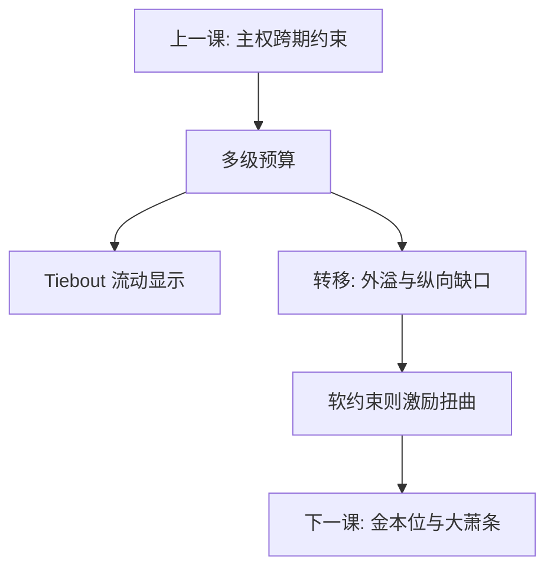

# 地方财政与转移支付

地方提供有空间范围的公共品，居民用脚投票；中央转移本为纠正外溢与纵向财力缺口，却可能把地方预算变成软约束，钱停在政府部门而不降税。

<footer>—— Tiebout, A Pure Theory of Local Expenditures, JPE 1956；Oates, Fiscal Federalism, 1972；Hines 与飞纸效应文献；Kornai 软预算约束；对照 Atkinson–Stiglitz</footer>

[上一课](/econ/sovereign-debt-sustain)把主权跨期预算写成 $r-g$ 与盈余承诺。本课缺口是多级：地方不能印储备货币，常被限制发债，支出却落在教育、基础设施上。转移支付是中央对地方的 $s$，会改变地方的激励，而不只是改变会计上的 $b$。公共财政在此收束；下一课经济史用制度对照危机。

## 问题

Tiebout：社区差异化提供地方公共品，居民选区，类似市场显示偏好——前提是流动、多社区、无外溢。Oates 分权定理：地方信息更好时，地方提供更对准；全国性外溢（国防、再分配）留在中央。缺口是转移：纵向缺口（地方税基不够支出责任）用一般或专项补助来补。补助若增加地方公共支出的程度大于等价的居民增收入，就是飞纸：钱粘在公共部门。软预算：地方预期中央会救，于是事前过度借、过度承诺——Kornai 的软约束从企业搬到政府。主权课的多重均衡在地方变成「中央会不会救」。

### 转移不是把地方变成中央出纳

若每笔支出都由专项指定并全额配套，地方没有边际选择，Tiebout 与 Oates 的信息优势消失，免费搭车与寻租转到项目申报。一般补助保留边际，但再分配与外溢纠正变弱。设计要在「对准全国目标」与「保留地方边际」之间权衡，不是越多专项越「规范」。

飞纸效应的经验大小有争议，机制候选包括政治代理、专项的价格效应、以及居民对补助的财政幻觉。本课要的是激励方向，不是某一个 meta 回归的点。

## 方法

三笔账。(1) 地方公共品：可排他到社区则免费搭车轻于全国纯公共品，但仍有辖区间外溢。(2) 转移公式：总额、配套率、封顶，改变地方公共资金的边际价格。(3) 硬预算：破产程序、不救助承诺要可信；不可信则地方债是隐性主权债，上一课的 $b$ 被低估。乘数：对地方的一次性转移，MPC 与漏出（买外地商品）决定地方 $Y$ 动多少，与全国乘数不同。

不要把土地财政或某一国的税制当普遍公式。机制是税基流动性、外溢与救助预期。资本税基比劳动更会跑，地方若靠流动性税基竞争，Oates 的「信息优势」会被竞次抵消——转移有时是为了阻止有害竞争，而不只是补缺口。专项的配套率过高，地方会为了把钱花完而选高成本项目，飞纸变成浪费而不是公共品。

## 机制

用脚投票把地方公共品的 MRS 显示在选址上，比全国自愿贡献好，因为排他到社区。外溢一出现，地方只对准内部 MRS，全国加总仍不足——转移或中央提供是把加总写回来。配套补助降低地方提供的边际成本，数量上升；收入补助只移动预算线，飞纸说数量升得比私人收入等价更多，代理问题是候选机制。软预算把地方的 $r$ 变成「中央 implicit 担保的 $r$」，过度投资，危机时并入主权。

与社保：地方养老金缺口是隐性债的一层，中央若兜底，再分配在地区之间发生，漏桶多一截政治。户籍与流动限制削弱 Tiebout：不能用脚投票时，地方公共品更接近全国自愿供给失败，只是范围小一号。设计转移时要把流动摩擦写进去，不能默认美国式社区选择。

Oates 1972 的分权是信息与外溢的权衡。Kornai 的软约束是承诺问题。两套机制叠在转移支付上：设计补助公式时，同时问外溢与救助预期。

## 边界

本课不写某国转移支付法条，不评估具体项目。公共财政领域课到此结束。经济史第一课用金本位对照：地方不能印金，主权在金本位下也不能随意印——约束形状相似，层级不同。后课默认：看见补助，先问专项还是一般、配套率、以及救助是否可信；不要把转移当成免费的 $G$。横向均等化若切断地方税基与支出的联系，Tiebout 显示偏好会弱掉一截。

## 小结

- 地方公共品靠流动与社区排他减轻免费搭车，外溢仍要中央。
- 转移纠正纵向缺口与外溢，也改变地方边际价格。
- 飞纸与软预算是代理和承诺失败，不是会计笔误。
- 地方隐性债可并入主权 $b$；救助预期是关键。
- 公共财政收束；下一课改用危机制度对照。
- 出处：Tiebout 1956；Oates 1972；飞纸文献；Kornai；Atkinson and Stiglitz。
