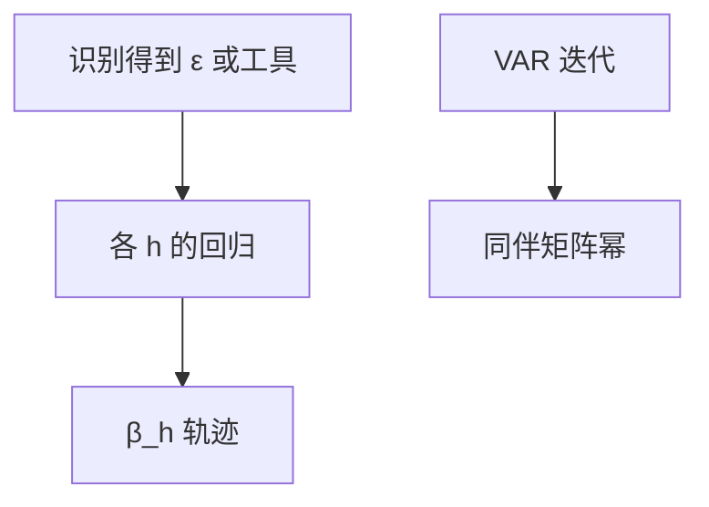

# 局部投影

每一地平线单独回归，不必先估一个套牢所有 $h$ 的 VAR；识别仍然要来自别处。

<footer>—— Jordà, Estimation and Inference of Impulse Responses by Local Projections, AER 2005</footer>

[上一课](/econ/svar-identification)用 VAR 的结构冲击生成所有地平线的 IRF。本课缺口是**换估计器**：局部投影（LP）把 $y_{t+h}$ 直接投到冲击或工具上。不重写 $A_0$ 的全部菜单，也不宣称 LP 免除识别。

## 问题

VAR 的 IRF 是迭代：$C_h$ 由同伴矩阵的幂给出，设定误差会随 $h$ 累积。Jordà：对每个 $h$ 估计

$$
y_{t+h}=\alpha_h+\beta_h\varepsilon_t+\gamma_h(L)X_t+u_{t+h},
$$

$\beta_h$ 就是该地平线的脉冲。$\varepsilon_t$ 仍须是结构的：来自 SVAR、来自叙事、来自高频工具。缺口是把「IRF 的估计」从「VAR 设定」里拆出来，而不是再发明一种冲击。

Jordà, *AER* 95(1), 2005, 161–182。Plagborg-Møller and Wolf：在线性、正确设定且滞后足够时，LP 与 VAR 的 IRF 渐近谈的是同一对象，差别在有限样本偏差–方差。

## 方法

冲击已知时，LP 是一串 OLS（或 IV）。冲击要估计时，先做识别步骤，再投影。推断：重叠地平线使 $u_{t+h}$ 序列相关，用 Newey–West 或滞后增广（Rambachan–Shephard、Montiel Olea 等讨论）。平滑 LP 把相邻 $h$ 的 $\beta_h$ 借强度，回到一点 VAR 的味道。非线性：把状态（衰退、ZLB、债务高）放进交互，LP 比 VAR 更容易写成状态依存 IRF。

财政乘数、货币脉冲的近期文献大量用 LP，正是因为状态依存与较少的动态套牢。识别差时，LP 只是更灵活地报错。

## 机制

机制是避免用错误的 VAR 动态去外推远地平线。代价是方差大、曲线毛。VAR 是收缩：所有 $h$ 共享参数。选择不是哲学，是偏差–方差。两者都要求条件均值线性或你已经把非线性写进回归。预期：若冲击被预见，无论 LP 还是 VAR 都会在 $t$ 之前动——新闻冲击课再处理。

与 DSGE：LP 的 $\beta_h$ 可当要匹配的半结构靶（Christiano–Eichenbaum–Evans 传统的 IRF 匹配），参数化仍回校准或估计课。

识别与估计分工：Stock–Watson 的外部工具可以进 SVAR，也可以进 LP-IV。后课叙事与高频，是工具的来源。

## 边界

本课不提供新的冲击序列。不把 LP 写成「比结构模型更真」。面板 LP、区域乘数（Nakamura–Steinsson）是同一估计器的另一数据，本课只钉时间序列宏观。微观结构的脉冲（订单流）不在本栏。

后课默认：IRF 可用 VAR 或 LP 估；识别另给。下一课：叙事日期与高频意外如何提供那条识别。

## 小结

- LP：每地平线回归，少套牢动态，多方差。
- 识别不因 LP 而消失。
- 线性正确设定下，与 VAR 谈同一 IRF。
- 出处：Jordà, *AER* 2005。
