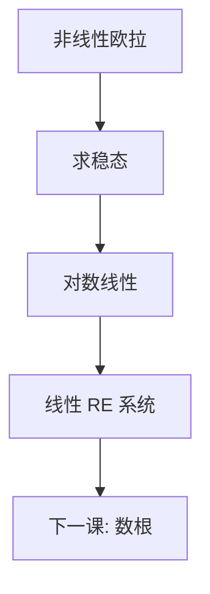

# 对数线性化

在稳态附近，百分比偏差服从线性理性预期系统；非线性被收进可算的系数。

<footer>—— Uhlig, A Toolkit for Analyzing Nonlinear Dynamic Stochastic Models, 1999；对照 King, Plosser and Rebelo 对 RBC 的对数线性</footer>

[上一课](/econ/euler-transversality)给出欧拉加横截。方程仍是非线性期望。本课缺口是：**在稳态附近换成线性**，得到后课 Blanchard–Kahn 能吃的状态空间。不重推 TVC，不把线性化当成模型本身。

## 问题

政策函数 $g$ 一般没有闭式。校准与脉冲要用对稳态的一阶：令 $\hat x_t=\log x_t-\log\bar x$，则 $f(x_t,x_{t+1},z_t)=0$ 变成

$$
A\,\mathbb{E}_t\hat x_{t+1}=B\hat x_t+C\varepsilon_t.
$$

Uhlig 的工具箱把乘积、幂、期望的一阶规则写成机械步骤。King–Plosser–Rebelo 对 RBC 已经这样做：劳动、消费、资本的百分比偏差构成线性系统。缺口不是再写欧拉，而是承认：一阶线性化丢掉风险溢价与确定性等价失效的部分——那是扰动高阶的缺口。

对数线性保持弹性常数，水平线性在零附近。宏观变量多正、稳态远离零，故常用对数。IRF 读成百分比，与 HP 滤波后的周期事实同单位。

## 方法

先求确定性稳态 $\bar x$（冲击关掉）。再对每条方程在 $\bar x$ 处取全微分，除以方程尺度，换成 hat。期望算子在一阶与线性交换，确定性等价成立：方差不进决策。内生的跳变量（消费、通胀）与预定变量（资本）分开，为 BK 数根准备。校准参数进入 $A,B,C$ 的数值。

与 VFI 对照：全局方法保留约束 kinks 与风险；对数线性默认内部解、小冲击。ZLB 或偶尔绑定的抵押约束会让线性化在关键区域失效——后课金融摩擦会再声明。

## 机制

机制是泰勒一阶。相对价格与数量的弹性变成矩阵元素；冲击的传播由特征值决定。因为确定性等价，预防性储蓄、风险溢价、不等的 Jensen 项全部消失——若题目正是这些，不要用本课当答案。线性 IRF 与冲击符号无关、可叠加，这是优点也是限制。

加总：代表性个体下 hat 变量就是总量。异质模型的加总方程一般不能对「平均资本」对数线性了事，因为分布矩会进价格——又是后课。

Christiano, Eichenbaum and Evans 的货币政策 DSGE 把对数线性当估计的起点。Smets–Wouters 在同一传统上加贝叶斯。本课只交货线性系统，不估计。

## 边界

本课不数根、不定与爆炸（下一课）。不把 HP 滤波当线性化的一部分。也不在此引入二阶福利：Lucas 成本、消费补偿要二阶，扰动法下一课才给。水平变量若可过零（净通胀、净外国资产），对数要改成水平或分段。

后课默认：说到「线性 DSGE」，指稳态附近的 hat 系统，确定性等价已用。下一课：哪些线性 RE 系统有唯一有界解。

## 小结

- 对数线性把非线性欧拉收成 hat 变量的线性 RE。
- 一阶 ⇒ 确定性等价；风险与约束绑定不在本课。
- 产出是矩阵 $A,B,C$，供 BK 与估计使用。
- 出处：Uhlig 1999 toolkit；King, Plosser and Rebelo, *JME* 1988。
