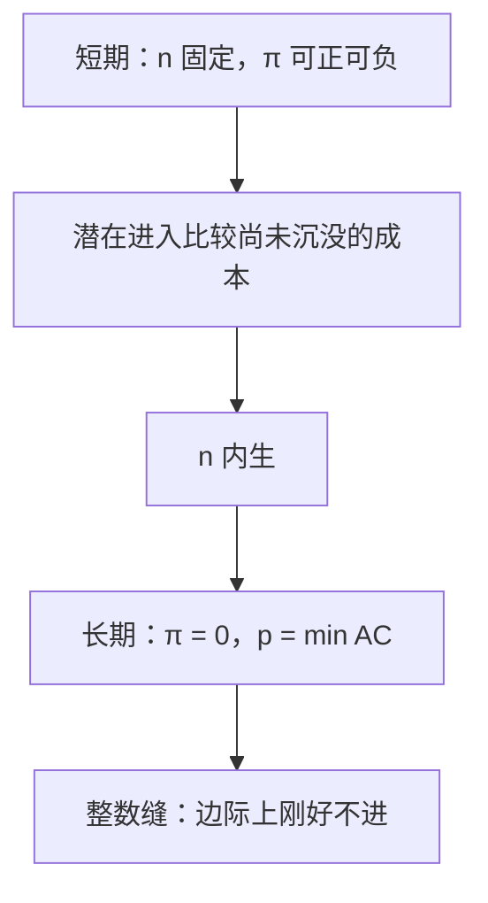

# 长期进入与零利润

自由进入把长期超额利润赶到零；那是进入条件，不是短期供给曲线上的会计恒等式。

<footer>—— 据 Varian, Intermediate Microeconomics；Viner, Cost Curves and Supply Curves, 1931 整理</footer>

定位：[上一课](/econ/perfect-competition)。完全竞争已经把短期行业供给写成既定 $n$ 下 MC 的加总，并把长期水平供给钉在 $\min\mathrm{AC}$。本课不重讲 $D$ 交 $S_{\mathrm{SR}}$。缺口是进入过程本身：$n$ 怎样从固定变成内生，零利润在哪一个时期成立，整数厂商与沉没进入成本会留下怎样的缝。

## 问题

短期 $n$ 给定，需求一移，$p$ 沿 $S_{\mathrm{SR}}$ 走，在位者可以赚准租金或亏固定部分——上一课允许利润可正可负。长期若进入自由且厂商相同、要素价格不随行业扩张而涨，潜在进入者比较的是进入后利润流与尚未付出的进入成本。均衡要求 $\pi=0$，从而 $p=\min\mathrm{AC}$，$n^*=D(p)/q^*$。缺口不是再写 $p=\mathrm{MC}$，而是：**谁在何时被赶到零。** 短期供给曲线上的点不必零利润；零利润是 $n$ 已调完之后的稳态。

整数问题：连续 $n$ 是教具。真实 $n$ 是整数时，长期可以停在「再进一家就亏、现有各家仍有小额租金」的缝上。不要把缝写成垄断势力——勒纳下一课才出场，这里 $P=\mathrm{MC}$ 在停产点以上仍成立。

### 零利润含正常回报

经济利润为零，要素按机会成本付酬，资本得到竞争性回报。读成「没人愿意生产」会把有效规模上的产出抹掉。进入成本一旦沉没，事后核算里它不再是一阶条件；事前它摊进 AC，正是为了让「零」含正常回报。上一课序的[沉没](/econ/sunk-cost)在这里变成进入壁垒的高度，不是短期停产规则。

外部不经济：行业扩张抬高 $w$，单家 AC 上移，长期供给向右上倾斜。零利润仍成立，但 $p$ 随 $Q$ 升。倾斜来自要素市场，不是把单家 DRS 水平加总。

## 方法

两步均衡。短期：给定 $n$，解 $D(p)=n q_{\mathrm{SR}}(p)$。长期：加条件 $\pi(p,w)=0$（或整数时 $\pi\ge 0$ 且再进一家 $\pi<0$），联立 $n$。比较静态必须声明时期：需求冲击的瞬时效应走 $S_{\mathrm{SR}}$，进入完成之后走水平（或倾斜的外部不经济）长期供给。

成本异质时，零利润钉在边际进入者；inframarginal 的低成本厂商保留租金，来源是稀缺投入，不是向下的剩余需求。自由进入消灭的是**复制者**的超额，不是一切准租金。

需求的季节性只改短期准租金，只要进入来得及，长期仍钉在 $\min\mathrm{AC}$；来不及则整段观测都是短期。不要把某一年的会计利润当成进入条件已经失败。

本课仍价格接受、产品同质。策略性进入阻挠是[限制进入定价](/econ/limit-pricing)；次加性只留一家是[自然垄断](/econ/natural-monopoly-ramsey)。不要把进入写成限价簿上新的做市商排队——簿是量化栏。

## 机制

正利润吸引模仿的机制是可观察的准租金：同样技术可以被复制，$n$ 升，沿短期供给 $p$ 降，直到进入无利。亏损则退出，直到剩下的人不再亏长期成本。没有进入壁垒时，壁垒不是本课对象。

与[规模报酬对规模经济](/econ/returns-vs-economies)的接口：U 形 AC 来自某段规模经济加上最终的复制；自由进入把行业停在有效规模的复制点上，而不是停在 IRS 的锥上。CRS 无沉没时 $\pi$ 在零与无穷之间刀刃——上一课序已说；有 U 形 AC 时刀刃被有效规模钉住。

进入调整的速度把「短期」变成经验问题：建厂、执照、培训若要若干期，观测到的利润序列可以长期为正而不否定本课的稳态。反过来，若退出的沉没很大，亏损也会持续——那是在位者的短期，不是「零利润失败」。税收归宿后课会分别用短、长期弹性；这里只把两条曲线的归属钉死。

Varian 的长期零利润是进入的均衡条件，与会计利润表不是同一张纸。短期「供给定理」用的是既定工厂；把长期弹性填进短期归宿，会把税收课的负担算错。

## 边界

执照、专利、最低资本，把「自由」拿掉，长期 $\pi=0$ 不必成立，市场结构滑向垄断或寡占。需求波动快于建厂时，观测上永远停在短期，零利润只是参照。也不处理匹配摩擦：出清靠价格，不靠排队。次加性使复制第二家更贵，自由进入的零利润均衡可以空掉，只留下一家——下一课垄断把这件事当成结构，本课仍假定 U 形 AC 可复制。

也不要把进入写成新做市商排进限价簿：本课没有队列。

后课默认：谈到完全竞争长期，指自由进入把经济利润赶到零、短期 $n$ 仍可正利润；对照垄断时，比较的就是这一进入条件被撤掉之后。

## 小结

- 短期 $n$ 固定，利润可正可负；长期进入把 $\pi$ 赶到零。
- 零利润是进入条件，含正常回报；整数厂商可留下缝。
- 比较静态必须声明走的是短期供给还是进入完成之后。
- 下一课撤掉进入与价格接受，面对向下的市场需求。
- 出处：Varian, *Intermediate Microeconomics*；Viner, 1931；Mas-Colell, Whinston and Green 第 10 章。
