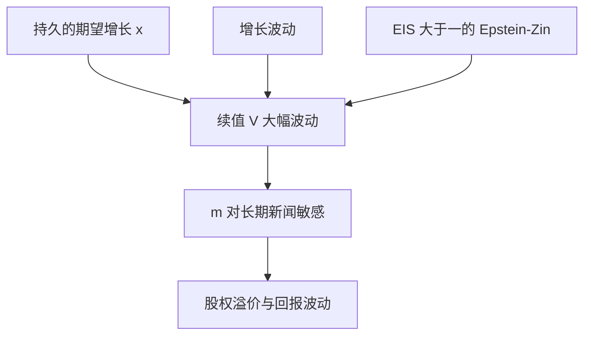

# 长期风险

消费增长里很小的持久成分，一旦被 Epstein–Zin 的高 EIS 放大，就会在续值上变成一阶风险；资产对长期增长新闻的暴露于是被定价。

<footer>—— Bansal and Yaron, Risks for the Long Run: A Potential Resolution of Asset Pricing Puzzles, Journal of Finance, 2004</footer>

[上一课](/econ/habit-formation)用习惯让当期边际效用随盈余比变动。并列的另一条路是：不改参照，而改消费过程的谱，让新闻进入续值。本课缺口是 Bansal–Yaron 的长期风险。不重写 CC 的敏感度函数，不把长期风险做成宏观因子表。

## 问题

EZ 已经允许 $m$ 对续值创新暴露。若消费只是 i.i.d. 增长，续值几乎不新，EZ 帮不上多少溢价。Bansal 与 Yaron（2004）给 $\Delta c$ 一个很小的 AR 成分（期望增长的慢移动）以及时变波动。对 EIS$>1$ 的人，好的长期增长新闻是好消息：愿意今天多消费，资产价格升；坏的长期新闻压价格。因为成分持久，贴现后的 $V$ 对它极敏感，即使当期 $\sigma(\Delta c)$ 仍小。

缺口是把「续值」从上一课的符号落实成可校准的消费过程，而不是再拆 $\gamma$ 与 $\rho$。习惯与长期风险是两条候选 $m$，本课不赛马宣布胜负。

长期风险：对期望消费增长（及增长的波动）的持久冲击。不是「持有期很长的债券风险」的同义反复，也不是期限结构栖息地。

## 方法

消费：$\Delta c_{t+1}=\mu+x_t+\sigma_t\eta_{t+1}$，$x_t$ 慢变，$\sigma_t$ 可随机。偏好：EZ，通常要 $\gamma>1$ 且 EIS$>1$，使价格–股利比对 $x$ 的加载为正且大。股权是对消费（或股利，股利可杠杆于消费）的要求权，于是对 $x$ 与 $\sigma$ 的暴露进入溢价。无风险利率对 $x$ 的敏感由 EIS 管，避免 Weil 式的崩溃。

测量：从年度消费里识别很小的 $x$ 并不容易。本课只钉机制，不审识别。可交易的「长期风险因子」若要排序，换量化栏，不要在本栏发明第三套 HML。

### 与习惯并列，不互为引理

习惯：当期 surplus 抖。长期风险：当期 $c$ 仍可平滑，但关于未来的信念抖。两者都能抬 $\sigma(m)$。数据上可以互相冒充，因为差的 $x$ 往往也是差的 surplus 年份。理论课必须分开写过程与偏好。

## 机制

机制是贴现与递归偏好的放大。持久增长的一小步，改变无穷期消费路径的水平，确定等价的 $V$ 于是大动。EIS$>1$ 意味着替代效应压过收入效应：更好的长期前景让人愿意付更高的资产价格（而不是只想今天大吃）。股票作为长久资产，对 $x$ 的久期长，国债短，溢价拉开。波动上升是坏消息（对 $\gamma>1$），进一步加价。

这不否定 HJ：$\sigma(m)$ 仍须大；大的来源从 $\gamma\sigma(\Delta c)$ 换成 $\gamma$ 对续值的暴露。Mehra–Prescott 的 i.i.d. 消费马尔可夫被改写，不是被「市场无效」替代。

Bansal and Yaron, *JF* 2004。后续文献争论 $x$ 是否可从消费里看见、以及 EIS 是否真大于一。本课不关闭争论，只把装置接到两谜之后的修补链。

## 边界

不要把长期风险写成宏观新闻发布的事件研究。也不要把它与仿射期限结构混成一句——收益率曲线的因子可以相关，但是后课 DTSM 的对象。下一课 [稀有灾难](/econ/rare-disasters)用尾部而不是持久均值来造 $\sigma(m)$。又一条并列修补。

后课默认：很小的持久增长风险，在 EZ 且 EIS$>1$ 时可以进入一阶溢价。习惯改参照，长期风险改谱；都不改「存在 $m$」。

截面价值是否等于久期或长期增长暴露，是量化栏的映射，本课不排序。

股利相对消费的杠杆，让股权对 $x$ 的久期更长，溢价更容易抬上去。那是支付过程的设定，不是又一个因子。EIS 若小于一，价格对 $x$ 的加载可以变号，校准常把 EIS 放在大于一的一侧——这是装置选择，须与上一课的分离参数一致。

稀有灾难下一课改支撑的尾，不改 $x$ 的 AR。平常年份仍可以平滑，崩溃另算。

## 小结

- Bansal–Yaron：消费的持久期望增长（加波动）经 EZ 进入续值与 $m$。
- 通常需要 EIS$>1$，以便长期好消息抬资产价格。
- 与习惯并列：一个改过程的谱，一个改边际效用的参照。
- 可交易「长期风险因子」的排序换量化栏，本课不发明第三套 HML。
- 下一课稀有灾难改支撑的尾，不改 $x$ 的自回归。
- 出处：Bansal and Yaron, *JF* 2004；偏好装置见 Epstein–Zin。
