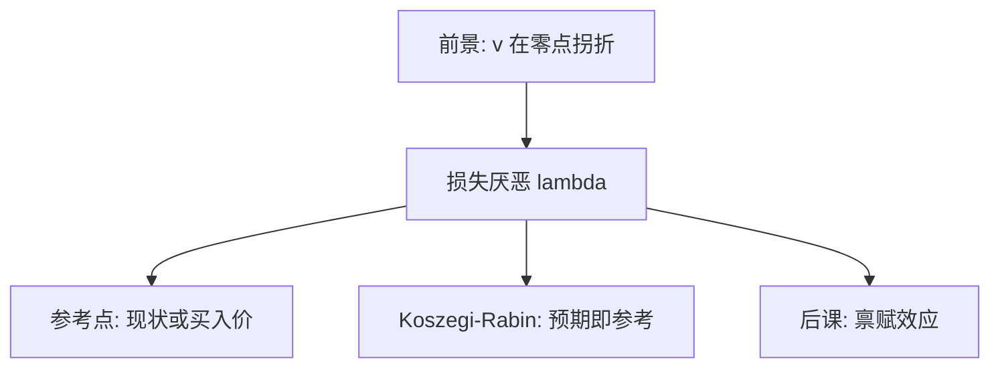

# 损失厌恶与参考点

损失的痛苦大于同等收益的快乐；没有参考点，这句话没有单位。

<footer>—— Tversky and Kahneman, Loss Aversion in Riskless Choice: A Reference-Dependent Model, QJE 1991；对照 Kőszegi and Rabin, QJE 2006</footer>

[上一课](/econ/prospect-theory)同时引入 $v$ 与 $\pi$。本课只拆损失厌恶：参考点两侧斜率不同，$\lambda>1$。不重写权重函数。

## 问题

1979 年的 $v$ 在零点拐折，损失段更陡。Tversky 与 Kahneman（1991）把同一逻辑写进无风险选择：买价与卖价缺口、现状偏误，不必有概率。参考点通常是现状、期望或刚实现的价格。Kőszegi 与 Rabin（2006）让参考点等于对结果的理性预期：人同时消费「消费效用」与「得-失效用」，均衡要求预期与选择一致。缺口是把拐折从实验室彩票接到状态依存的参考，而不是再推 [vNM](/econ/expected-utility)。

家庭金融接口：股票相对买入价被编码成浮盈/浮亏，处置效应后课再写；本课只钉 $\lambda$ 与参考点的定义。

损失厌恶不是风险厌恶。$\lambda$ 比较的是参考点两侧的斜率；$\gamma$ 比较的是财富上 $u$ 的弯曲。Benartzi–Thaler 的短视损失厌恶把两者乘在评价频率上，那是定价课。

## 方法

写 $v(x)=x$（收益）与 $v(x)=\lambda x$（损失，$x<0$），或对凹/凸形状再加弯曲。风险中性加损失厌恶已经足以产生对小赌注的拒绝——Rabin 校准指出，vNM 若拒绝小赌注会推出对大赌注的荒谬拒绝；损失厌恶避开这条。参考点的选取：现状、买入价、KR 预期。本课不估计 $\lambda\approx 2$ 的来源实验细节。

## 机制

机制是不对称编码。从参考点向上走一单位，价值增 $1$；向下走一单位，价值减 $\lambda$。因此放弃已持有的物品被编码为损失，获得未持有的物品被编码为收益，WTA–WTP 缺口出现——禀赋效应课展开。在风险上，相对参考点的对称赌注期望为负（若 $\lambda>1$），人拒绝公平硬币，看起来像极度厌恶风险。

参考点移动时，同一期末财富的评价翻转。这与指数贴现的时间不一致不同：这里甚至不必跨期，一期菜单改框架即可。

Rabin 校准的逻辑要写清：若 vNM 在小赌注上拒绝公平硬币，凹性会在大赌注上爆炸；损失厌恶把「拒绝小赌注」从曲率挪到拐折，大赌注仍可被接受。KR 的预期参考点使已预期的工资不产生得失，未预期的奖金才进入 $v$——这与现状参考点对工资刚性、对股票买入价的预测不同，后课按对象选用，不混成一个 $\lambda$。

## 边界

并非所有 WTA–WTP 缺口都是 $\lambda$：收入效应、实验经验（List 2003 的专业交易者）会缩小缺口。KR 的预期参考点使「意料中的损失」不那么痛，与现状参考点预测不同。本课不把宏观消费欧拉改成损失厌恶欧拉。

后课默认：损失厌恶是 $v$ 在参考点的斜率比；概率扭曲是另一零件。

$\lambda$ 比较参考点两侧斜率，不是 $u$ 的曲率；小赌注拒绝因此不必推出荒谬的大赌注厌恶。

KR 的预期参考点与现状参考点对工资、对买入价的预测不同，后课按对象选用。

## 小结

- 损失厌恶是参考点两侧斜率之比，不是 $u$ 的曲率。
- 参考点可以是现状、成本或理性预期（KR）。
- 小赌注拒绝不必推出荒谬的大赌注厌恶。
- 禀赋效应是现状参考点的现场。
- 短视损失厌恶把评价频率留给定价课。
- 出处：Tversky and Kahneman, *QJE* 1991；Kőszegi and Rabin, *QJE* 2006。
