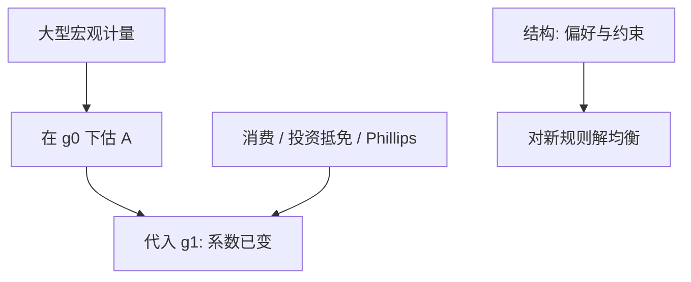

# Lucas 政策评价原文

    
政策规则一变，决策规则跟着变；用旧制度下估出的消费函数或菲利普斯曲线去模拟新政，是把简化式当成结构。

    <footer>—— Lucas, Econometric Policy Evaluation: A Critique, Carnegie–Rochester Conference Series on Public Policy 1976</footer>

附录对照，不插入主干。[上一课](/econ/solow-1956-paper)对照的是外生储蓄的增长模型。本篇对照 **Lucas 1976 原文的问题设定**：不是再选 RBC 或 NK，而是战后宏观计量把简化式当政策实验室为何不成立。主干[卢卡斯批判](/econ/lucas-critique)已取结构与 $g$ 的区分；这里对照 Carnegie–Rochester 会议文的三个例子——消费、投资税抵免、菲利普斯——以及它为何不是一篇普通期刊论文的章节体。

## 问题

Klein 式的大型联立方程把 $C=cY$、$I=I(Y,r)$、工资–物价当成可平移的菜单，然后问「若 $G$ 或 $M$ 按某路径走，$Y$ 如何」。Lucas 指出：这些系数里已经嵌着当时规则下的预期。规则从 $g_0$ 换成 $g_1$，持久收入、资本成本、$\pi^e$ 的推断都变，$A(g_1)\neq A(g_0)$。缺口是政策评估必须在**均衡决策规则**里做：改规则，重新解。

会议文集的体例允许点名当时的政策模拟实践，而不先铺一套完整 DSGE。三个例子各自打在一条当时常用的回归上，共用一句：系数不是偏好。理性预期是为了让「规则进入信息集」可写，不是文章的全部哲学。

原文点名的消费函数、投资税抵免模拟、以及用菲利普斯菜单选通胀–失业点，都是同一错误的三个标本。Friedman 的自然率是菲利普斯那一标本的特例；Lucas 把它推广到所有「历史相关当因果菜单」的做法。

Carnegie–Rochester Conference Series on Public Policy 1, 1976, 19–46。不是 AER 正刊体例。不要发明 arXiv。批判要求结构，并不颁发某一个 DSGE 的执照。

## 方法

把行为写成政策过程的函数。记简化式 $Y=A(g)X+\varepsilon$。估计 $A(g_0)$ 再代入 $g_1$ 一般无效。正确做法：从偏好与约束写欧拉，把 $g$ 放进条件期望，解新均衡。原文用理性预期作为工作假设，以便「规则进入期望」有一句干净的数学；批判的逻辑比后来某一种校准程序更宽。

主干课已用 NK/RBC 对照当先修；附录不重讲粘性与冲击，只对照 1976 年的靶子是计量政策评价，不是「预期不重要」。

## 机制

机制是期望对规则的条件化。家庭与厂商的当前 $C$、$I$、$w$ 把对未来政策的推断编进系数。计量若只回归当前 $Y$ 与 $\pi$，等于把推断压缩进 $A$。新政改变信息集，压缩结果不同。时间不一致（Kydland–Prescott 规则优于权变）是相邻附录的另一刀：连宣布的规则都可能不可信；1976 年先假定规则会被相信，已经足够推翻简化式模拟。

投资税抵免例最干净：旧样本里 $I$ 对税项的斜率，是当时抵免规则与资本价格预期的混合物；新抵免率改变未来税则，斜率不能乘上去。消费例是持久收入随规则变；菲利普斯例是 $\pi^e$ 成为新规则的函数。三例不要被读成三篇论文。

### 对照主干批判课，不插入增长与周期之间

主干[卢卡斯批判](/econ/lucas-critique)已从周期对照接到「任何 $C=cY$ 菜单」。本附录对照会议文的三个例子与理性预期写法。把 1976 接在 Solow 原文之后只因为宏观附录链如此排，**不插入**增长主干，也不插在 RBC 课中间当必读插页。读完回主干批判课。

规则不变时，简化式仍可预报下一季。批判禁止的是把预报方程当成「若改 $g$」的实验室。预测与评估不是同一句话——主干已写，原文例子全是评估。

## 边界

批判不自动支持「政策完全无效」。在粘性下，被理解的规则仍可通过实际利率路径改变缺口——那是结构模拟。也不要把 1976 写成「任何回归都不能做」。识别失败仍可能：深层参数估错，新规则下一样错。批判是必要条，不是充分条。

原文没有高频交易、没有因子模型参数漂移。那些是量化栏的另一套不变性，不要翻译进来。

投资税抵免的例子针对的是：把旧样本里 $I$ 对税项的系数拿去乘新抵免率。消费例子针对持久收入对规则的依赖。菲利普斯例子针对 $\pi^e$ 不是常数。三例共用一个逻辑。

校准与后来的 DSGE 是对批判的建设性回应，不是 1976 年已经写好的模型清单。

宏观附录下一篇转到开放经济的资本流动原文。

Hicks 的 IS–LM 若把 $P$ 与 $\pi^e$ 冻住去做新政，同样犯简化式错误；若允许二者随规则走，长期中性回来。1976 年的靶子是计量菜单，不是把 IS–LM 从图上擦掉。

## 小结

- 附录对照 Lucas 1976：简化式系数嵌着旧规则下的预期，不能直接评估新政。
- 标本是消费函数、投资税抵免与菲利普斯菜单。
- 正确做法是对新规则解均衡；预报与评估分家。
- 出处：Lucas, Carnegie–Rochester 1976。
