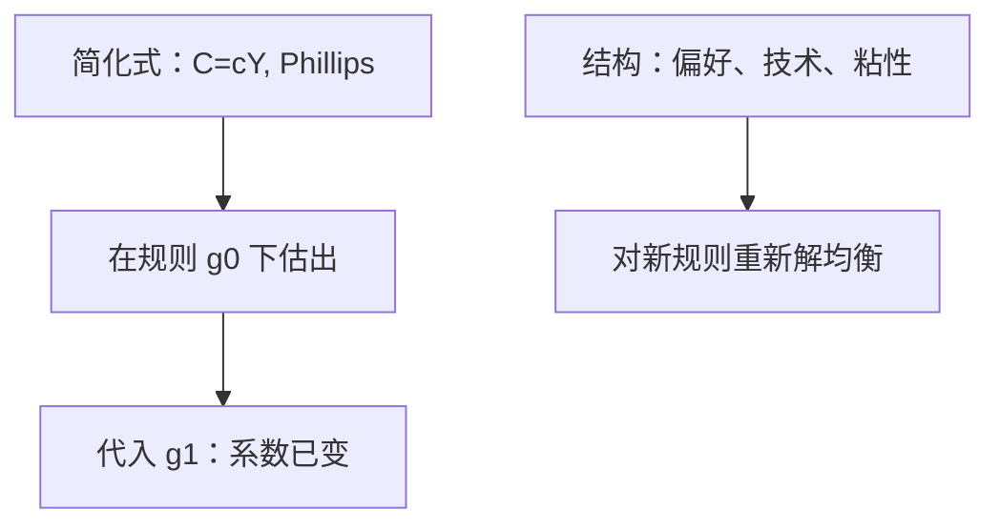

# 卢卡斯批判

政策一变，公众的决策规则就变；用旧制度下估出来的消费函数或菲利普斯曲线去模拟新政，是把简化式当成结构。

<footer>—— Lucas, Econometric Policy Evaluation: A Critique, Carnegie–Rochester 1976</footer>

[上一课](/econ/rbc-contrast)把周期对照成：缺口可以是粘性，也可以是自然产出在动。两边都已经用到预期。本课的缺口不是再选 NK 或 RBC，而是：任何把 $C=cY$、把 Phillips 当固定菜单的计量政策评估，在规则改变时都会失效。Taylor 规则是下一课用显式利率规则去换「相机微调」；本课先把批判钉死。

## 问题

战后宏观计量把消费、投资、工资方程估成对当期变量的回归，然后做「若 $G$ 或 $M$ 按某路径走，$Y$ 如何」的模拟。Lucas（1976）指出：这些方程的系数里已经嵌着当时政策规则下的预期。规则一变，$\pi^e$、持久收入、资本成本的推断都变，系数跟着变。缺口是区分**结构参数**（偏好、技术、调价频率）与**简化式系数**。

[菲利普斯](/econ/phillips-expectations)是最干净的例子：在固定 $\pi^e$ 下估出负斜率，用来选通胀–失业点；一旦央行改规则，$\pi^e$ 成为新规则的函数，替换消失。IS 的 $C(Y)$ 同样：减税若被看成持久，MPC 大；若被看成李嘉图式的时间平移，MPC 小。用旧样本的 $c$ 去乘新减税，是把预期制度偷运进乘数。

批判不是「计量无用」。它要求政策实验在均衡决策规则里做：改的是规则，解出的是新的欧拉与定价。校准与后来的 DSGE 是回应，不是免责。

## 方法

把行为写成：最优决策是政策过程的函数。记规则为 $g$（例如 $M$ 的反馈、利率如何对通胀反应）。简化式 $Y=A(g)X+\varepsilon$。估计 $A(g_0)$ 再代入 $g_1$，一般 $A(g_1)\neq A(g_0)$。正确做法：从偏好与约束推导欧拉，把 $g$ 放进预期，重新解均衡。

Friedman 的自然率已经是批判的特例：货币规则不能把 $u$ 永久钉在 $u^*$ 下。Lucas 把它推广到所有「把历史相关当因果菜单」的做法。Hicks 的 IS–LM 比较静态若把 $P$、$\pi^e$ 当常数，同样犯简化式错误；若允许 $P$ 与预期随规则调整，长期回到中性，与批判一致。

### 识别仍要假设

声明结构不等于已经识别。NK 的 $\kappa$、RBC 的冲击过程，都会随样本与设定而变。批判禁止的是无结构的政策模拟，不是保证某一个 DSGE 为真。

乘数 $dY/dG$ 依赖 LM 斜率、粘性、是否李嘉图、规则是否对冲。把它当自然常数，正是批判的靶子。Hicks 图仍可用于既定规则下的叙事，但不能当新政计算器。

## 机制

预期是对未来政策的条件期望。家庭与厂商的欧拉、调价，把这些期望编进当前的 $C$、$P$、$w$。计量若只回归当前 $Y$ 与 $\pi$，等于把期望压缩进系数。新政改变期望的信息集，压缩结果不同。时间不一致课会再加一层：连「宣布的规则」本身都可能不可信，期望对准的是将来会重新优化的那条路径。

Kydland–Prescott 的 RBC 校准与 Woodford 的 NK，都是对批判的建设性回应：先写对规则不变的块，再改 $g$ 解新均衡。IS–LM 比较静态若把 $P$ 与 $\pi^e$ 冻住，是批判的靶子；若允许二者随规则走，长期中性与自然率重新出现，与 Friedman 1968 一致。

规则不变时，简化式可以预报下一季 $Y$。批判禁止的是把预报方程当成「若改 $g$ 会怎样」的实验室。预测与评估不是同一句话。

## 边界

批判不自动支持「政策完全无效」。在粘性价格下，被理解的规则仍然通过实际利率路径改变 $\tilde{y}$——那是结构模拟，不是旧 Phillips 菜单。也不要把批判写成「任何回归都不能做预测」：在规则不变时，简化式可以预测；变的是**政策评估**。

识别失败仍可能发生：深层 $\theta$ 估错，新规则下的模拟一样错。批判是必要条，不是充分条。本栏不把批判延伸成高频交易策略的参数漂移；那是量化栏的另一套不变性。

后课默认：谈乘数、泰勒规则、承诺，必须说清规则与预期如何进入结构。下一课把利率政策写成对通胀与缺口的反应函数。

## 小结

- 简化式系数嵌着旧规则下的预期，不能直接用来评估新政。
- 结构是偏好、技术、约束与定价摩擦；政策是规则 $g$。
- Phillips 菜单与 $C=cY$ 乘数是典型翻车处。
- 正确做法是对新规则解均衡，不是平移历史回归。
- 预报可以靠简化式；评估不能。
- 出处：Lucas, Carnegie–Rochester 1976。
