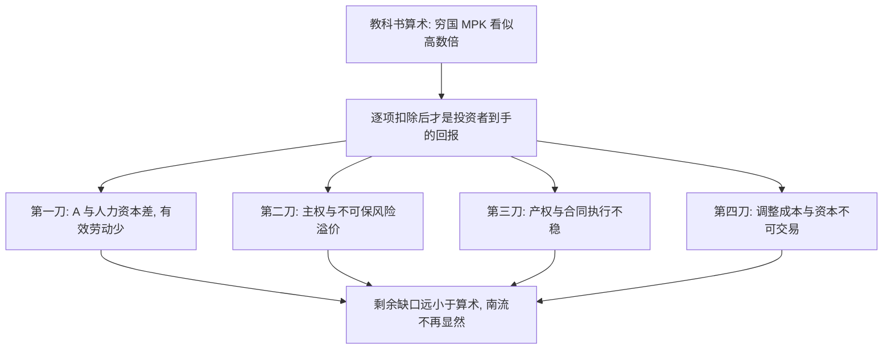

# Lucas 悖论

若资本边际产出只由 $K/L$ 决定，穷国 $r$ 应远高于富国，资本应狂奔向南；观测到的净流远小于这道算术——缺的不是计算器，是 $A$、人力资本与制度。

<footer>—— Lucas, Why Doesn't Capital Flow from Rich to Poor Countries?, AER 1990</footer>

[上一课](/econ/trade-growth)把货物贸易收到水平与增长。国际金融续换对象：资本为何这样流。主干已有[Feldstein–Horioka](/econ/feldstein-horioka)的储蓄–投资相关；本课从 Lucas 的边际产出算术起，问净流为何不按教科书。全球失衡下一课把流量写成系统格局。

## 问题

Cobb–Douglas，$r=\alpha A(K/L)^{\alpha-1}$。用美印人均产出差反推，若 $A$ 相同，印度 $r$ 应数倍于美国，一美元不该留在美国。Lucas：观察到的净流远不够填平。缺口不是再讲 $CA=S-I$，而是：要么 $A$ 不同（穷国有效劳动更少），要么人力资本、外部性、制度使私人 $r$ 对外国投资者不是社会 $MPK$，要么风险与主权使套利停住。Feldstein–Horioka 是截面相关；Lucas 是水平：为什么穷国没有被资本填满。

数字实例：取 $A$ 相同、$\alpha=0.4$，人均产出差 5 倍时，印度的 $MPK$ 应高出美国约 $5^{(1-\alpha)/\alpha}=5^{1.5}\approx 11$ 倍——按这个数资本该洪水般南流，观测到的净流连零头都不到，这就是悖论的刺痛点。

Caselli–Feyrer：用可复制资本的价格与自然资本份额修正后，$MPK$ 差距缩小。悖论的一部分是测量：不是所有「资本」都能跨境安装。

## 方法

先做 Lucas 的反事实算术，再逐项放松 $A$ 相同、资本同质、无风险。制度（没收、合同）把外国 $MPK$ 打折。人力资本使有效 $L$ 不是人口。外部性（Lucas 自己的人力资本外部）使社会报酬高于私人，市场不会把 $K$ 送到社会最优。金融摩擦：原罪、突然停止使净流突然断——主干已有，本课当边界。

与贸易：货物可以间接流动要素服务（HO），资本不南流与贸易存在可以同时真。不要用贸易量否定 Lucas。

## 机制

机制是「观测到的 $r$ 不是可套利的无风险 $MPK$」。索洛世界里 $A$ 外生且相同，资本必流。发展核算把大部分收入差归到 $A$，于是 $MPK$ 差缩小。剩下的差被风险溢价、不可交易性、调整成本吃掉。官方资本（援助、多边）与私人 FDI 行为不同：FDI 带 $A$，组合投资更怕制度——后课储备与主权财富基金是另一类官方流。

直觉类比：教科书把跨境投资想成「水往低处流」——水位差大就一定流。但现实的水管上装了好几道阀门：技能不够（水太稠流不动）、产权不稳（水管随时被拔走）、风险不可保（水压忽大忽小）。阀门不开，水位差再大也不流。

与 FH：高 $\beta$ 说储蓄留在本国；Lucas 说穷国该有净流入。两者都指向跨境资本远非完美，但一个是相关，一个是水平。共同冲击可以解释 FH，解释不了「印度为何没有被填满」。

Lucas 原文用人力资本外部与劳动力市场：资本需要配套技能，否则 $MPK$ 掉。这不是道德，是互补。

## 边界

本课不估一个新的 $MPK$ 表。不把悖论写成「全球化失败」。全球失衡下一课：资本在 2000 年代大量流向美国（「上流」），比 Lucas 的南流缺失更刺耳。不要把 CIP 基差当 Lucas 的点估计；报价层见 `/quant/irp`。

后课默认：教科书 $MPK$ 差被 $A$、人力资本、制度与风险大幅缩小；净流缺失首先是这些，不是算术错误。FH 是另一条相关谜。上流与储备积累下一课。

常见误区：初学者容易把「资本不南流」读成「穷国资本不稀缺」——稀缺照旧，只是私人投资者到手的回报被制度、风险与配套缺口打了折。也别把 FDI 与组合投资混为一谈：FDI 自带技术与管理、对制度耐受度高，组合投资跑得快也更怕制度。

## 小结

- 若 $A$ 相同，$K/L$ 差意味着巨大 $r$ 差与南流；观测远小于算术。
- $A$、人力资本、制度、风险把私人可套利 $MPK$ 打下来。
- 测量（Caselli–Feyrer）再削一截。
- 与 FH 相关谜分层：一个水平，一个斜率。
- 出处：Lucas, *AER* 1990；Caselli and Feyrer。
