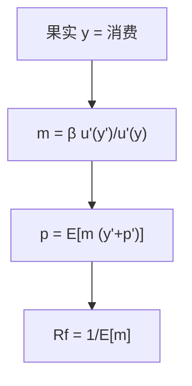

# Lucas 树

果实外生落下，证券是对果实的要求权；价格使代表性主体愿意持有这棵树，随机折现因子就是果实的边际效用比。

<footer>—— Lucas, Asset Prices in an Exchange Economy, Econometrica, 1978</footer>

[上一课](/econ/state-price-sdf-bridge)焊好了 $q$、$m$、$\mathbb{Q}$。本课缺口是**均衡选取**：在纯交换的禀赋经济里，消费等于树上落下的果实，$m$ 不再是任意正核，而是 $\beta u'(y_{t+1})/u'(y_t)$。不重写 FTAP，不把 Mehra–Prescott 的校准表提前铺开——谜是特化失败，树是装置。

## 问题

Lucas（1978）：Markov 果实过程 $\{y_t\}$，代表性主体、完全市场、无生产。股权是对全部果实的要求权，债券是对确定支付的要求权。出清迫使 $c_t=y_t$，欧拉成为定价方程。价格是果实流在该核下的期望折现。缺口不是再定义 SDF，而是：无套利允许许多 $m$，出清加代表性主体选出一个，并且把选出的 $m$ 绑在可观测的总量 $y$ 上。

这与 [CAPM](/econ/capm-theory) 的选取不同：CAPM 用均值方差加总把 $m$ 绑在市场回报上；Lucas 树把 $m$ 绑在禀赋边际效用上。两者都可以是完全市场均衡，坐标不同。CCAPM 是连续时间里把消费当充分统计；树是离散 Markov 的教室版。

Lucas, *Econometrica* 46(6), 1978。果实外生，故称交换经济。生产课序会让 $y$ 对价格有反馈，那是 Cochrane 的生产基础定价，不是本课。

## 方法

Bellman 或直接欧拉。股权价格 $p_t=p(y_t)$ 满足

$$
p(y)=\mathrm{E}\Bigl[\beta\frac{u'(y')}{u'(y)}\bigl(y'+p(y')\bigr)\Bigm|y\Bigr].
$$

无风险利率由 $\mathrm{E}[m\mid y]$ 的倒数给出。Markov 使价格是 $y$ 的函数，不必另引泡沫项——横截条件把爆炸解关掉（理性泡沫课已从行为课序写过另一条缝）。本课默认基本面解。

与信息课序：树通常假定公共信息，价格完全反映 $y$ 的历史，没有 GS 采集。把果实做成私人观察，REE 与树可以叠，本课不叠，以免装置失焦。

## 机制

机制是代表性主体必须愿意持有全部风险。没有外部，果实的波动就是消费波动，$u'$ 的波动就是 $m$ 的波动。果实高的状态 $m$ 低，股权在那时支付高，协方差为负，故有正溢价。债券在所有状态支付确定，溢价为零（实际债券），名义债券另论。股权溢价之谜已经在主干里：观测到的 $y$ 太平，常规 $u$ 给不出够抖的 $m$。本课只把机制钉在树上，不重跑校准。

生产一旦进来，$c$ 可以平滑，$y$ 不再等于 $c$，核跟着消费走而不是跟着股利走——后课生产基础会反过来用投资的一阶条件给回报定价。树是无平滑技术的对照。

异质主体、不完全市场会让 $m$ 依赖某个加权消费或约束乘子，不再等于总量 $u'(y)$。树是加总已经完成的特例。

## 边界

不要把树写成「股利贴现模型的实证」。后课 Campbell–Shiller 才把价格、股利、回报做成恒等式与预测。本课价格是均衡函数 $p(y)$，不是回归。也不要把树的 Markov 当成限价簿上的状态变量。

下一课：在不指定 $u$ 的前提下，把价格、股利与回报的对数线性关系写成会计恒等式——Campbell–Shiller 分解。树给出的 $p(y)$ 必须服从那条会计。

后课默认：交换经济出清 ⇒ $c=y$ ⇒ $m$ 由果实的边际效用给出。这是对 FTAP 集合的均衡选取，不是对 NA 的替代定义。

## 小结

- Lucas 树：外生果实，出清 $c=y$，股权是对果实的要求权。
- $m=\beta u'(y')/u'(y)$ 是均衡选出的核，价格是该核下的期望折现。
- 溢价之谜是这个特化在数据上抖不够，不是树的定义失败。
- 出处：Lucas, *Econometrica* 1978。
