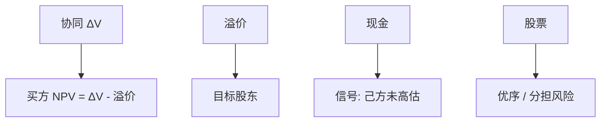

# 并购协同与支付方式

    
协同是两家企业合在一起才有的现金流增量；用股票支付时，收购方在自己被高估时更爱发股，目标股东分担事后风险——支付方式本身是信号。

    <footer>—— Travlos, Journal of Finance 1987；Hansen, Journal of Business 1987；Andrade, Mitchell and Stafford, Journal of Economic Perspectives 2001</footer>

[上一课](/econ/takeover-defenses)决定交易能否发生。本课缺口是成交之后的经济学：协同是否真实，以及现金对股票如何改变双方的价值分割与信号。不重写毒丸，不把 LBO 的债务结构提前。

## 问题

资本预算单元的 NPV 现在应用到「买下另一家企业」。协同 = 合并后 $V$ 减两家独立 $V$ 之和，来自成本、定价、税盾、债务容量、以及减少竞争（后者是转移不是创造）。免费搭车与防御决定溢价；若溢价大于协同，收购方股东 NPV 为负。Travlos：股票支付的收购方公告回报更差，像 Myers–Majluf——用高估的股票当货币。Hansen：目标比买方更了解自己，股票让目标分担事后真相，缓解买方的赢家诅咒。缺口是把支付方式接到优序与择时，而不是「会计上能否联营」。

Andrade–Mitchell–Stafford：并购的股东总回报多为正但不大，目标拿溢价，收购方接近零或负。平均不证明某一交易的协同，只限制「并购总是创造巨额价值」的修辞。

## 方法

先估独立 DCF（本课程第一单元），再估合并现金流：重复计算总部费用、双重计算终值增长，是协同造假的标准路径。实物期权：合并可能毁掉一方的等待期权或创造放弃重叠项目的期权。支付：现金用债务或现金存量，纪律硬、信号「我们不认为自己股票贵」；股票分享风险、稀释、信号相反。混合可以分离类型。

赢家诅咒：拍卖中出价最高者往往高估目标。股票部分对冲这种高估。现金在竞争拍卖中更常见于确定性强的交易。

与国家风险、会计：跨境协同常被高估。倍数课的交易倍数已含控制溢价，不能再加一遍协同。

## 机制

机制是增量现金流加不对称信息。协同若只是把目标放到买方高倍数下重估，没有增量 FCFF，是叙事。支付方式改变谁承担 $v$ 的实现风险，并泄漏买方对自身 $V$ 的看法——同一 Myers–Majluf 通道。防御提高溢价，使买方 NPV 更易为负，于是只有自认高估的买方还用股票硬买——选择偏差让股票交易看起来更糟。

与 Jensen：FCF 多的买方更可能现金收购浪费；成长股买方更可能股票收购。样本要按现金存量与估值分，不能混成一个「并购是否创造价值」。

### 不要把「战略协同」写成 APV 的正项而不改现金流

第一单元已禁。并购材料里故技重演：DCF 之外另加战略。必须能指向哪一年的哪一条现金。

税：资产升值摊销、税损，可以是真协同（税码）。个人税与 Miller 客户影响股票对现金的税负，本课不展开税表。

## 边界

不要把本课写成行业并购史。下一课 LBO：协同主要是治理与杠杆纪律，支付几乎是现金加债，买方是私募。VC 则是另一端的分阶段。

后课默认：协同必须是增量现金；股票支付含柠檬与风险分担。溢价大于协同则买方 NPV 负。交易倍数已含控制权，禁止再加。

## 小结

- 协同是合并增量 FCFF，不是倍数重估；溢价超过协同则买方受损。
- 现金与股票含相反信号，并分配事后风险。
- 平均上目标获溢价、买方接近零，不取消单笔 NPV 纪律。
- 出处：Travlos, *JF* 1987；Hansen, *JB* 1987；Andrade, Mitchell and Stafford 2001。
