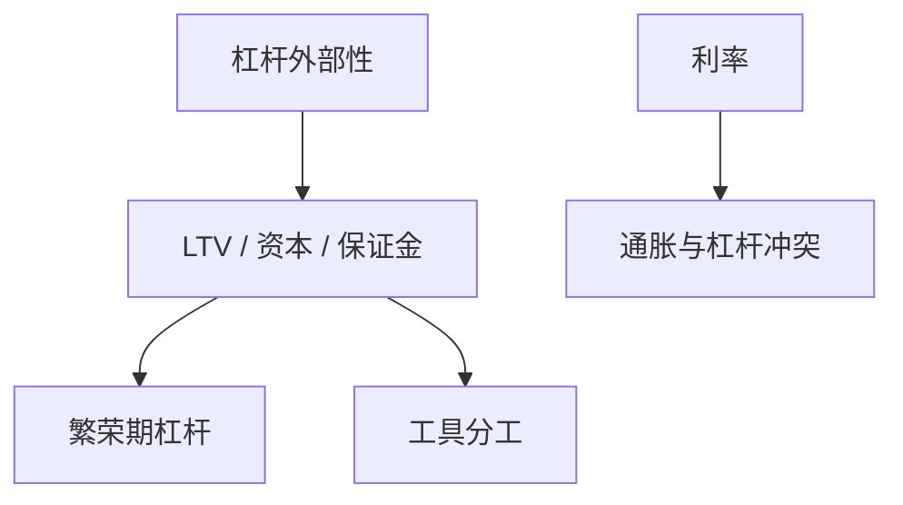

# 宏观审慎政策

对杠杆的约束是总量状态上的政策，目标是外部性：火线出售与中介净值的价格影响未进入私人一阶条件。

<footer>—— Bianchi and Mendoza；Jeanne and Korinek 的杠杆外部性；Basel III 的逆周期缓冲作为制度对照</footer>

[上一课](/econ/eggertsson-krugman)的 $\bar b$ 突然下降是灾难。本课缺口是**事前**把 $\bar b$ 或银行 $\phi$ 当成工具：宏观审慎。不重推 ZLB 乘数，不写巴塞尔每一条会计。

## 问题

KM/GK/住房 LTV 里，私人借款人与银行不内化 $q$ 与净值的价格效应。繁荣时过度杠杆，崩溃时放大。审慎：逆周期 LTV、资本缓冲、保证金。与货币政策分工：利率是粗工具，同时管通胀与杠杆会冲突（Tinbergen）。缺口是给「金融稳定政策」一条外部性语言，而不是把所有稳定都交给泰勒规则。

Jeanne and Korinek；Bianchi, *AER* 2011 过度借贷。Farhi and Werning 的宏观审慎与货币。Galati and Moessner 综述。Basel III CCyB 是制度，不是本课推导出来的最优税率。

## 方法

福利：比较竞争均衡与计划者，得到对债务的 Pigou 税或数量限制。定量：在 Iacoviello 或 GK 里对 LTV、资本要求做 Ramsey 或简单规则。与 ZLB：事前审慎减少事后陷阱的概率，与事后财政是互补。开放：资本流入税是同一外部性的跨境版（后课全球金融周期）。

识别：审慎工具的宏观 IRF 短、内生性强，叙事与跨国差异（英国 FPC、香港 LTV）比 SVAR 更常用。

## 机制

机制是把约束当政策而非当技术。过紧：正常时期投资与住房服务损失；过松：崩溃概率。偶尔绑定使最优政策本身状态依存：松约束世界里审慎几乎无成本也无收益。预期：若审慎被预见为「繁荣必收」，可抑制诊断性房价过冲。

与 HANK：LTV 主要绑中产住房借款人，分配效应明显，不是代表性福利能概括。

本课不把微观审慎（单家银行风险）与宏观审慎（周期与系统）混成一词。前者已有资本监管课接口。

## 边界

本课不定 CCyB 的基点。不写全部宏观审慎工具箱清单。影子银行会绕开（后课）。货币主导与财政主导会限制谁有工具。下一课把同一外部性放到跨境资本流。

后课默认：宏观审慎针对杠杆外部性，与利率分工。下一课：全球金融周期。

## 小结

- 杠杆有价格外部性，审慎是 Pigou 或数量工具。
- 与货币政策分工，因工具与目标数量。
- 过紧有稳态成本；状态依存是关键。
- 出处：Bianchi；Jeanne and Korinek；Farhi and Werning。
