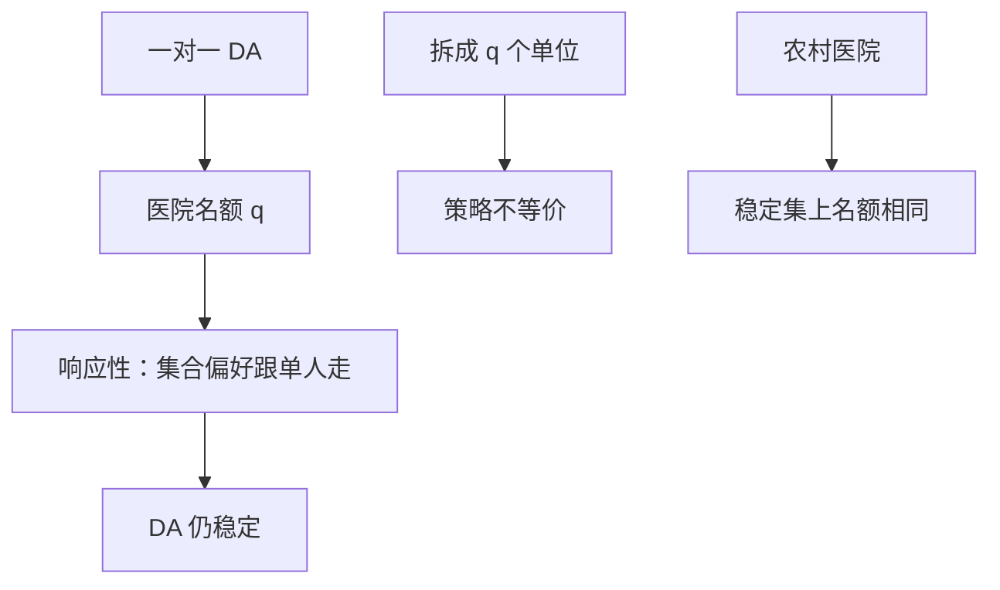

# 多对一匹配

医院有名额、医生一人一岗时，稳定仍可定义，延迟接受仍给出稳定匹配；但录取问题与把每个名额当成独立「人」的婚姻问题并不等价。

<footer>—— Roth, The College Admissions Problem Is Not Equivalent to the Marriage Problem, Journal of Economic Theory, 1985；The Evolution of the Labor Market for Medical Interns and Residents, Journal of Political Economy, 1984</footer>

[上一课](/econ/matching-strategy-proof)在一对一上钉了：延迟接受对求婚方策略证明，对接收方可操纵，稳定与双边策略证明不可兼得。缺口是名额：医院招多人、学院有配额。是否把每个床位复制成独立代理人，一对一定理原样搬？Roth 说不能。本课钉多对一的稳定、响应性偏好与农村医院定理，不把学校优先权当成学院自己的福利——那是下一课学校选择。

## 问题

医生集合 $D$，医院集合 $H$，医院 $h$ 有整数名额 $q_h$。匹配使每位医生至多一家，医院 $h$ 至多 $q_h$ 人。阻塞：一名医生与一家医院互相宁可「改配」——对医院而言，宁可在现有集合里换人或用空额加人。稳定：无阻塞对、无阻塞个人（宁可空缺）。

若医院对医生集合的偏好是**响应性的**（responsive）：对单人的排序能一致地扩展到集合（更好的人替换更差的人，集合变好；空额当最差），则 Gale–Shapley 的延迟接受仍终止于稳定匹配。医生求婚 DA 给出医生最优稳定匹配。

### 复制名额不是同一博弈

把医院 $h$ 拆成 $q_h$ 个「单位」，每个单位当一对一的人，偏好抄医院对单人的排序——稳定匹配的集合可以对应，**策略**不对应。医院是一个玩家，谎报的是一份名单或名额，不是 $q_h$ 个独立单位分别操纵。Roth 1985：学院录取在策略上不等于婚姻市场。一对一上「接收方可操纵」在多对一里更宽：还可以隐瞒名额、改集合偏好。

农村医院定理（Roth, 1986）：所有稳定匹配中，同一医院的填满人数相同；若某医院在一个稳定匹配中未满，则它在所有稳定匹配中得到同一集合。名额空在农村的，稳定解救不了——那是供给，不是算法选边。

## 方法

对象：有限、严格单人排序、响应性、配额固定。算法：医生求婚或医院求婚的 DA，暂持改为「暂持当前最好的至多 $q_h$ 人」。先证稳定，再证农村医院（名额与未匹配集合在稳定集上不变）。最后给反例：非响应性（要「成对互补」的科室组合）时，稳定可以空，或 DA 的暂持规则没有意义。

医院求婚 DA 给出医院最优稳定匹配，医生更差。配额没有把双边策略证明变可能。

NRMP 历史：医院求婚改成医生求婚，是选哪一边被策略保护，不是「有没有稳定」。名额 $q_h$ 本身若可被医院隐瞒（少报床位），稳定与策略证明都要另查：少报可以改变谁被暂持，从而在格上挪位置。一对一没有这条杠杆。

## 机制

响应性让「医院当作对单人排序的扩」与「对集合排序」一致，于是阻塞对仍能用单人语言写。DA 的暂持就是在名额内维持当前最优集合。农村医院说：稳定格改变的是「谁和谁配」，不是「农村一共几个岗被填」。操纵改质量，不改那些岗的空置——若空置是偏好与地理，不是边选错。

与一对一策略证明的衔接：医生求婚 DA 对医生仍策略证明（在响应性、无捆绑下）。医院一边：名额与集合使谎报空间更大，不是简单「接收方在格的坏端」。夫妻捆绑、互补会破坏存在性与策略证明，本课只钉经典住院医师。

### 稳定仍对立两边

医生最优稳定匹配对医院仍是稳定集里较差的一端（在响应性下有格）。选求婚边仍是选谁被保护。多对一只是把「一端」从单人改成带配额的机构，没有把双边策略证明变可能。

Roth 1984 追溯美国住院医师市场：早期爆炸要约与逐级退出，稳定匹配作为集中清算恢复了市场。算法细节后来改求婚边，动机正是本课与上一课的激励，不是运算速度。

## 边界

工资可谈的赋值博弈、合同匹配（Hatfield–Milgrom）把货币请回来，替代性条件替换响应性。那是后继。不要把医院名额写成限价簿的深度。互补偏好下稳定可空，本课不靠它说话。

夫妻捆绑把两名医生的偏好焊在一起，稳定可以空，DA 的求婚方策略证明也会坏——这是配额之外的另一条裂口，住院医师匹配后来用补丁处理，不是本课的响应性定理能覆盖。学校选择里学校往往根本没有这类福利互补，优先权是另一套对象。

后课默认：多对一在响应性下 DA 稳定，复制单位不等于同一策略博弈；农村医院钉住空置。下一课学校选择：机构一边往往只有优先权，没有福利。

## 小结

- 配额加响应性，DA 仍给出稳定匹配。
- 录取问题在策略上不等于把名额拆成婚姻市场。
- 农村医院：稳定解不改变未满医院的名额与集合。
- 医生求婚保护医生诚实；医院仍可操纵。
- 出处：Roth, *JPE*, 1984；*JET*, 1985；农村医院 *AER*, 1986。
