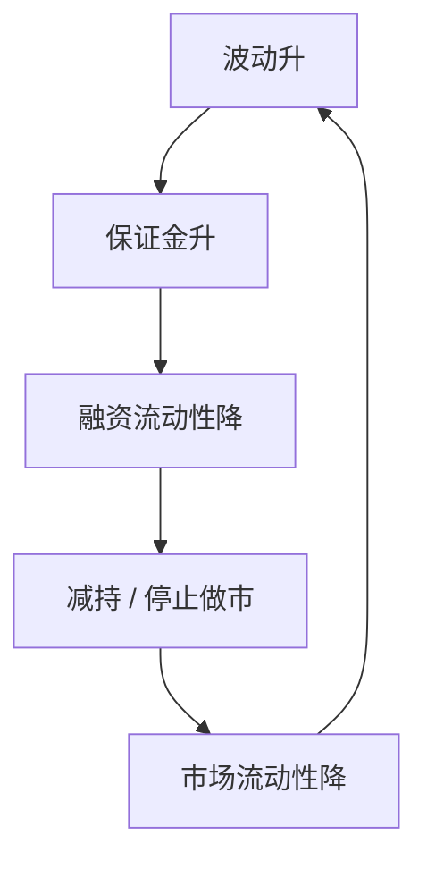

# 市场与融资流动性 Brunnermeier–Pedersen

做市要占保证金；融资一紧，市场流动性枯竭，保证金再升——流动性螺旋可以自我实现。

<footer>—— Brunnermeier and Pedersen, Market Liquidity and Funding Liquidity, Review of Financial Studies, 2009</footer>

[上一课](/econ/intermediary-asset-pricing)的约束是专家净值相对资产规模。本课缺口换成**保证金**：持有（或做市）一单位风险要占用融资，haircut 随波动与不利价格内生。市场流动性（价差、冲击成本）与融资流动性（借钱的难易）互馈。不重写 He–Krishnamurthy 的激励约束形式，不估计 TED 或 VIX。

## 问题

接口课把 $\lambda$ 与价差标成不利选择对象。Brunnermeier 与 Pedersen（2009）给出另一来源：即使信息对称，投机者/做市商的资本与保证金要求也能制造流动性。他们提供市场流动性，但每单位头寸占用融资；价格波动升 → 保证金升 → 融资流动性降 → 被迫减持 → 市场流动性再降。螺旋有两条：保证金螺旋与损失螺旋（与上一课净值放大同族）。缺口是把「流动性」拆成市场端与融资端，并允许它们在均衡里互相决定。

与 Glosten–Milgrom 并列：那边是逆向选择保险；这边是资本与抵押。危机里两者一起紧，理论要能分开通道。

Brunnermeier and Pedersen, *RFS* 22(6), 2009。保证金取 VaR 型：波动或不利尾部越大，haircut 越高。内生波动使乘数可以大于一。

## 方法

投机者效用或中介利润，受资本与保证金约束。市场流动性用反需求斜率或价差度量——本栏仍是均衡对象，不是盘口回归。融资流动性用保证金率与融资利率度量。均衡：给定保证金规则，价格与流动性出清；保证金规则又依赖均衡波动。多重均衡或陡峭的非线性：同一基本面，紧与松两套流动性。

不要把螺旋画成限价簿撤单 cascade 的微观过程。撤单是协议；本课是约束与 haircut 的均衡映射。量化栏可以测量螺旋的订单流足迹，本课不写足迹。

## 机制

机制是占用稀缺的风险资本。提供流动性是一种杠杆头寸，融资条款把杠杆上限写成价格波动的函数，于是流动性供给的边际成本内生。家庭或长期投资者若不能立刻填上做市空缺（慢资本），短期价格由受约束的边际决定——与 He–Krishnamurthy 同一精神，状态从净值换成保证金规则。信息对称时仍可以发生：波动可以来自公共冲击，不必来自知情单。

Kyle 的 $\lambda$ 在有保证金时会被放大：同样的噪声交易，融资紧时冲击更大。本课不重解 Kyle，只指出乘数作用在已有的逆需求上。

「飞行至流动性」：对保证金敏感的资产先被抛，安全、可抵押的资产被追逐。下一课 Geanakoplos 把可抵押性写成均衡杠杆；再后课便利收益把安全资产标成特殊支付。

## 边界

本课不分解 Amihud 比率，不写危机日期的事件研究。下一课杠杆周期从抵押均衡的另一头进入：杠杆本身是内生产品，悲观与乐观用多少保证金来交易。BP 的保证金规则可以外生给定形式；Geanakoplos 让 haircut 在异质信念下被均衡出来。

后课默认：市场流动性与融资流动性可以互馈成螺旋；保证金把波动写进约束。这与不利选择价差是不同通道。协议层的队列仍不在本栏。

## 小结

- 做市占用保证金；融资紧 → 市场流动性降 → 波动与保证金再升。
- 螺旋不需要不对称信息，但可以与之叠加。
- 状态是融资条件，不是总量消费。
- 出处：Brunnermeier and Pedersen, *RFS* 2009。
