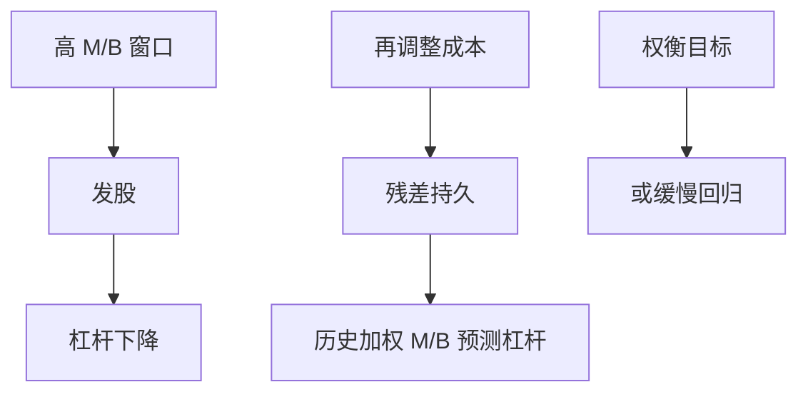

# 市场择时理论

    
若经理认为股权被高估就发股、低估就回购，资本结构可以是历史市值窗口的残差，而不必是朝 $D^\ast$ 调整的结果。

    <footer>—— Baker and Wurgler, Market Timing and Capital Structure, Journal of Finance 2002</footer>

[上一课](/econ/dynamic-tradeoff)把慢调整写成有成本权衡的最优等待。本课缺口是 Baker–Wurgler（2002）：加权的历史市值账面比能预测多年后的杠杆，解释成市场择时留下的持久残差。不重估 $\lambda$，不把行为金融的全部异象搬进公司。

## 问题

优序：被高估才愿意发股（Myers–Majluf 的镜像）。择时：即使没有新项目，只要窗口好也可以发股囤现金或减债。Baker–Wurgler 构造「外部融资加权的过去 M/B」，发现它与未来杠杆负相关且持久，主张资本结构是择时的累积结果。缺口是与动态权衡分手：若只是带内游走，历史 M/B 不应在控制了当前 $D^\ast$ 之后仍长期预测杠杆。若预测成立，要么目标本身被过去窗口移动，要么残差持久到权衡带解释不了。

Welch（2004）强调市值杠杆的机械变化：股价涨则杠杆降，不必有发行。择时理论要的是主动发行/回购对错误定价的反应，不是被动的分母效应。识别课再拆。

## 方法

理论最小结构：经理比市场更接近「基本面」或更乐观/悲观，发行成本在高估时为负（卖贵）。最优是窗口期发股、低估期发债或等。持久性来自再调整成本——于是择时与动态权衡可以叠加：择时决定何时撞哪一条边界，带仍在。Baker–Wurgler 的强版本是：累积择时压过税盾目标，长期看不到回归。

与 [MM](/econ/modigliani-miller)：无摩擦时卖贵买便宜不能增加总价值（谁在对面？）。择时需要非理性对手或分割市场，或经理的错误信念（他们以为能择时）。Tirole：若市场有效，择时不能作为价值来源，只改变切片时机；若无效，现有股东可以从新股东处转移——与 Myers–Majluf 同一转移，符号由高估驱动。

操作：资本预算不要把「现在股价高所以股权成本低」写进 WACC——那是把择时误当成 $r_E$ 下降。正确：若必须发股，柠檬/择时进发行折价（APV），项目 $r_U$ 仍由资产风险决定。Brealey–Myers 反复强调这一点。

## 机制

机制是跨期的财富转移加调整摩擦。高估时发股，新股东买单，旧股东获益，杠杆下降；若回购与发债的反向窗口不对称（经理更愿在高估时发、不愿在低估时回购到目标），残差持久。这与 Fischer 带不同：带的中心仍是税盾；择时强版本的中心被发行史替换。

行为：经理自己可能过度乐观，在高 M/B 时其实是投负 NPV（[FCF](/econ/agency-free-cash-flow)）。择时与代理在「高估值时融资」上观测等价，要看钱是吐出还是浪费。后课治理再拆。

### 不要把市值账面比当成错误定价的充分统计

M/B 含增长期权与风险。高 M/B 企业发股，也可能是优序下投资机会到来。Baker–Wurgler 用加权历史来抓「过去的窗口」，仍可能抓到过去的增长。本课钉逻辑，不裁判回归是否已控制增长。

Alti、Hovakimian 等后续检验发行后的回归速度。课程最后一课会把这类持久性争论写成识别问题。

## 边界

不要把择时写成已经否证 MM：它否证的是「市场有效且经理无法利用窗口」，或「调整成本为零」。税盾仍在。下一课 Miller 均衡：个人税可以在总量上吃掉公司税盾，与择时无关，但同样改变「目标」是否还值得去调。

后课默认：发行窗口可以留下杠杆残差；WACC 不因股价高而下降。动态权衡与择时对「历史是否预测杠杆」预测不同，识别在后。

## 小结

- Baker–Wurgler：杠杆可以是股权窗口的累积残差，而不必紧贴 $D^\ast$。
- 与有成本权衡可叠加；强版本认为残差压过税盾目标。
- 高 M/B 不降低项目 $r_U$；择时进发行价格，不进资产折现率。
- 出处：Baker and Wurgler, *JF* 2002；对照 Welch, *JF* 2004。
