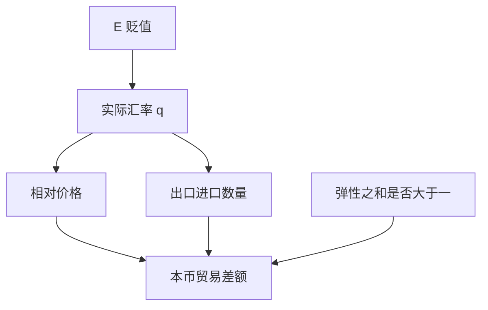

# 马歇尔–勒纳

贬值改善贸易差额，当且仅当进口与出口需求弹性之和足够大；否则相对价格动了，数量跟不上，经常账户可以先恶化。

<footer>—— 据 Marshall, Money, Credit and Commerce；Lerner, The Economics of Control；Robinson, The Foreign Exchanges</footer>

[上一课](/econ/uip-and-cip)把 $i$ 接到 $E$：CIP 是远期复制，UIP 是无抛补期望。资产平价能让 $E$ 立刻跳，却还没有说这一跳会不会改善经常账户。本课缺口是货物市场的弹性条件：马歇尔–勒纳。不重写利率平价，不把贸易弹性做成回归表。

## 问题

开放会计已经给出 $CA\equiv S-I$。蒙代尔装置要把 $NX$ 写成 $q$ 的函数，隐含「贬值改善净出口」。缺口是：以本币计的贸易差额，同时含价格与数量。出口以外币计价时，贬值使单位外币更贵，数量若几乎不动，本币出口收入可以下降。马歇尔、勒纳与罗宾逊把充分条件收成弹性之和。

上一课的 $E$ 来自资产市场。本课问的是同一 $\Delta e$ 在贸易账上的符号，不是再拆 CIP 与 UIP。实证弹性、pass-through 系数一律不在此报。

教学口径：初始贸易平衡、供给完全弹性、只看需求弹性时，$\lvert\eta_X\rvert+\lvert\eta_M\rvert\gt 1$ 则贬值改善 $CA$。罗宾逊把供给弹性与初始差额补进去，条件更苛刻，精神仍是「数量必须够动」。

## 方法

记本币计价的净出口大致为 $P_X X(q)-E P_M^* M(q)$。对 $q$ 求导，在平衡与无穷供给弹性下，符号由出口需求弹性与进口需求弹性之和决定。这就是马歇尔–勒纳。它是比较静态，不是跨期最优：吸收 $C+I+G$ 可以同时变，$CA=S-I$ 仍事后成立。

不完全 pass-through 把 $q$ 与边境价格切开：贬值若未写入进口本币价，数量激励更弱，条件更难满足。本课只标明这一刀，不估 pass-through。

### 资产平价不代替弹性

UIP 决定 $E$ 可以跳多远；马歇尔–勒纳决定这一跳在货物账上是改善还是恶化。两句话分层：上一课是资产，本课是贸易。不要用 Fama 斜率「证明」贬值无效，也不要用贸易弹性「证明」UIP 失败。

## 机制

机制是支出转换对数量的依赖。贬值使外国货物相对更贵，本国可贸易品相对更便宜。若数量几乎刚，价格效应主导：进口更贵、出口本币单价若随 $E$ 掉，差额恶化。若数量充分转向，数量效应压过计价效应，差额改善。罗宾逊强调：供给若也不弹性，数量更难动，同一阈值不够。

长期中性与相对 PPP 仍锚定 $\Delta\ln E$ 的通胀差部分。马歇尔–勒纳是短中期贸易账的局部条件，不是对 PPP 的否证。吸收渠道（贬值经实际余额或收入改 $S-I$）可以与转换渠道同号或反号，恒等不负责拆开。

弹性是局部导数，不是「竞争力评分」。初始逆差很大时，即便弹性过关，本币差额的改善也可以很小——罗宾逊已经把初始位置写进条件。

## 边界

不要把条件写成永远成立的经验事实。低收入弹性、计价货币、分销环节，都会让短窗失败。下一课 [J 曲线](/econ/j-curve)正是：合同与数量粘住时，同一条件在时间上后置。也不要把限价簿外汇订单当成贸易弹性。

后课默认：贬值改善 $CA$ 需要数量弹性够大。蒙代尔把 $NX(q)$ 画成向右下，已经假定本课过关或谈论的是调整完成之后。

数量论与 PPP 管长期名义锚。马歇尔–勒纳管的是 $q$ 变动时贸易账的比较静态，不管货币中性是否成立。

原罪把同一 $\Delta e$ 写成净值税，弹性过关也不保证 $Y$ 改善。本课只钉贸易账符号，不把福利写成弹性之和。CIP 偏离、套息回归见 `/quant/irp`，不要用基差否证马歇尔–勒纳。

计价货币若是美元而不是本币，$q$ 与发票价格可以分开，阈值要用发票弹性来写。那是同一比较静态的币种版，不是限价簿。

## 小结

- 贬值改善经常账户，依赖进出口需求弹性之和足够大。
- 价格效应与数量效应方向可以相反；阈值是比较静态，不是恒等。
- 资产平价决定 $E$ 能否跳；本课决定跳完贸易账的符号。
- 不完全传递与外币计价使短窗更难过关，不改会计恒等。
- 下一课 J 曲线把同一条件放到时间上：数量粘住时先恶化。
- 出处：Marshall, *Money, Credit and Commerce*；Lerner, *The Economics of Control*；Robinson, *The Foreign Exchanges*。
