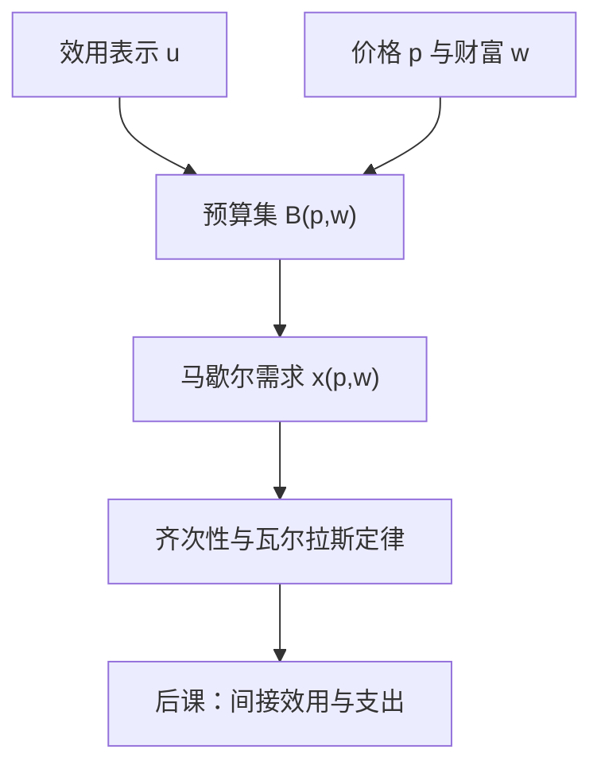

# 预算集与马歇尔需求

消费者问题是：在价格与财富给定的预算集上，选出偏好最大的消费束。

<footer>—— 据 Varian, Microeconomic Analysis；Mas-Colell, Whinston and Green, Microeconomic Theory 第 2–3 章整理</footer>

[上一课](/econ/ces-cobb-douglas)（CES 与 Cobb–Douglas）。给出了连续效用表示 $u$，菜单上的选择可以写成 $\arg\max u$。本课不重讲 Debreu 表示，也不把 $u$ 再定义一遍。缺口是：后课要谈的菜单不是任意闭集，而是由价格向量 $p\gg 0$ 与财富 $w\gt 0$ 切出来的预算集。没有预算，就没有需求作为 $(p,w)$ 的对应，也没有齐次性、瓦尔拉斯定律这些后课对偶要用的恒等式。

## 问题

偏好在 $X$ 上已经排好序。市场却不让人任意取最大元：每件商品有标价，能买的束必须满足 $p\cdot x\le w$。若仍只写「最大元」，对象随菜单变，后课无法对价格求导，也无法把「收入效应」从价格效应里拆出来。缺口因此不是排序，而是把可行集参数化成

$$
B(p,w)=\{x\in X:p\cdot x\le w\},
$$

并定义马歇尔需求 $x(p,w)=\arg\max_{x\in B(p,w)}u(x)$。它一般是对应：无差异时可以集值。后课的间接效用直接吃这个对应的值。

局部非餍足在本课进场。没有它，最优可以落在预算内部，$p\cdot x\lt w$，对偶等式会漏一项。有了它，最优必在边界，$p\cdot x(p,w)=w$，这就是瓦尔拉斯定律。单调偏好蕴含局部非餍足，但本课只钉这条弱条件，不把「多多益善」写成公理清单。

### 需求是对应，不是事先画好的曲线

教科书里的「需求曲线」是把其他价格与 $w$ 冻住、再把某一坐标对自身价格作图。原始对象是 $x(p,w)$。价格刚好使两个束无差异时，对应是一段，曲线垂直。这不是缺陷：上一课已经允许最大元是集合。后课斯勒茨基矩阵在可微的单值分支上写。

量化栏的[限价簿](/quant/lob-structure)假定已经有人在报价。本课的 $p$ 是参数，消费者按 $p$ 取走商品，不在这里形成报价。

## 方法

价格与财富同比例缩放不改变 $B$：$B(\lambda p,\lambda w)=B(p,w)$ 对一切 $\lambda\gt 0$。因此 $x(p,w)$ 零次齐次。这不是偏好的性质，是预算的几何：只比值 $p/w$ 进入问题。选 $w=1$ 的归一化与选一种计价物，后课一般均衡会再用。

内部解且 $u$ 可微时，一阶条件是 $\nabla u(x)=\lambda p$，即边际替代率等于价格比。本课不把 Kuhn–Tucker 再推一遍：它只是「最大元在平滑边界上」的微积分写法。角点解意味着某些商品零消费，一阶条件改成不等式，后课可积性必须允许这种分支。

凸偏好使最优集凸；严格凸使单值。后课多数时候默认单值可微，以便写斯勒茨基方程。本课先承认对应，再把单值当正则情形。

## 机制

齐次性说：通胀若按同一因子抬价并抬名义财富，选择不变。瓦尔拉斯定律说：局部非餍足者把预算花完。两者合在一起，需求落在 $n-1$ 维单纯形上，后课超额需求才能用瓦尔拉斯法则加总。

比较静态的原料已经齐了：可以问 $p_j$ 变时 $x_i$ 怎么动。符号并不由本课决定——自价格可以因收入效应为正，吉芬商品合法。拆开替代与收入，是[斯勒茨基方程](/econ/slutsky-equation)的缺口。本课只提供被拆的对象 $x(p,w)$。

财富 $w$ 在交换经济里来自禀赋 $p\cdot\omega$。本课把 $w$ 当独立参数，是局部的消费者问题；一般均衡再把 $w$ 内生化。

## 边界

需求对应在 $p$ 或 $w$ 趋于边界时可能逃向无穷：某些价格为零且偏好单调，则 $B$ 无界、最大元可以空。后课存在性证明用的是严格正价格与紧化技巧，本课不预支。也不要把马歇尔需求读成「市场上能买到的数量」：那是均衡配置，这里只是一个人的意愿。

显示偏好课会反过来从观测到的 $(p,w,x)$ 恢复关系。本课走的是「偏好 → 需求」这一方向，与上一课「排序 → 最大元」同一朝向，只是菜单换成了预算。

拟线性效用把收入效应赶到计价物上，使其他商品的马歇尔需求几乎等于希克斯需求——那是后课局部均衡常用的刀，不是本课的默认形状。Cobb–Douglas 给出份额恒定的例子，同样只是表示的一种，不是预算几何本身。

后课默认：消费者带着 $x(p,w)$，满足零次齐次与瓦尔拉斯定律。

## 小结

- 预算集 $B(p,w)$ 把菜单参数化；马歇尔需求是其上的 $\arg\max u$。
- 零次齐次来自预算几何；瓦尔拉斯定律来自局部非餍足。
- 需求可以是对应；单值可微是后课分解用的正则情形。
- 替代与收入尚未拆开；对偶函数下一课才定义。
- $p$ 在此是参数，不是限价簿上的报价。
- 出处：Varian, *Microeconomic Analysis*；Mas-Colell, Whinston and Green 第 2–3 章。
