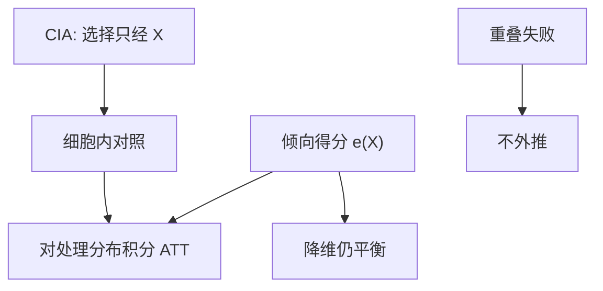

# 匹配与倾向得分

若赋值只通过可观测 $X$ 选择，则在 $X$ 的细胞里比较处理与对照就回到随机化；倾向得分把细胞从高维 $X$ 压成一维概率。

<footer>—— Rosenbaum and Rubin, The Central Role of the Propensity Score, Biometrika 1983；Heckman, Ichimura and Todd, Matching as an Econometric Evaluation Estimator, RES 1998</footer>

[上一课](/econ/synthetic-control)用凸权构造**一个**处理单位的反事实路径。本课缺口是许多单位、处理在截面上选择：匹配与倾向得分。[事件研究](/econ/event-study-econ)下一课把公告窗口写成设计；固定效应更后才把选择收到时不变未观测。本课先假设选择可观测（CIA）。

## 问题

条件独立：$Y(1),Y(0)\perp D\mid X$，再加重叠 $0<P(D=1\mid X)<1$。则在 $X=x$ 的细胞里，处理对照均值差识别 $\mathbb{E}[\tau\mid X=x]$，再对处理组分布积分得 ATT。缺口是维数：$X$ 一多，细胞空。Rosenbaum–Rubin：倾向得分 $e(X)=P(D=1\mid X)$ 是平衡得分，条件于 $e(X)$ 同样有 CIA。于是匹配、分层、加权（IPW）都在 $e(X)$ 上操作。

Heckman–Ichimura–Todd 把匹配写成核：用对照的核加权平均当 $\hat Y_i(0)$。重叠失败时（处理组跑到 $e$ 的尾部无人对照）不要外推——与合成控制的凸包禁令同族。

CIA 不可检验。平衡检验只说明给定 $X$（或 $\hat e$）后，**可观测**的均值接近；未观测选择仍在，那是 OVB，不是匹配能洗掉的。

## 方法

估计 $e(X)$：logit / probit，或后课机器学习。然后：最近邻匹配、核匹配、分层、IPW（Horvitz–Thompson）。Doubly robust：结果回归与倾向加权一个对就一致。报告重叠图、平衡表、共同支撑上的 ATT。不要用处理后再测的 $X$（坏控制）。

标准误要计入 $\hat e$ 的第一步；Abadie–Imbens 对最近邻匹配给出渐近修正。朴素 bootstrap 对离散匹配可能失效。

## 机制

机制是在可观测上重建随机化。倾向得分是降维装置，不是新的识别。识别仍是 CIA + 重叠。IPW 把「对照里稀有的 $X$」放大，方差在尾部爆炸——这是重叠的价格。匹配丢弃无法配对的单位，换外部有效为内部有效。

与 RDD：RDD 只在门槛局部不需要 CIA 对全局 $X$。匹配声称全局（在支撑上）CIA，更强。与 IV：IV 允许未观测选择，换排除约束。三套设计不要混成「我控制了很多所以因果」。

Dehejia–Wahba 用 Lalonde 实验基准演示：实验 ATE 当真理，观测匹配能贴近——前提是 $X$ 足够。换一套 $X$，贴近可以消失。这是敏感性，不是一次胜利。

## 边界

本课不把倾向得分写成机器学习竞赛。不估计未观测选择的 Heckman 两步全文——那是选择模型，识别靠排除，与 CIA 是两条路。下一课事件研究：把公告日附近的累积异常写成设计，仍在可观测选择这一侧。量化栏的配对交易不是本课匹配。

后课默认：匹配 / IPW 的参数是 CIA 支撑上的 ATT 或 ATE；平衡不是识别证明。公告窗的事件研究下一课；未观测时不变异质更后交给 FE。

## 小结

- CIA + 重叠 ⇒ 细胞比较识别条件效应。
- 倾向得分是平衡得分，用来降维，不削弱假设。
- 重叠差则停止外推；IPW 尾部方差大。
- 平衡检验只管可观测。
- 出处：Rosenbaum and Rubin, *Biometrika* 1983；Heckman, Ichimura and Todd, *RES* 1998。
