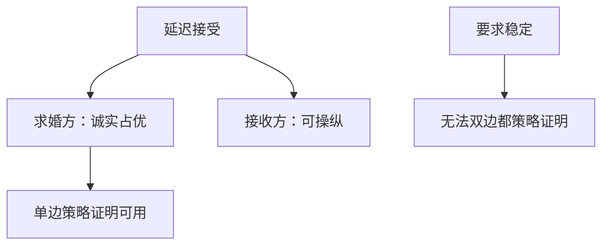

# 策略证明与延迟接受

延迟接受对求婚方是占优策略诚实的；接收方可以靠谎报偏好把匹配挪向对自己更好的稳定点。

<footer>—— Dubins and Freedman, Machiavelli and the Gale–Shapley Algorithm, AMM, 1981；Roth, The Economics of Matching: Stability and Incentives, Mathematics of Operations Research, 1982</footer>

[上一课](/econ/gale-shapley)给出稳定匹配与 DA，并钉了求婚方最优。缺口是偏好为私有时，报名单是不是占优策略。若诚实不是均衡，稳定在纸上、操纵在路上。本课钉单边策略证明与接收方可操纵，不把早期解约、逐级退出写成柠檬，也不把 VCG 的货币转移搬进来。

## 问题

策略证明：每人把真实偏好报给机制是占优策略。DA 对求婚方：无论别人报什么，求婚方按真名单往下求，不会比谎报更好。直觉：对求婚方而言，DA 已经给了他在「所报偏好」下的最优稳定匹配；把名单改差，等于主动丢掉更好的对象，或把阻塞对让给别人。Dubins–Freedman 与 Roth 把这句话写成定理。

接收方不然。接收方在求婚方最优稳定匹配上最差，谎报可以把某次「暂持」改成拒绝，从而迫使算法走到另一稳定匹配，对自己更好。因此：不存在既稳定、又对双方都策略证明的机制——这是双边匹配的不可能，比后课 Gibbard–Satterthwaite 更早、更窄（对象是匹配，不是任意社会选择）。

### 占优策略不是贝叶斯 IC

策略证明要求对任意对手报告都最优，不依赖先验。市场设计常用这一层，因为医院、学生很难共有一个估值分布。贝叶斯 IC 更宽，可以让接收方在期望上诚实，但不是 DA 的性质。

农村医院定理（Roth）：所有稳定匹配中，同一医院的填满名额相同，未被匹配的人也相同。接收方操纵改变的是「和谁配」，不是名额总数——对常满的大医院，操纵空间更在对象质量，不在数量。

一对一严格偏好下，求婚方策略证明是干净的。
多对一里，接收方（学校）即使诚实，名额与捆绑也会另造操纵，本课只钉经典 DA。
可操纵不等于均衡里人人操纵：别人诚实、自己谎报才有利时，才构成对诚实的偏离。

## 方法

对象：有限双边、严格偏好、DA（指定求婚边）。先证求婚方：任何对真偏好的偏离，可用「首次吃亏的对象」把阻塞对引回来，证明不更好。再给接收方一个三人教具：诚实走到求婚方最优，接收方把第二名报到第一之前，可以抓住原本到不了手的对象。最后：稳定 + 双方策略证明 $\Rightarrow$ 矛盾（除非偏好结构退化）。

## 机制

DA 把求婚方变成「按名单消耗拒绝」：他没有「先藏起真爱、等别人被拒再出手」的好处，因为算法已经让他按顺序试完所有更好的。接收方的暂持是路径依赖的：谎报改变拒绝时点，等于选择格上另一端附近的点。稳定作为约束把机制钉在格上；策略证明要把格的两端同时变成占优策略结果，做不到。

与拍卖对照：二价对所有人占优策略诚实，因为有货币把外部性收成价格。匹配没有转移，诚实只能送给一边。要把两边都按住，必须放弃稳定，或引入货币（赋值博弈、VCG 式转移），那是后课机制设计，不是本课的 DA。接收方的操纵空间来自格：诚实把他钉在最差稳定点，谎报等于在格上另选一点。不是所有谎报都有利，但存在偏好轮廓使诚实不是最优反应，故不是占优策略。

稳定作为约束把机制钉在格上；两边同时策略证明会要求格的两端都是占优结果，做不到。
谎报改变的是拒绝时点，从而选择格上另一端附近的点，不是改名额总数。

## 边界

大规模、近似随机偏好时，一个人的操纵收益可以很小（Immorlica–Mahdian、Kojima–Pathak 一类极限），诚实近似成立。这是极限，不是定理被取消。夫妻捆绑、学院配额、转学契约会破坏求婚方策略证明。早期签约、限期承诺（exploding offer）是另一套「在 DA 之前就匹配」，那是市场崩溃的时序，不是 DA 内部的谎报。

后课默认：DA 对求婚方策略证明、对接收方可操纵；稳定与双边策略证明不可兼得。信息课序里的柠檬、信号不改这句话。

### 选哪一边求婚就是选谁被保护

市场设计选住院医师求婚，则医师诚实、医院可操纵。反过来亦然。政策选的是激励保护哪一边，不是算法是否「公平」。没有货币时，这是仅有的杠杆。

Roth 1982 同时证明：不存在稳定且对双方都策略证明的机制。后课 GS 不可能是任意社会选择的版本；本课只在匹配核上。

## 小结

- DA 对求婚方占优策略诚实，对接收方一般不是。
- 稳定与双边策略证明不可兼得。
- 操纵改的是格上的位置，农村医院定理限制名额变化。
- 无转移时，选求婚边即选被保护的一边。
- 出处：Dubins and Freedman, *AMM* 1981；Roth, *Math. Oper. Res.* 1982。
