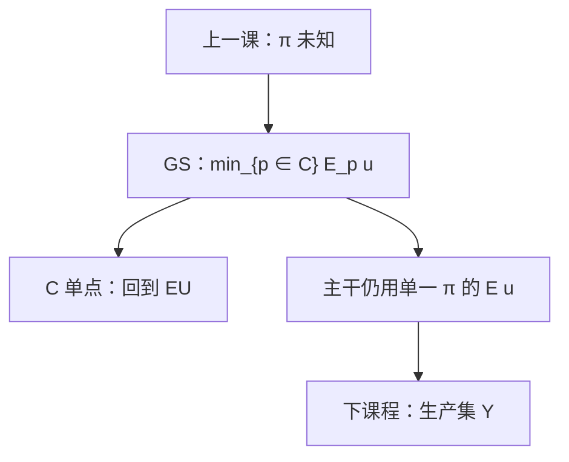

# Maxmin 期望效用

先验不是一个点，而是一组概率。厌恶模糊的人，按这组里最坏的那个期望效用做选择。

<footer>—— 据 Gilboa and Schmeidler, Maxmin Expected Utility with Non-unique Prior, Journal of Mathematical Economics, 1989 整理</footer>

[上一课](/econ/ellsberg-ambiguity)把未知权重与已知 $\pi$ 的风险分开，并声明主干仍用 $\mathbb{E}u$。本课不重做两只罐子，也不把 Borch 再写一遍。缺口是：埃尔斯伯格只给出反例，没有给出替代表示。Gilboa–Schmeidler 用多先验上的最大最小

$$
V(f)=\min_{p\in C}\int u(f)\,\mathrm{d}p
$$

把模糊厌恶收成公理化对象。本课把这条表示钉死，同时再声明一次：后课保险、占优、状态价格、宏观，默认仍走单一 $\pi$ 的期望效用；Maxmin 是已标明的边界，不升格为新主干。

## 问题

上一课指出：若坚持单一主观概率，罐子选择不一致；若放弃，常用弱化是多先验。缺口是写出那条弱化，而不是再描述实验。Gilboa–Schmeidler 在 Anscombe–Aumann 菜单上以**确定性独立**替换独立性，并加上不确定厌恶（凸组合优于端点的混合），得到紧凸先验集 $C\subseteq\Delta(S)$ 与仿射 $u$，使 $V$ 即上式。$C$ 退化为单点时，回到主观期望效用。$C$ 越大，越厌恶模糊。

这与凹性无关：$u$ 仍可凹，风险厌恶在每个 $p$ 内部照旧；$\min$ 额外打击的是先验的未知。不要把 Maxmin 读成「更凹的 $u$」。

### 最坏先验不是 MPS

对 $C$ 取 $\min$，不是在某一客观 $F$ 上做均值保持展开。罐子二没有给出 $F$。把 $C$ 里最散的 $p$ 当成「更大风险」，是偷换对象——上一课已经禁过。本课表示承认：决策者仿佛与敌对的自然对弈，自然从 $C$ 里挑 $p$。规范市场理论不必采用这场对弈。

确定性独立：与确定结果混合时，独立性保留；与不确定行为混合时，独立性放弃。这正是为了容纳埃尔斯伯格，又保住 $u$ 的仿射。

## 方法

工作策略与阿莱课对称：问卷与表示当对照，市场公式默认单一 $\pi$。若某后课改用 Maxmin 或鲁棒控制，必须显式写出 $C$，不能把 $q_s/\pi_s$ 里的 $\pi$ 偷偷换成「最坏 $p$」。检验表示：看是否存在凸 $C$ 使选择等于最坏期望；本课不估计 $C$。

光滑模糊、乘子偏好、变分偏好是同一家族的放松，$\min$ 换成对先验的惩罚。本课只取 GS 的 $\min$，以免把不确定课序写成决策理论综述。下一课程换对象：生产集 $Y$ 没有先验，也不要写成 $C$。

本课不把 Maxmin 引进状态价格。完全市场的 $q$ 默认仍对已知 $\pi$ 记账。也不把 $C$ 写成限价簿上「不确定谁报价」。

## 机制

为何是 $\min$：不确定厌恶公理要求，把两个行为混在一起（对先验更确定）不差于两端。最坏期望对 $C$ 的凸组合是线性的，对行为的混合则偏好凸性，正好匹配。$u$ 仍来自对客观彩票的 vNM；多出来的只是先验集。因此风险厌恶与模糊厌恶可以共存：同一 $u$ 凹，同时 $C$ 不是单点。

对后课的含义不变。规范层：Borch、SOSD、Arrow 价格继续按 $\mathbb{E}u$ 写。描述层：实验室回避未知权重，用 $C$ 记录，不拿来改写 $r_A$。本栏宏观与公司金融走规范层。若要把鲁棒性写进欧拉，那是另课声明，不是本课自动生效。

Gilboa and Schmeidler 1989 针对 Anscombe–Aumann 的主观混合。Savage 风格的纯主观菜单上，多先验表示更绕。引用不要把罐子写成前景理论附录。

## 边界

$C$ 从哪来，公理不说。事后把所有拒绝的 $p$ 塞进 $C$，表示会变得没有限制。市场数据很少识别 $C$，这是主干保留 EU 的经验理由，不是无视公理。Maxmin 对某些信息更新不平滑（最坏先验跳跃），后课贝叶斯学习默认单一先验。

也不要把 Maxmin 当生产技术。厂商课的不确定性若出现，先写成状态依存的 $Y_s$，仍默认 $\pi$。本课把不确定课序收束在对照表示上，不把生产集改写成先验集。

后课默认：工作表示仍是单一 $\pi$ 上的 $\mathbb{E}u$；Gilboa–Schmeidler 是埃尔斯伯格的形式化对照。见到 $\min_{p\in C}$，当作显式偏离主干，不是默认的分担与占优。

## 小结

- 多先验 Maxmin：$V=\min_{p\in C}\mathbb{E}_p u$；确定性独立加不确定厌恶。
- $C$ 单点即主观 EU；模糊厌恶是 $C$ 变大，不是更凹。
- 最坏先验不是 SOSD 的展形；对象是未知权重。
- 主干仍用期望效用；本课只完成上一课未展开的表示。
- 出处：Gilboa and Schmeidler, *Journal of Mathematical Economics*, 1989。
