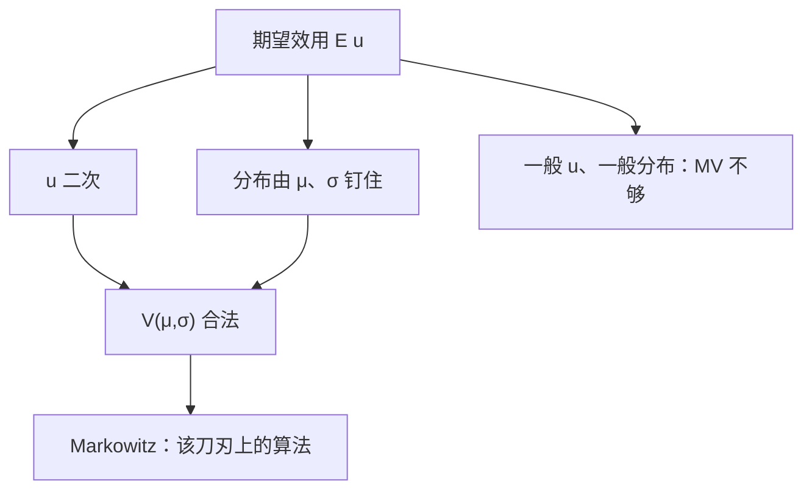

# 均值方差何时等于 EU

    
用均值与方差排序，只在效用是二次、或分布被这两个数字完全钉住时，才与期望效用是同一问题。

    <footer>—— 据 Markowitz, Portfolio Selection, Journal of Finance, 1952；对照 von Neumann–Morgenstern 表示</footer>

[上一课](/econ/background-risk)（背景风险）。钉了 CARA / CRRA / DARA 的形状。本课不重写这些微分方程，也不把 $r_A$ 再定义一遍。缺口是：资产配置文献常把目标直接写成 $V(\mu,\sigma)$。这在一般 $u$ 与一般分布下并不等于 $\mathbb{E}u$。必须标明两条——也几乎只有两条——使均值方差成为期望效用的充分统计，而不是另起一套偏好。

## 问题

vNM 的对象是整条分布。均值与方差是两个数字。若没有额外结构，两个分布可以 $\mu$、$\sigma$ 相同而 $\mathbb{E}u$ 不同，也可以 $\sigma$ 更大但被所有凹 $u$ 喜欢（偏度、支撑作怪）。缺口因此不是「要不要分散」，而是问：何时存在 $V$，使

$$
\mathbb{E}\,u(\tilde w)=V\bigl(\mathbb{E}\tilde w,\mathrm{Var}(\tilde w)\bigr)
$$

对所考虑的菜单成立。答案是刀刃：要么 $u$ 是二次，要么分布族被 $(\mu,\sigma)$ 参数化——正态是最常用的一员。Markowitz 的均值方差分析是这条刀刃上的算法，不是对 EU 的一般改写。本课不写组合实证，不把有效前沿拿去拟合收益。

二次效用 $u(w)=w-bw^2$ 只依赖一、二阶矩，但 $r_A$ 递增且存在餍足，与上一课的 DARA 工作假设冲突。故它是数学特例，不是主干偏好。

### 正态加 CARA 是另一条刀刃，不是二次

若 $\tilde w$ 正态且 $u$ 是 CARA，则 $\mathbb{E}u$ 是 $\mu-\tfrac12\alpha\sigma^2$ 的单调变换。此时均值方差来自分布加形状，不是来自二次。CRRA 加对数正态在乘法冲击上有类似封闭解，但一般加法组合不是椭圆，EU 不能收成 $(\mu,\sigma)$。不要把「正态」写成「任意钟形」。

椭圆分布族（正态是其中一员）使任意凹增的 $u$ 在该族内的排序都是均值方差。族一离开，同一 $u$ 会在偏度上分裂。

## 方法

检验两条路。路一：看 $u$ 是否二次——只对没有餍足区的财富水平、且接受 IARA 时可用。路二：把菜单限制在正态（或椭圆）线性组合上，再选 CARA 或任意只通过 $(\mu,\sigma)$ 进入的 $V$。两条路都是对**对象**加约束，不是对独立性加约束。

若两条都不成立，均值方差可以与 EU 反向。后课[随机占优](/econ/stochastic-dominance)会给出不指定 $u$ 的偏序；方差更小既非 SOSD 的定义，也不是 MPS。本课先把「MV = EU」的许可证钉死，以免后课把 Markowitz 图当成一般风险厌恶。

本课不引入 $\beta$、市场组合或样本协方差。那些是定价课与量化栏的对象。这里只问表示何时塌成两个数字。

## 机制

二次的机制是泰勒在二阶截断且余项恒为零。正态的机制是分布被两个参数穷尽，任意积分 $\mathbb{E}u$ 都是 $(\mu,\sigma)$ 的函数。二者看起来像同一张图，来源不同：一个砍效用，一个砍世界。

与 CARA/CRRA 的接口：CARA+正态给出线性的均值方差权衡，绝对风险需求与财富无关，和上一课一致。CRRA+正态一般没有闭式 $V(\mu,\sigma)$ 作为欧氏均值方差。把幂效用塞进 Markowitz 程序，是偷换了目标。

Markowitz 1952 自己把效用当背景动机，计算走的是 $(\mu,\sigma)$。引用时不要把它写成拒绝 vNM，也不要写成 CAPM 实证。

## 边界

近似：小风险下 Pratt 的局部溢价只用到方差，那是无穷小，不是有限菜单上的表示等式。大风险、偏度、跳跃，MV 排序可以误导。本课把「局部 ≈」与「全局 =」分开。

不完全市场、约束、非交易的劳动收入，会让可交易财富的边际分布不再正态，即使冲击原本是正态。刀刃更窄。也不要把有效前沿画成限价簿上的可成交组合：这里没有报价，只有给定分布族上的选择。

后课随机占优不依赖二次或正态。那是把本课的「两个数字不够」接下去：用整条分布的积分条件说话。

后课默认：均值方差等于 EU，仅当二次效用或（椭圆）分布被 $(\mu,\sigma)$ 参数化；Markowitz 是该特例的算法，不是一般风险偏好。

## 小结

- 一般 $\mathbb{E}u$ 不能收成 $V(\mu,\sigma)$；二次 $u$ 或正态/椭圆族是许可证。
- 二次带来 IARA 与餍足，与 DARA 主干不合。
- CARA+正态是另一条合法刀刃，不等于二次。
- 本课不写组合实证；下一课用不指定 $u$ 的占优处理一般分布。
- 出处：Markowitz, *Journal of Finance*, 1952；von Neumann and Morgenstern, 1944。
