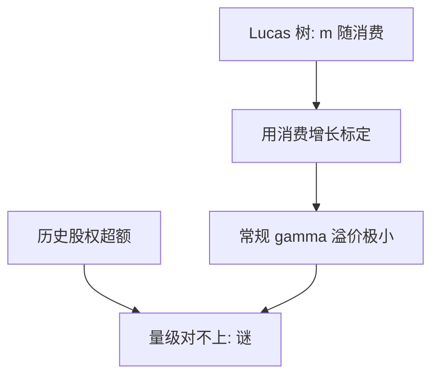

# Mehra–Prescott 股权溢价原文

在 Lucas 树经济里用美国消费增长校准，常规风险厌恶产生的股权溢价只有几个基点量级，与历史超额不在同一档。

<footer>—— Mehra and Prescott, The Equity Premium: A Puzzle, Journal of Monetary Economics, 1985</footer>

附录对照，不插入主干。[上一课](/econ/mp-1994-paper)对照的是搜寻摩擦下的失业流量。本篇对照 **Mehra–Prescott 1985 原文的问题设定**：代表性主体、时间可分 CRRA、用总量消费当禀赋，为何配不出股票对国债的平均超额。主干[股权溢价之谜](/econ/equity-premium-puzzle)已从 Hansen–Jagannathan 界译成偏好语言；这里对照 *JME* 如何把谜写成一篇校准短文，以及它为何不是 DMP 的续篇。

## 问题

Lucas 树已经给出 $m=\beta u'(c_{t+1})/u'(c_t)$。把 $c$ 换成美国人均消费增长的马尔可夫，股票当成对禀赋的要求权，国债近似无风险。Mehra 与 Prescott 问：在 $\gamma$ 落在当时认为可接受的区间时，模型溢价是多少。答案是极小。要把模型溢价抬到历史量级，$\gamma$ 必须大到与微观、与无风险利率一起冲突。缺口是这篇校准的靶子与装置，不是再推 Cauchy–Schwarz。

原文用的是短样本上的消费与收益矩，明确写成 puzzle：不是「再估一个 $\beta$」。Weil 1989 把 $r_f$ 的孪生拒绝补在同一偏好上，是后文；1985 年正文以溢价为主。

Mehra and Prescott, *Journal of Monetary Economics* 15, 1985, 145–161。不要发明 arXiv。不要把这篇写成对有效市场分层的否证：靶子是消费核的特化。

## 方法

两状态马尔可夫消费增长，匹配均值与方差（以及自相关，视标定）。股权是对消费流的要求权，价格由欧拉解出，超额相对无风险债。风险厌恶与时间偏好在网格上扫。常规 $\gamma$（原文讨论的个位数区间）给出的溢价远低于样本均值。技术是校准，不是估计消费 beta 的截面。

主干课已用 HJ 的 $\sigma(m)$ 下界当入口；附录不重推不等式，只对照 1985 年把失败写在一张校准表的精神上——表本身不在附录重排。

## 机制

机制是总量消费太平滑，而股票与消费的协方差被这道平滑封顶。要溢价大，只能把 $\gamma$ 顶上去，使 $m$ 对剩余那一点协方差极敏感。原文把这写成代表性主体完全市场的失败，不是交易摩擦或限价簿。后文的习惯、长期风险、灾难、不完全市场，都是改 $m$ 或改谁的 $c$ 进 $m$，1985 年正文没有提供修补菜单。

与 Mortensen–Pissarides 的对照只在附录链上：都是宏观结构装置。一个是劳动流量，一个是资产定价校准。不要把股权溢价插进搜寻主干，也不要把失业匹配写成消费核。

### 对照主干溢价课，不插入劳动与定价之间

主干[股权溢价之谜](/econ/equity-premium-puzzle)已取「HJ 要求 $\sigma(m)$ 大，CRRA 被 $\sigma(\Delta c)$ 限制」。本附录对照 *JME* 1985：Lucas 树、马尔可夫消费、校准语气、以及谜针对时间序列溢价而非 CAPM 截面。把这篇接在 MP 原文之后只因为宏观附录链如此排，**不插入**主干。因子表与横截面换 [/quant/capm](/quant/capm)，本附录不重跑。

样本起点、生存偏差、事先溢价是否等于事后均值，改变「谜有多大」。原文的定性刺对时间可分总量 CRRA 足够：量级不对。

## 边界

不要把 1985 写成「快买股票因为模型算不出溢价」。它可以是模型错或样本错。也不要把高 $\gamma$ 当成已经接受。主干后课的 Weil、EZ、习惯、长期风险、灾难是修补链；附录停在谜的原文装置。

读完回主干股权溢价课。宏观与货币的论文对照链到此结束。不要把四篇开放–搜寻–溢价原文当成插入主干的连续单元。

截面 CAPM 可以有一个够大的 $\mathrm{E}[R_m]-r_f$，却仍然没有消费解释。1985 年比较的是股票与国债的时间序列差。

习惯、长期风险、灾难、递归效用，是主干里已经写过的修补链。附录不重做 Weil 的 $r_f$ 孪生，只钉 1985 年正文的靶子：溢价量级。读完回主干[股权溢价之谜](/econ/equity-premium-puzzle)，不要从这篇走进量化栏的三因子表。

宏观附录链到此结束。搜寻原文与溢价原文排在一起，只因为对照课程如此排，不是同一条结构模型。

## 小结

- 附录对照 Mehra–Prescott 1985：Lucas 树加总量 CRRA，常规风险厌恶给不出历史股权溢价。
- 谜针对消费核的特化，不是对存在 $m$ 或对信息分层的否证。
- 校准装置是马尔可夫消费增长，不是截面因子工程。
- 因子表与横截面换 [/quant/capm](/quant/capm)，本附录不重跑。
- 读完回主干股权溢价课；宏观附录链到此结束。
- 时间序列溢价与 CAPM 截面不是同一检验。
- 出处：Mehra and Prescott, *JME* 1985。
