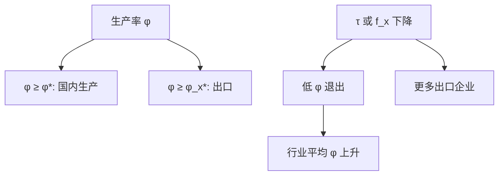

# Melitz 异质企业

固定出口成本面前，只有生产率够高的企业出口；贸易自由化让资源从低生产率企业流向高生产率企业，行业平均生产率上升——这是选择，不只是每家规模变大。

<footer>—— Melitz, The Impact of Trade on Intra-Industry Reallocations and Aggregate Industry Productivity, Econometrica 2003</footer>

[上一课](/econ/krugman-new-trade)在对称企业下给出产业内贸易。本课缺口是现场最硬的事实：出口企业更大、更高效，多数企业不出口。Melitz 把生产率异质与出口固定成本写进同一套 CES。引力下一课把双边流量加总；本课先钉企业选择。

## 问题

企业抽到生产率 $\varphi$，支付固定生产成本。出口另付固定成本 $f_x$ 与冰山 $\tau$。只有 $\varphi\ge\varphi_x^*\gt \varphi^*$（国内存活门槛）的企业出口。开放：出口机会提高利润预期，进入增加，国内门槛 $\varphi^*$ 上升，最低效企业退出。行业加总生产率升。缺口不是再讲 Krugman 品种，而是：贸易的增益有一块来自**组内再配置**，即使没有 HO 的要素再配置。这与[生产函数](/econ/production-function-estimation)估到的厂级 $\omega$ 分布对接：Melitz 把分布的截断当成一般均衡结果。

Melitz–Ottaviano、Bernard–Eaton–Jensen–Kortum 是变体。本课以 2003 年 CES + 帕累托（常用闭式）为最小模型。异质是生产率，不是任意固定效应。

## 方法

自由进入：期望利润（含退出）等于进入沉没成本。两个门槛由零利润与出口零利润定。贸易成本 $\tau$ 或 $f_x$ 下降：$\varphi_x^*$ 降（更多企业出口），$\varphi^*$ 升（国内更卷）。福利：品种、加成（在某些变体）、再配置。对称国家仍可有产业内贸易，但只有一部分企业参与。

与计量：出口固定成本的证据来自稀疏的出口参与、一次出口后的持续。因果设计可以估「关税下降对出口参与」，结构把参与收成 $\varphi_x^*$。两条路，本课是结构机制。

## 机制

机制是选择。固定成本使出口成为离散决策，不是每个 Krugman 企业都出一点。贸易自由化提高竞争（进口品种）同时打开外国市场：对高 $\varphi$ 是机会，对低 $\varphi$ 是淘汰。加总 TFP 升可以与部分企业死亡、部分地区劳动市场阵痛同时发生——后课 China shock 的微观基础之一，但 China shock 还有 HO/SS 的行业维度，不要把 Melitz 当成唯一通道。

与 HO：Melitz 通常一种劳动，分配冲突弱；把技能或地区流动摩擦叠进去，再配置的输家出现在企业与地区层，而不是 $w$ 对 $r$。

帕累托形状参数同时管企业规模分布与贸易弹性，这是方便也是识别风险：宏观贸易弹性与微观销售分布被同一参数锁死。后课 Eaton–Kortum 用另一套极端值。

## 边界

本课不估企业级 $\varphi$ 的新分布。不把多产品企业、质量、网络全部展开。全球价值链后课把「出口」拆成任务。引力把 Melitz 加总成双边方程，下一课。不要用「异质企业」取消李嘉图：技术差仍可写在 $\varphi$ 的分布国别位置上。

后课默认：只有高 $\varphi$ 出口；自由化提高国内门槛、提高加总生产率。对称 Krugman 是 $\varphi$ 退化的特例。再配置增益与地区劳动市场损失可以并存。

## 小结

- 出口固定成本 ⇒ 选择：高生产率企业出口。
- 自由化：低 $\varphi$ 退出，行业平均生产率升。
- 产业内贸易与「多数企业不出口」同时成立。
- 加总 TFP 通道不同于 HO 的要素再配置。
- 出处：Melitz, *Econometrica* 2003。
