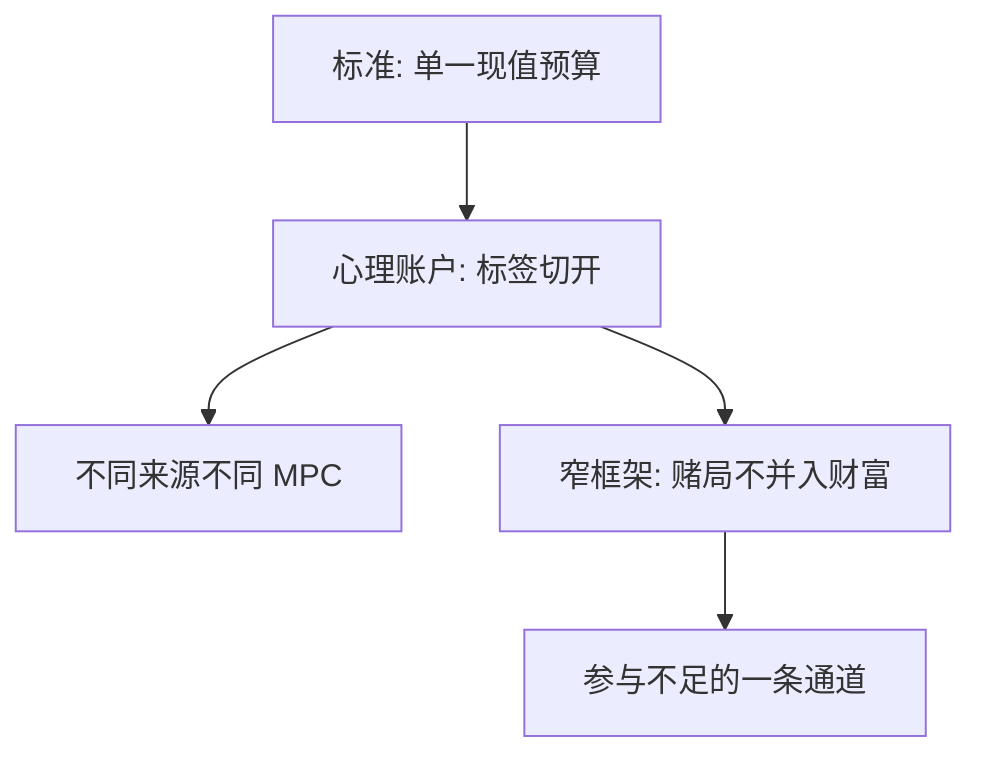

# 心理账户

钱在账户之间不流动：奖金、房价浮盈和工资被标上不同的标签，边际替代被标签切断。

<footer>—— Thaler, Mental Accounting and Consumer Choice, Marketing Science, 1985；Thaler, Journal of Behavioral Decision Making, 1999</footer>

[上一课](/econ/probability-weighting)假定一个前景、一套 $w$。本课缺口是：家庭并不把所有财富并进一个 $w$。Thaler 的心理账户把收入来源、支出类别和结算频率切开。不重写 CPT。

## 问题

标准预算是单一现值约束，见[两期](/econ/two-period-micro)：一元就是一元。现场：退税更容易被花掉，房价浮盈不容易被当成消费（至少在可再融资之前），股票账户与储蓄账户的风险容忍不同。Thaler（1980, 1985）把编辑规则写成账户：当期收入账户、资产账户、未来收入账户，MPC 递减。窄框架（narrow framing）是账户的风险版：每次赌局单独用前景理论评价，而不是并入总财富——Barberis、Huang 与 Thaler 后来用它解释股票参与不足。

缺口是给前景理论加上「哪些结果进同一个 $v$」，而不是再定义 $\lambda$。

沉没成本被账户保留：票已经买了，不去就结算一笔损失。vNM 的财富只看可决策的未来，沉没成本应被忽略。

## 方法

把选择写成：先归入账户，再在账户内用 $v$ 评价，账户之间转移有心理成本。结算频率决定参考点何时重置：一年看一次组合与每天看一次，损失厌恶的打击次数不同——短视损失厌恶的微观零件在此。本课不校准频率。

## 机制

机制是不可替代。标签把可替代的货币变成不可替代的商品。这不是新的商品空间公理，是决策者自己施加的约束，类似被需求的承诺，但动机往往不是老练自我，而是编辑习惯。住房净值进「资产账户」时，服务流仍被消费，资本利得却不进当期 MPC——与上一单元住房课的交易成本叠加，不必二选一。

与[欧拉](/econ/consumption-euler)的冲突是局部的：账户内仍可有平滑，账户间的转移摩擦制造过度敏感的另一种来源，与流动性约束可观测相似。

窄框架是账户在风险上的名字：每次股票下注单独进 $v$，总财富的 $u(c)$ 不来对冲。于是公平的股权溢价在账户内仍被 $\lambda$ 拒绝，参与下降——后课短视损失厌恶把评价频率也变成账户规则。退税、红包、房价浮盈被标上不同标签时，MPC 不同，不是因为现值预算裂了，是编辑规则不许一元等于一元。

## 边界

并非所有分类都是非理性：监督、夫妻分工、企业的成本中心，都有代理理由。识别心理账户要看标签变化而资源不变时选择是否变。本课不把公司资本预算的部门墙写成家庭理论。也不进入簿的账户（清算、保证金），那是量化栏。

后课默认：框架效应是账户与编辑的语言面；同一客观菜单，陈述不同则归入不同账户。

标签把可替代货币变成不可替代商品；一元不再等于一元，是编辑规则，不是预算裂了。

窄框架让每次赌局单独进 $v$，参与不足多一条通道。

## 小结

- 心理账户切断货币可替代性，MPC 随标签变。
- 窄框架让前景理论作用于局部赌局，加重不参与。
- 不重写加权函数；只问哪些结果进入同一个前景。
- 结算频率决定损失厌恶被打击的次数。
- 沉没成本被账户保留，规范模型应忽略。
- 出处：Thaler, 1980, 1985, 1999。
