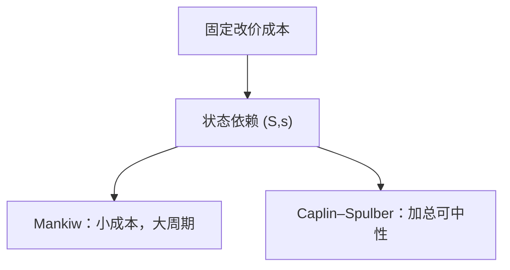

# 菜单成本

改一次价要付固定成本时，厂商按状态决定动不动，而不是按日历抽签；小成本可以放大成大的名义刚性，也可以在加总时互相抵消。

<footer>—— Mankiw, Small Menu Costs and Large Business Cycles, QJE 1985；对照 Caplin and Spulber；Sheshinski and Weiss 的 (S,s)</footer>

[上一课](/econ/calvo-rotemberg)把 NK 的粘性钉成随机改价机会或二次调价成本，并声明菜单成本是状态依赖的第三条，不把 Calvo 日历当真。本课的缺口是把第三条写开：一次总付的改价成本如何给出 $(S,s)$ 带，以及加总时货币可以中性也可以不中性。粘性工资下一课才换对象；NKPC 的斜率更后才收。

## 问题

Calvo 的 $\theta$ 与日期无关：该不该改价，不看你的相对价格偏了多远。菜单成本：只有偏离大到付得起那一笔固定成本才改。Sheshinski–Weiss 把通胀下的最优政策写成 $(S,s)$ 带。Mankiw（1985）：垄断竞争下，私人改价的收益是二阶小，社会成本可以是一阶——于是**小**菜单成本足以阻止改价，放大成宏观周期。Caplin–Spulber（1987）：加总时若厂商均匀铺在带里，货币冲击只改变谁改价、不改变加总价格的响应弹性，货币可以回到中性。缺口是并列这两句，而不是再推 Calvo 的 $\kappa$。

状态依赖：通胀高时改价频率上升，固定 $\theta$ 会高估刚性。这正是 Calvo 课已经承认、却不写进主干线性化的那一条。

## 方法

单家：相对价格落到下界 $s$ 才一次性调到上界 $S$，中间不动。冲击大则立刻改，冲击小则吸收进加成。Mankiw 比较私人激励与社会剩余，说明外部性使刚性过大。Caplin–Spulber 用均匀分布的稳态，使加总价格对货币一对一——选择效应抵消了单家刚性。Golosov–Lucas 以后的定量菜单成本，在大冲击与厚尾下更接近状态依赖的经验。本课不校准那一笔成本。

Rotemberg 的二次成本每期都动一点，没有不动带。菜单成本有不动带，通胀对小冲击不反应、对大冲击跳跃。线性 NKPC 难以同时装下这两种；主干用 Calvo 是为了三方程，不是因为菜单成本被证伪。

### 福利不要和 Calvo 混用

Calvo 的损失含价格离散；菜单成本的损失含改价的真实资源与（未改时的）错误相对价格。把 Mankiw 的「一阶社会成本」直接抄进 Woodford 二次福利，对象不同。本课只钉微观，不改损失函数。

### 二次成本没有不动带

Rotemberg 每期都付一点调价成本，价格连续动，没有 $(S,s)$ 带。菜单成本有带：小冲击被加成吸收，大冲击触发一跳。

线性 NKPC 更像把两种故事平均成一个 $\kappa$。状态依赖的判别是频率是否随冲击变，不是看方程里有没有 $\beta\mathbb{E}\pi$。高通胀样本更像带，低通胀的三方程仍常用 Calvo。

把频率校准成相同，并不能把两种微观焊成一个福利对象。

## 机制

正的货币或需求冲击：靠近上界的厂商立刻改价，深处带内的不动。加总通胀取决于有多少人靠近边界。高通胀时大家都更常碰到边界，频率上升——状态依赖。Mankiw 的放大：垄断者面对的需求曲线使私人损失对小的错误定价不敏感，却让总需求的外部性很大。Caplin–Spulber 的抵消：均匀铺开时，货币只平移分布，加总 $P$ 跟 $M$，实际变量不动。

经验上，改价频率随通胀上升，更像菜单成本而不是固定 $\theta$。宏观线性模型仍常用 Calvo，是因为可加进欧拉与利率规则。后课 NKPC 默认时间依赖；读 $\kappa$ 时要记得状态依赖会让 $\kappa$ 随通胀状态变。

分布若被大冲击打成一簇（大家都靠近同一边界），选择效应不再均匀，Caplin–Spulber 的中性垮掉，货币有真实效应——这正是 Mankiw 放大与加总中性能够共存的条件：小的、打不散分布的冲击近中性，大的或同步的冲击不中性。不要把其中一句当定理、另一句当错误。

Sheshinski–Weiss 的带是通胀稳态下的最优。零稳态通胀时带的形状要重写，不要把高通胀的 $(S,s)$ 直接贴到 NK 的零通胀线性化。

## 边界

本课不估计菜单成本的美元数，不把超市改价当宏观识别。工资下一课可以同样有合同成本，但对象是劳动价格。量化栏的限价改价是微观结构；这里是宏观名义刚性。ZLB、金融摩擦仍不在方程里。

观察「价格多久改一次」不能单独裁定 Calvo 还是菜单成本：频率在两种微观里都可以被校准出来。判别要靠状态依赖——冲击大时频率是否升。本课把这条判别留给经验对照，不在主干里改三方程。高通胀样本更像菜单成本，低通胀的 NK 线性化仍常用 Calvo。

后课默认：状态依赖是 Calvo/Rotemberg 的对照微观；加总中性不是定理，取决于分布。下一课：工资是否比价格更粘，以及这如何拆掉只靠价格粘性的传导。

## 小结

- Calvo 按日历抽签；菜单成本按状态付固定成本。
- Mankiw：小成本可通过外部性放大成大周期。
- Caplin–Spulber：加总选择效应可以使货币中性。
- 改价频率随通胀变，是状态依赖的经验标记。
- 出处：Mankiw, *QJE* 1985；Caplin and Spulber, *QJE* 1987；Sheshinski and Weiss 的 $(S,s)$。
