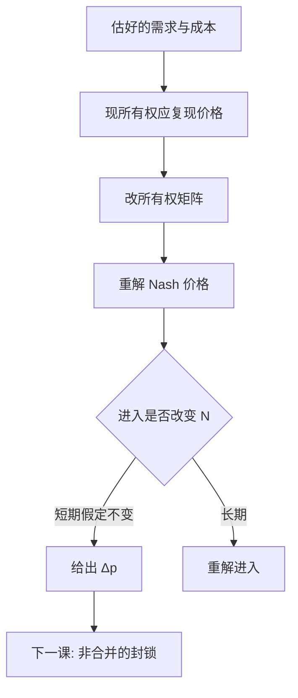

# 合并模拟

把所有权矩阵改一格，在估好的需求与成本上重解 Nash 价格，得到的是这条结构下的反事实加价，不是 $HHI$ 阈值上的行政跳变。

<footer>—— Werden and Froeb 合并模拟传统；Nevo, Mergers with Differentiated Products, 以及 RAND 麦片文的反事实；Farrell and Shapiro 的 UPP；对照 Tirole</footer>

[上一课](/econ/two-sided-pricing-io)要求平台合并重解两边价格。本课把装置写全：水平合并如何从[差异化定价](/econ/differentiated-pricing)的一阶条件走到 $\Delta p$。SCP 用集中度筛案；NEIO 用模拟回答「若这两家变成一家，均衡价格动多少」。后课掠夺与排他处理非合并的策略性封锁；本课只改所有权，不改成本函数以外的博弈规则。

## 问题

两家独立厂商各按 Bertrand–Nash 定价。合并后，交叉弹性对应的销量损失被内部化，两边倾向于涨价；若有边际成本协同，FOC 里的 $c$ 下降，方向相反。净效应是弹性矩阵、所有权、成本协同三者的函数。缺口不是再解释什么是合并，而是：**没有需求系统就没有可加的内部化项；有了需求系统，仍要把进入、产品重新定位和效率声称分开声明。** $HHI$ 增量只在同质 Cournot 一类模型里近似势力变化，差异化下它可以误导。

UPP（Farrell–Shapiro）：用「转移率」近似内部化压力，少解一次完整均衡，适合筛案。完整模拟解新均衡，适合要 $\Delta p$ 与福利的场合。两者都是结构，不是减式回归。

### 模拟不是份额相加

把两家份额加总再套单边勒纳，等于假设合并后仍是单产品垄断面对市场剩余需求，抹掉其他品种的约束，也抹掉多产品内部的重新优化。正确做法是改 $\mathcal{H}$，保持其他厂商的反应函数，重解整条 $p$。平台两边、网络加总，都只是 $\mathcal{H}$ 与 $s(p)$ 的不同形状，算法同构。

Werden–Froeb 强调：模拟的可信度绑在需求 IV 与行为假设（Bertrand 对数量竞争）。弹性估错，反事实价格跟着错——与弱工具是同一病。

## 方法

步骤：(1) 估 $s(p,\xi)$ 与 $c$；(2) 校验：在位所有权下，FOC 应能复现观测价格（否则模型未通过拟合）；(3) 改 $\mathcal{H}$，可选改 $c$；(4) 重解 $p'$，比较消费剩余与利润。进入：若涨价诱使第 $N+1$ 家进来，短期模拟高估伤害——接[进入与沉没](/econ/entry-exit-sunk)。效率：协同必须有可检验的成本矩，不能把 $\Delta p$ 的残差叫成效率。

标准误：反事实是估计量的非线性函数，要用 delta 方法或[bootstrap](/econ/bootstrap-econ)。不要只报一个点的「涨百分之几」。

## 机制

内部化：合并前，A 涨价把销量推向 B，A 不在乎 B 的利润；合并后在乎，A 的有效需求更陡，加价上升。转移率高（近替代）则 UPP 大。成本下降是另一条导数。网络与双边：合并可能把两张网合成一张（效率）同时减少平台竞争（伤害），符号不定，必须两边一起解。这正是第一课 NEIO 相对 SCP 的那句：反事实是算出来的，不是从集中度表里读出来的。

校准式模拟（假定弹性）与估计式模拟（BLP/嵌套 logit）差别在弹性从哪来，FOC 逻辑相同。

Farrell and Shapiro 的 UPP 把「向上定价压力」写成可计算的筛：不必先给完整福利，也能拒绝「价格不变」的零假设。完整模拟仍要做，若筛已经很脏。

## 边界

本课不写申报门槛与救济谈判的法律流程，不提供如何包装效率声称的文本。量化栏并购套利用公告窗，对象是证券价格，不是产品加价，两套事件不要混。合谋、共同所有权（共同基金持股）会改变 $\mathcal{H}$ 的解释，点到为止。下一课：不通过合并、而通过低价或排他改变 $N$ 的策略。

后课默认：水平合并的对象是 $\Delta p$（及福利），来自改 $\mathcal{H}$ 后的均衡，并声明进入与效率假设。

## 小结

- 合并改所有权，内部化交叉弹性，倾向涨价；成本协同反向。
- $HHI$ 不是差异化市场里 $\Delta p$ 的充分统计。
- UPP 是筛，完整模拟是重解均衡。
- 进入与效率必须单独声明，不能塞进残差。
- 出处：Werden and Froeb；Nevo；Farrell and Shapiro；Tirole。
