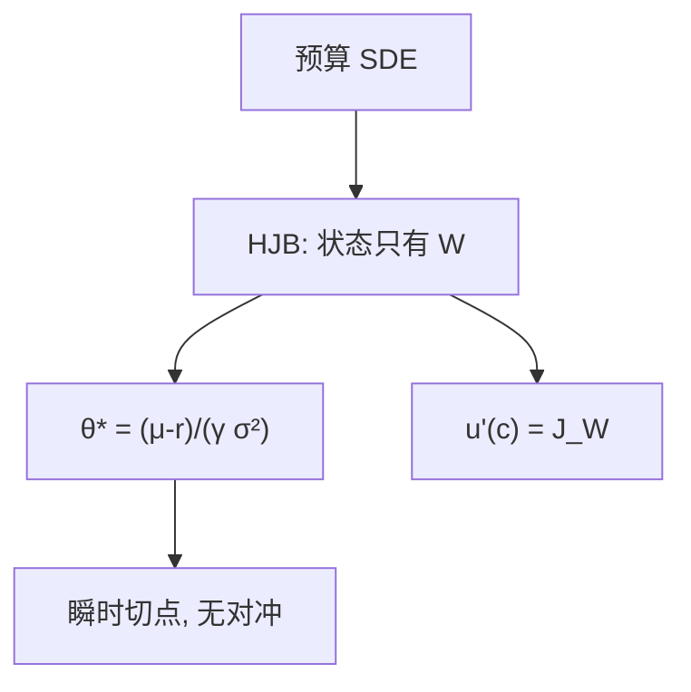

# Merton 组合问题

常投资机会下，最优是瞬时均值–方差切点加消费；权重对财富的比例由风险厌恶钉住，对冲还没有出场。

<footer>—— Merton, Lifetime Portfolio Selection under Uncertainty: the Continuous-Time Case, Review of Economics and Statistics, 1969；JET 1971</footer>

[上一课](/econ/continuous-time-budget)写好了 $\mathrm{d}W$。本课缺口是最优：在常系数 $(\mu,r,\sigma)$ 下选 $(c_t,\theta_t)$ 最大化时间可分期望效用。主干 [ICAPM](/econ/icapm-merton) 已经用过「机会随机则多对冲」；本课先把机会钉死，得到教科书 Merton 权重。不重写 ICAPM 的多 beta，不估计股票债券比例。

## 问题

无限（或有限）生命，$\mathrm{E}\int_0^T e^{-\rho t}u(c_t)\,\mathrm{d}t$（可加遗产）。状态只要 $W$，因为 $(\mu,r,\sigma)$ 不是状态。HJB：值函数 $J(W)$，一阶条件给出

$$
\theta^\ast=\frac{\mu-r}{\gamma(W)\,\sigma^2},\qquad u'(c)=J_W,
$$

其中 $\gamma(W)=-W J_{WW}/J_W$ 为相对风险厌恶（值函数的）。CRRA 时 $\theta$ 为常数、$c$ 与 $W$ 成比例。缺口是：这是连续时间里均值方差切点的精确化——机会确定，不必对冲。后课才把 $r$ 或 $\mu$ 变成状态。

与离散均值方差课对照：那里 MV=EU 需要二次或正态；这里扩散加时间可分，瞬时问题就是 MV，伊藤把高阶瞬间变成 $\mathrm{d}t$ 的高阶无穷小。许可证来自连续时间装置，不是二次效用。

Merton, *REStat* 1969；*JET* 1971。CARA 对财富的绝对需求，CRRA 对比例需求。本课以 CRRA 为工作形状，与主干偏好课一致。

## 方法

HJB 对 $\theta,c$ 点态最大化，把预算的漂移与扩散代入生成元。包络：$J_W$ 是财富的影子价格，消费欧拉是 $u'(c)$ 沿最优财富的伊藤过程为鞅（差折现）。组合的一阶是「超额回报对边际效用的协方差」瞬时版——与 [SDF](/econ/stochastic-discount-factor) 的 $0=\mathrm{E}[m R^e]$ 同一句话，测度换成无穷小。

完全市场：一个布朗、一个风险资产，任意终端消费可复制，个人问题良定。不完全：$\theta$ 张不成所有暴露，HJB 仍可写，但达不到第一优——定价界后课。

## 机制

机制是瞬时切点与消费分离。机会确定时，财富是唯一状态，组合只为了这瞬间的均值方差（对 $J$ 而言），消费只为了摊平 $u'(c)$ 与 $J_W$。两基金：无风险加切点基金。加总若人人同此且同质信念，市场即切点——下一课连续时间 CAPM。本课还不出清，只单人。

$\gamma$ 若随 $W$ 变（非 CRRA），$\theta$ 随财富变，加总困难——Gorman 加总在连续时间同样刀刃。工作模型常用 CRRA 正是为了比例需求。

有限生命的确定性等价仍比例于 $W$（CRRA），但消费率随剩余寿命变。无限生命更干净：政策平稳。

## 边界

不要把 $\theta^\ast$ 写成「股票配置 60%」的建议。$(\mu,\sigma)$ 不是本栏估计对象。下一课打开机会集：状态 $z$ 进入 $J(W,z)$，一阶条件多出 $J_{Wz}$ 项——对冲需求的来源。ICAPM 主干已经报过结果；后课写来源，不重写截面。

后课默认：常机会下 Merton 权重是瞬时切点，消费由 $J_W$ 给出。无对冲项。CRRA 使 $\theta$ 为常数。这是组合理论，不是 CAPM 实证。

## 小结

- 常 $(\mu,r,\sigma)$：$\theta^\ast=(\mu-r)/(\gamma\sigma^2)$，$u'(c)=J_W$。
- 瞬时问题是均值方差，因为扩散把更高阶变成 $o(\mathrm{d}t)$。
- 尚未出清，尚未对冲；两基金只在单人问题里。
- 出处：Merton, *REStat* 1969；*JET* 1971。
