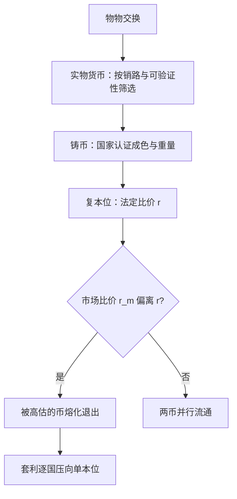
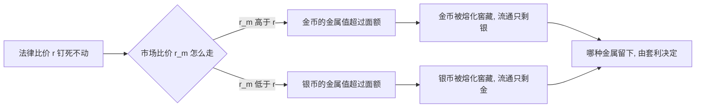

# 实物货币到金属本位

铸币省下的从来不是金属，而是逐笔检验金属的成本；金属本位的全部历史，就是把「这枚币按面额照收」这份承诺做实的历史。

<footer>—— 据 Sargent and Velde, The Big Problem of Small Change, 2002；Redish, Bimetallism, 2000 整理</footer>

[上一课](/econ/ed2-map)把教育经济学收束：平均对边际、代理对产出、个体对均衡三条口径各有证据闭环，认知技能的差距换算成长期增长率差。本课是「货币史对照」的第一课，往回退一步：货币——这个在历次危机与超通胀中被反复冲击的对象——本身从哪来。已写好的[货币层次与支付](/econ/money-as-medium)假定货币单位已经在那里；本课程要追的是这个单位如何被造出、拴住、又如何被反复挣断。后课默认已经读完本课。

## 问题

物物交换要求需求的双向耦合：我有麦、要布，你得同时有布、要麦。出路是把某一种商品立为一般等价物，所有人都接受它，双向耦合拆成两次单向交换。但哪种商品能当此任不靠法令：只有当「别人也会接受它」成为普遍预期时，接受才理性。实物货币因此是被筛选出来的，不是被发明的。

「需求的双向耦合」翻译成大白话就是教科书说的「需求双重巧合」：我得恰好想要你手里的东西，你也恰好想要我手里的，交换才成。一般等价物的功劳是把这个苛刻条件拆成两步——先把麦子换成大家都收的媒介，再用媒介换布，谁都不必撞上第二个巧合。

筛选的维度是销路、耐久、可分与**可验证**。前三条是物理属性，第四条最贵：金属要验真伪、称重量、看成色，每笔都做一遍，媒介的好处就被吃掉。缺口因此不是「找到好商品」，而是把验证成本从每一笔交易里拿掉。

### 铸币与法定比价

铸币的解法是国家把成色与重量一次认证进去，交易只认面额。吕底亚公元前 7 世纪的琥珀金币是这层认证的早期标本。但认证制造了新问题：一旦按面额交易，面额与含量的缝隙就成了两个入口——铸造者偷走它（减色），商人按金属价值把好币熔化出口。复本位把这条缝隙制度化：金币与银币同时流通，法律定下兑换比价。

「劣币驱逐良币」有前提：只有当两种币被法定比价钉在同一面额时才成立。市场比价浮动时，良币只是涨价，不会消失；定律描述的是套利在法定比价下的单边出口，不是人性定律。

## 方法

把本位的演化写成一道套利条件。设法律比价为 $r$：一枚金币法定兑换 $r$ 枚银币；市场比价为 $r_m$。若 $r_m \gt r$，金币的金属比面额值钱，金币被熔化、窖藏或出口，流通里只剩银币；反之银币退出。复本位因此内嵌一枚单边扳机：只要市场比价漂离法定比价，一种金属必然离开流通。法国 1803 年把 $r$ 定在 15.5，美国 1792 年定 15——都用固定的法律数字对冲浮动的市场数字。

数字实例：法定比价 15.5，即一枚金币按面额兑 15.5 枚银币。若市场比价漂到 16，把金币熔成金属在市场上能换回相当于 16 枚银币的东西，比按面额多赚半枚——金币于是被熔化出口，流通只剩银币；反向漂到 15，退出的就是银币。法定数字不动、市场数字在动，扳机自己会扣。

制度回应只有两条路：定期重定 $r$（每次都像一场征税），或放弃一种金属改行单本位。历史大多走第二条路。1870 年代德国改行金本位抛出白银，银价下坠，拉大市场比价与法定比价的裂缝；拉丁货币同盟 1874 年起限制银币自由铸造，1878 年停铸。复本位让位于金本位，不是某次国际会议的决议，而是套利条件逐国压出来的残渣。

## 机制

机制一是认证替代检验：国家把验证成本集中到铸币厂一次完成，交易面额化。代价是铸造者自己也从缝隙里取收入（铸币税）与可推卸的减色诱惑——16 世纪的法国与英国都反复用过，减色立刻推高物价，是最古老的通胀机制。机制二是套利执行淘汰：法定比价不动、市场比价在动，「哪种金属留下」的决定权在市场手里，不在立法者手里。把 1870 年代的金本位化当成强国的会议产物，就解释不了主动选白银的美国也留不住复本位——门槛不是意志，是套利。

铸币税的直白版：你交来值 100 文的银子，国家铸成面额 105 文的币还给你，多出的 5 文就是铸币税——它是把「认证」变成收入的权力，也是偷偷减色的诱惑源头。可以想象成今天的食品质量认证：不是每位顾客都学会化验，而是把检验集中给一个盖章机构，面额即免检通行证。

## 边界

本课只到金属本位如何胜出：金本位的运转是第三课，减色与纸币的财政机制在第四、五课，银行发券属于下一课。也不把实物货币浪漫化为自发生成的完美制度：它的供给由金属产量外生决定，19 世纪中叶加州与南非的矿脉几乎重写了欧洲的货币环境——「供给不归人管」既是金本位可信性的来源，也是它日后崩溃的伏笔。

后课默认：谈任何「本位」，先问三件事——兑换承诺写给谁、认证由谁做、比价是否法定。

## 小结

- 实物货币是去中心化均衡里被普遍接受的筛选结果，先于国家。
- 铸币用认证换走逐笔检验；面额与含量的缝隙是减色与铸币税的共同入口。
- 复本位内嵌单边扳机：法定比价不动、市场比价在动，一种金属必被熔化退出。
- 1870 年代的金本位化是套利逐国压出的结果，不是会议设计。
- 出处：Kiyotaki and Wright 1989；Sargent and Velde 2002；Redish 2000。
