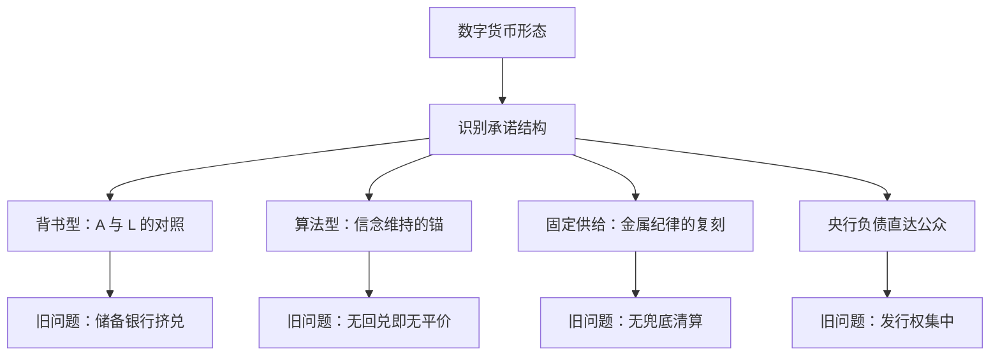
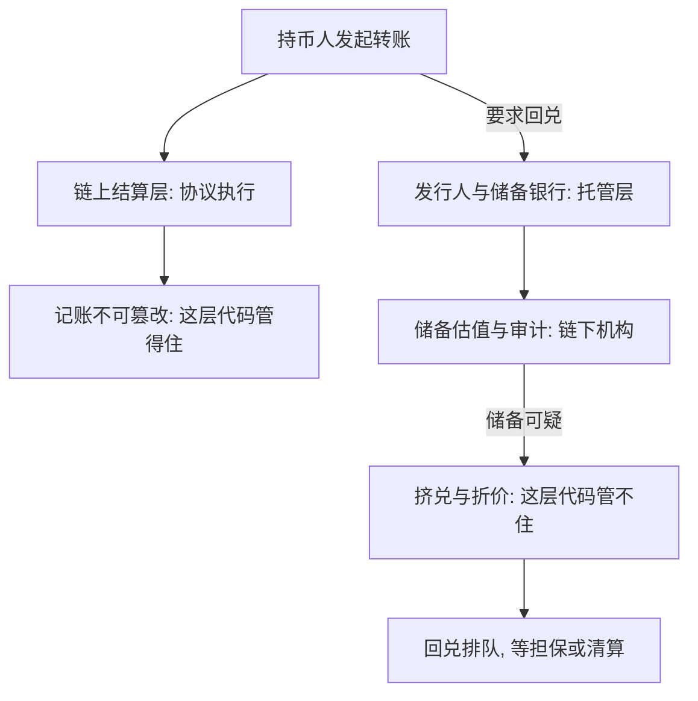

# 数字货币的历史对照

每一种新货币制度都会被旧问题追上：谁来兑现、谁来清算、停兑日谁说了算。代码只是把这三个问题的答案执行得更快。

<footer>—— 据 Fama 1980；Diamond and Dybvig 1983 整理</footer>

[上一课](/econ/mh-monetary-union)写了联盟如何用平价锁定托管成员的财政纪律；本课处理最新也最常被宣称「超越历史」的形态：加密资产与 CBDC。技术机制与货币理论已有[数字货币的理论](/econ/mt-digital-currency-theory)与[CBDC](/econ/cbdc)专课；本课不碰共识算法，只做一件事——把每种数字形态按承诺结构放回货币史的坐标系，看旧问题从哪里追上来。检验表是第一、二课留下的：兑换承诺写给谁、清算与认证由谁做、停兑日谁说了算。

## 问题

数字形态的卖点是摆脱历史：算法代替锚、分布式账本代替清算所、固定规则代替央行裁量。缺口在于，货币史给出的三个恒久问题并没有被消灭，只是换了落点。结算层（协议）与托管层（发行人、交易所、储备银行）在数字形态里是分开的；历史教训几乎全部落在托管层，因为回兑、审计、清算这些动作照旧发生在链下的机构和合同里。挤兑的微观结构就是[Diamond–Dybvig 挤兑](/econ/diamond-dybvig)那一套，只是柜台换了位置。

术语翻译：结算层就是「记录谁转给谁、这笔转账是否有效」的账本与规则，在数字货币里是一套协议代码；托管层是「替你拿着真东西、负责兑现」的机构，如发行人、交易所、储备银行。老挤兑从不打账本，打的是那个拿东西的柜台——链上账本再稳，也替链下托管人还不了钱。

2023 年 3 月，储备中有 33 亿美元存于硅谷银行的 USDC 一度跌到约 0.88 美元，两天后随存款担保恢复平价：挤兑的对象是储备银行，链上结算救不了链下托管。这几乎是 1837 年美国银行券停兑的链上重演。

## 方法

把四种数字形态逐一对照。资产背书型稳定币：全额储备加一比一兑付承诺，结构上就是自由银行时代的私人银行券；平价条件是储备价值 $A_t$ 不低于负债 $L_t$，市场一旦怀疑 $A_t \lt L_t$，折价立即重演券的信用利差。算法稳定币：无足额准备，锚靠套利者用增发券吸收卖压的信念维持，即 $E_t[p_{t+1}]\ge 1$ 必须是共同知识；信念一撤，没有回兑抵押兜底——Terra/UST 在 2022 年 5 月从 1 美元跌到几美分，是第二课「没有回兑就没有平价」的实验重现。比特币：固定供给计划是第一课金本位供给纪律的复刻，「供给不归人管」原样保留；差别在金本位有清算网络与央行合作补位，而链上没有最后贷款人，FTX 这类交易所是新的野猫银行——挤兑对象是托管层，不是协议。CBDC：央行负债直达公众，是发钞权集中化谱系的最新一站；美国 1865 年对州银行券征收 10% 的税，用财政手段把私人券挤出流通——发行权的集中曾经靠税完成过一次。

数字实例：设稳定币负债 100 亿美元、储备跌到 94 亿，持币人预期回兑只能按比例拿回，币价便跌向 0.94 附近——折价本身就是 $A_t \lt L_t$ 的实时报价。反过来，只要储备足额、回兑通畅，套利者会以 0.99 买入换回 1 美元，把价格顶回平价：平价不是宣传出来的，是套利与回兑撑出来的。

## 机制

机制是认证逻辑的迁移。第一课说铸币用国家认证换走逐笔检验；「代码即法律」用协议认证规则，做的是同一件事——把验证成本集中。但铸币史同样提醒：认证只保护成色，不保护财政，也不保护托管人。代码保证的是协议层的规则执行，储备的估值、审计与兑付仍在人的机构手里。不这么做会错在哪：把币价崩溃当成史无前例，就重演野猫叙事的误诊——先把储备和回兑查一遍，再谈叙事；反过来，把「历史对照」当成否定一切的判词也不对，CBDC 恰恰是历史上发钞权集中这一主线的延续，而不是反常。

常见误区：初学者容易把「代码即法律」听成「代码保证币值」。实际上代码只保证协议内的执行——转账不可篡改、规则不可绕过；币值取决于储备是否足额、回兑是否通畅，全在链下的合同与机构手里。协议没出过错而持币人照样亏钱的案例，历史上几乎全是托管层出的事。

## 边界

本课不写共识机制、账户模型与跨链桥的技术风险；CBDC 对商业银行与利率走廊的影响归[数字货币的理论](/econ/mt-digital-currency-theory)与[CBDC](/econ/cbdc)，数字形态上的银行挤兑理论归[银行挤兑的现代理论](/econ/bm-modern-runs)。本课的对照表也不构成预测：坐标系的用处是定位问题，不是断言结局——这正是整门课程用历史做对照而不是做算命的口径。

后课默认：拿到任何新货币形态，先填检验表三问，再谈创新。

## 小结

- 结算层与托管层分离是数字形态的新结构；旧问题落在托管层。
- 背书型稳定币是私人银行券的链上复刻，平价由储备估值与回兑维持。
- 算法锚是信念，不是承诺；固定供给复刻金属纪律，同时复刻「无兜底」。
- CBDC 是发钞权集中谱系的延续；上一次集中靠的是对私人券征税。
- 出处：Fama 1980；Diamond and Dybvig 1983；Selgin 1988；据 2022–2023 年公开市场事件整理。
