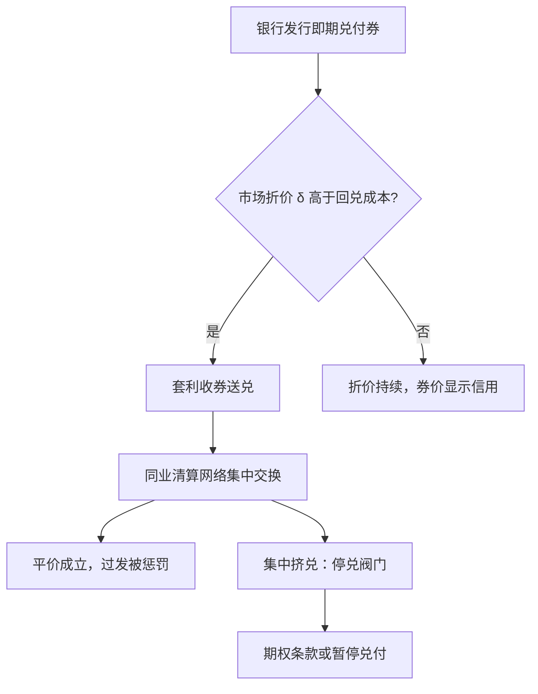
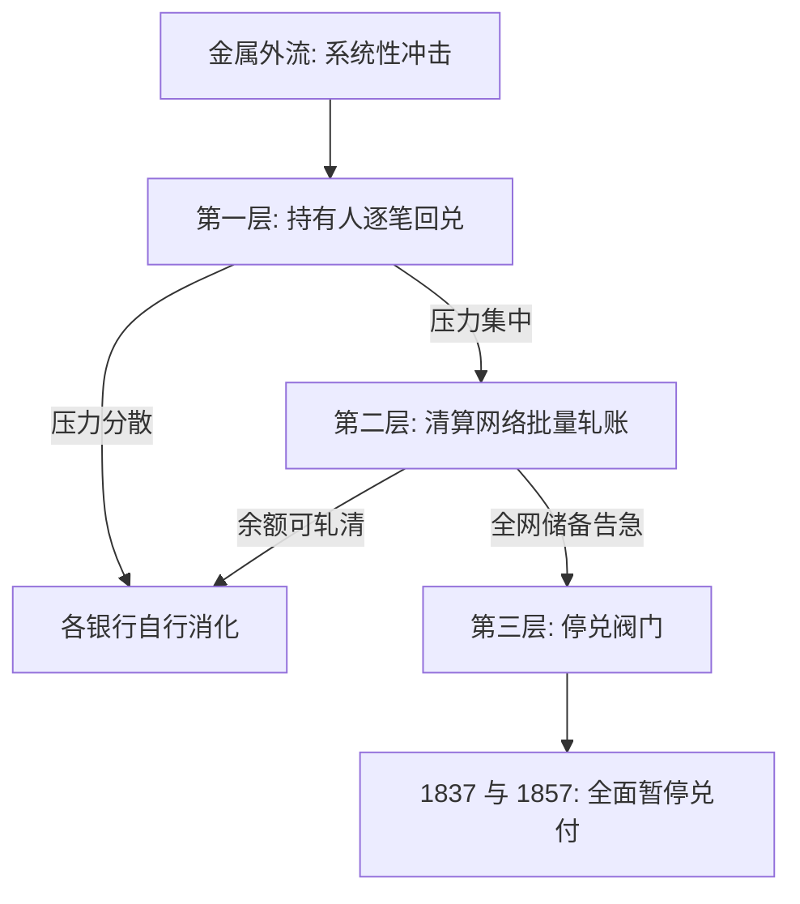

# 自由银行时代

银行券的纪律不在发钞者的誓言里，而在持有人每天把它送回柜台兑现的那个动作里；没有回兑，誓言只是印刷品。

<footer>—— 据 Selgin, The Theory of Free Banking, 1988；Rolnick and Weber 1983 整理</footer>

[上一课](/econ/mh-commodity-money)把金属本位的胜出写成套利压出的结果：国家认证面额，交易按面额走。缺口随即出现：银行把自己发行的券放进流通，承诺随时兑回金属——这套私人的面额承诺凭什么被人按平价收下？19 世纪的「自由银行」实验给了几组对照样本。本课程考察发钞的纪律如何自下而上地长出来，又在哪里失效。挤兑的微观理论已由[Diamond–Dybvig 挤兑](/econ/diamond-dybvig)给出；本课看它在没有央行兜底的年代如何被制度性压制。

## 问题

银行券是银行的即期负债，持有人可按面额兑金银。竞争发钞的核心问题是纪律：过发的银行券会回流到发行行兑现，储备耗尽即破产；但每家银行都希望别家节制、自己多发。缺口是找到一种安排，让「过发」在变成危机之前就被价格或清算机制惩罚。

术语翻译：银行券就是银行自己印的「欠条」，「即期负债」意思是持有人今天拿来、银行今天就得付金银，不能拖欠。所以过发欠条等于给自己埋雷——欠条流出去多少，理论上就有多少可以随时涌回柜台要钱，储备一空即破产。

纪律的候选答案有三种：持有人逐笔回兑、同业清算网络、以及合同条款本身。三者分别对应三种成本：持有人的检验成本、清算的运营成本、以及条款对挤兑的处理能力。没有央行、没有存款保险的年代，这三条线就是全部防线。

### 三组样本

苏格兰（1716–1845）：几家大银行竞争发钞，票据每天交换、按面额清算，Adam Smith 记述其稳健。美国 1837–1863：州立法下进入自由，但银行券须以州债券存押于州审计官，所谓「自由」是进入自由而非无约束。加拿大：特许银行分支制，破产极少。

苏格兰银行 1730–1765 年使用「期权条款」：银行可把兑付推迟六个月，逾期按年息 5% 计息。它把挤兑的时点成本写进合同，让只有真流动性担忧的人才提前回兑；1765 年被议会禁掉，Smith 在 1776 年已记述其运作。

## 方法

把「券为什么按面额值钱」写成一道逐日套利。设券面额为 $1$，市场折价为 $\delta$，回兑成本为 $c$。只要 $\delta \gt c$，套利者收券、送兑、赚取差价，折价被压回 $c$ 以内。清算网络把 $c$ 压到接近零：波士顿的 Suffolk 系统（1825 年起）把乡村银行券集中交换，逼发行行备足金属，否则直接拒绝其券进入网络——平价从法令问题变成网络准入问题。

数字实例：某州银行券市价 0.97，回兑的运费与工钱合计约 1 分，即 $c=0.01$。套利者花 97 分收券、送柜台兑回 100 分金属，每张净赚约 2 分；只要差价还在，收券送兑的人络绎不绝，折价就被压回 1 分以内——平价不必法令维持，利润动机自己干活。

失败案例同样要写成机制。美国「野猫银行」的传统叙事说银行故意远遁荒野逃避兑付；Rolnick 与 Weber 重检数据后发现，印第安纳、明尼苏达等州的银行失败主要由存押债券跌价驱动——银行券充足率没问题，是担保品没了。担保品机制比「跑路」解释了更多破产。

## 机制

机制是折价作为信用利差的实时显示：一张券的市价就是发行行的违约概率乘以损失率，清算网络让这个信号每天被发现并执行。它不依赖任何人对银行的善意，也不需要央行设定利率。三个层次咬合：持有人回兑是边缘约束，清算网络是批量执行，停兑是最后阀门——1837 与 1857 年美国两度全面停兑，说明前两层在系统性的金属外流面前确实会失守。

不这么做会错在哪：把纪律寄托在发钞银行的声誉上，就解释不了边远地区折价长期偏大——声誉只覆盖监督得到的地方；把破产全归咎过发，就重演了野猫叙事对债券贬值的误诊。合约设计（期权条款）能删除挤兑均衡，但它保护的是兑付时点，不保护资不抵债。

常见误区：初学者容易以为自由银行等于「想怎么印就怎么印」，实际上约束从四面八方来——持有人天天回兑、清算网络可以拒绝你的券进入交换、存押的担保品还可能自己跌价。样本里银行破产的大头不是乱印，而是担保品贬值：看自由银行要看约束是否真实，不看名义上有没有监管。

## 边界

本课不评价自由银行是否整体优于央行制：苏格兰样本小、仍在金面额约束之下，美国样本又混着债券存押这种自设的担保品扭曲，对照要小心归因。国家券取代私人券的历史（美国的国民银行券与对州券征税）留给第七课。停兑时的政府介入算不算「最早的最后贷款人实践」，已有[最后贷款人](/econ/bm-lender-of-last-resort)一课专论，此处不展开。

后课默认：谈「可兑换」三个字，要能说出兑换由谁执行、折价由谁发现、挤兑由哪一条款吸收。

## 小结

- 银行券的平价不是法令给的，是回兑套利加清算网络每天重新挣出来的。
- 券的折价是发行行信用利差的实时报价；清算把检验成本压到套利可行。
- 野猫叙事被数据修正：债券存押贬值解释的破产远多于跑路。
- 期权条款把挤兑时点成本写进合同，是删除坏均衡的民间方案。
- 出处：Smith 1776；Selgin 1988；Rolnick and Weber 1983；Dowd 1992。
