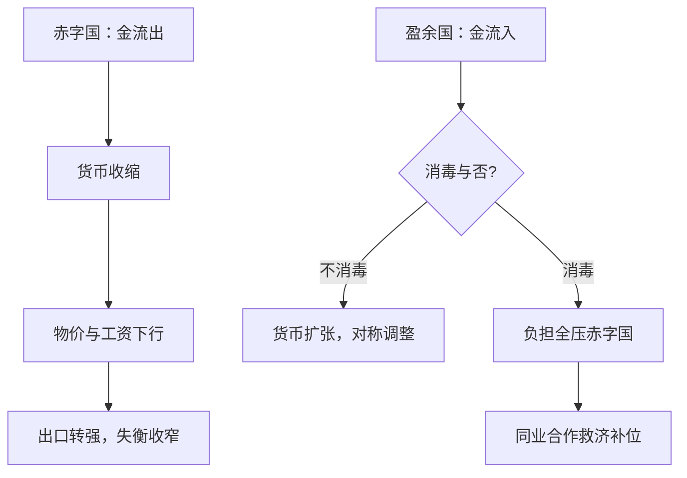

# 金本位的运作

金本位的约束从不在黄金本身，而在各国政府愿意一次次把国内政策交给兑换承诺；规则是承诺的规则，黄金只是记账的秤。

<footer>—— 据 Bordo and Kydland 1995；Bloomfield 1959 整理</footer>

[上一课](/econ/mh-free-banking)把银行券的平价写成回兑套利与清算网络逐日挣出的结果，但「兑换到什么」仍缺一个跨国的共同锚。古典金本位（约 1870–1914）把这个锚配齐：各国货币都承诺兑金，彼此的比价就自动定了。主干已有[金本位与大萧条](/econ/gold-standard-depression)讲它如何把一国通缩输出成全球萧条；本课只写它平时怎么运转，后课默认已经读完本课。

## 问题

几十种银行券与存款各自承诺兑金，两国货币之间的汇率凭什么稳定？国际收支失衡发生后，调整由谁执行、负担落在谁头上？还有可信性：承诺兑金的国家每天都有动机少兑一点——凭什么相信它不？

三个问题的答案共享同一个装置：铸币平价。每国把本币单位定义为固定重量的金，两国货币的比价就是两个含金量之比。缺口在于把「定义为多少」变成「永远兑到多少」的机制——这需要套利、需要规则、也需要政府克制。

### 金点：物理写成的汇率走廊

设美元–英镑平价为 $\bar e$，运金到对方的成本率为 $c$，则汇率被钉在
$$\bar e(1-c) \;\le\; e_t \;\le\; \bar e(1+c).$$
带内汇率自由浮动，由外汇供需决定；一旦越界，运金比付汇便宜，套利者自己动手把汇率推回带内。带宽由运费、保险与利息决定，是物理参数写出的走廊。

美元–英镑平价 $\$4.8665$，黄金输出点约 $\$4.89$、输入点约 $\$4.85$，带宽不足半个百分点。带内看不出金本位的存在，越界的瞬间它以一箱金币的形态出现。

## 方法

调整机制来自休谟：赤字国金流出，货币与信贷收缩，物价与工资下行，出口重新变得便宜，失衡自动收窄；盈余国反向。这就是「游戏规则」：两国对称地让黄金流量驱动国内货币量。纪律与调整是同一枚硬币——正因为政府不消毒，承诺才可信。

但实际执行不对称。Bloomfield 对 1880–1914 央行记录的重检发现，各国经常消毒金流动、保护国内信贷，赤字国被迫紧缩而盈余国可以袖手。于是承诺的重量几乎全压在赤字国与它们的债务人身上。制度史对此的回应是合作：1890 年巴林危机，英格兰银行联合法兰西银行与俄国国库的借款额度救市——锚能维持，部分靠这套临时性的同业救济。

承诺本身另有一层设计：Bordo 与 Kydland 指出，战时停兑并不毁掉信誉，因为规则里写着「战后按旧平价重返」；政府遵守的是规则而不是每一天的兑换。金本位于是像一条有豁免条款的合同——豁免被消费，条款却存续。

## 机制

机制一是套利把汇率问题消解为运费问题：央行不需要买卖外汇维持平价，黄金点自己执行，这解释了为什么古典金本位下外汇干预罕见。机制二是承诺的可信性由对称调整买单：正因为紧缩真的会发生，兑换承诺才不是空头支票——这也把调整的政治成本写进了制度。不这么做会错在哪：只看「金本位稳定了汇率」，就看不见稳定由谁的失业与通缩支付；消毒与不对称执行正是它在 1930 年代崩溃时被反噬的内伤，那段见[金本位与大萧条](/econ/gold-standard-depression)。

## 边界

本课不写战时停兑与战后复本位的财政逻辑，那是下一课；也不写崩溃与浮动，金本位与大萧条、[布雷顿森林与崩溃](/econ/bretton-woods-collapse)已各司其职。金本位下没有相机选择的货币政策，物价长期由金矿供给决定——1890 年代南非与阿拉斯加的金脉如同一次外生宽松，这个「供给不归人管」的承袭来自第一课。它与现代的汇率制度谱系如何对位，见[汇率制度](/econ/exchange-regimes)。

后课默认：「本位」意味着平价、金点与调整负担三者同时在场，缺一个就不叫本位。

## 小结

- 铸币平价加金点：汇率稳定由运费套利执行，不靠日常干预。
- 调整靠休谟机制，但实际执行不对称，负担压在赤字国与债务人。
- 可信性来自「战后按旧平价重返」的规则；停兑是条款内豁免，不是违约。
- 合作救济（如 1890 年巴林）是锚的非正式补丁。
- 出处：Hume 1752；Bloomfield 1959；Bordo and Kydland 1995；Eichengreen 1992。
