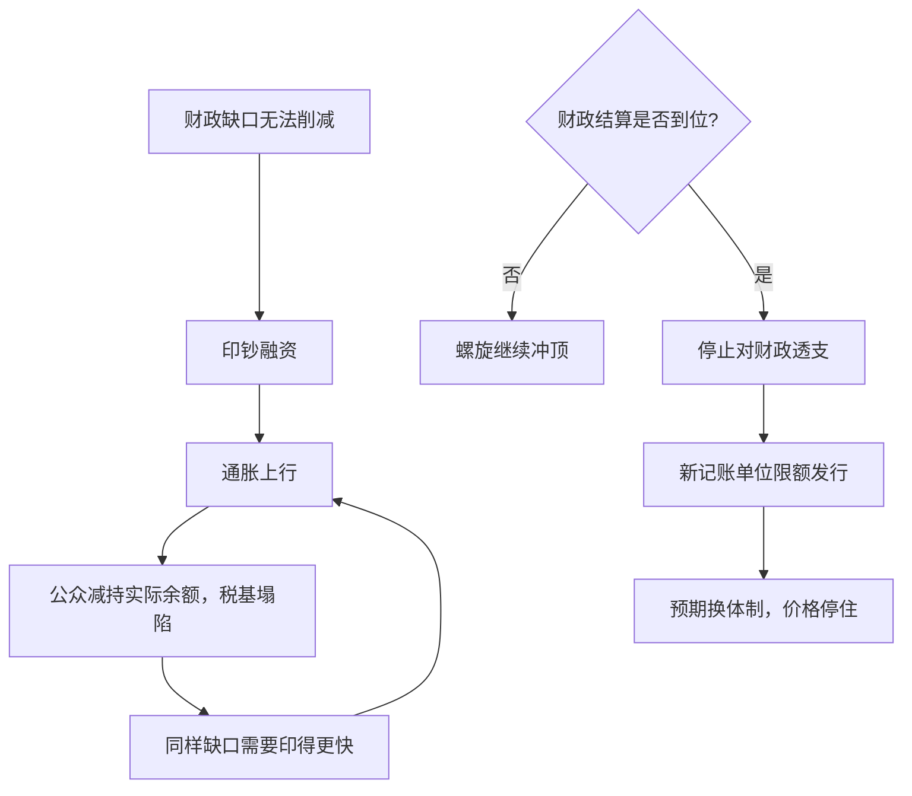

# 恶性通胀的两个案例

恶性通胀不是央行失手，是财政把印钞机当成唯一还开着的税基；终结它的从来不是货币技术，而是财政结算。

<footer>—— 据 Cagan 1956；Sargent 1982 整理</footer>

[上一课](/econ/mh-wartime-finance)写了通胀税的温和用法与「按旧平价复本」的信誉赎回；本课写同一台机器冲过税基收缩拐点的两个极端标本：1923 年的德国与 1946 年的匈牙利。理论工具已由[通胀税与铸币税](/econ/seigniorage)备好，最优铸币税的框架见[最优通货膨胀](/econ/mt-optimal-inflation)；本课只回答两个问题：加速为什么自我强化，结束为什么总是突然。

## 问题

Cagan 给恶性通胀下了操作性定义：月通胀率超过 50%。按这个门槛，二十世纪的极端样本远不止两例，但德国与匈牙利是量级上的两个端点。缺口不是记录惨状，而是解释一个悖论：印钞的人不是疯子，他们在弥补无法削减的赤字；可为什么越印收入反而越少、越印越不得不印——以及，为什么各国结束恶性通胀的方式惊人一致，几乎都发生在几周之内。

### 两个标本

德国：战败赔款加国内战债，财政靠帝国银行贴现票据、垫付政府开支并购买外汇交赔款。1923 年 11 月，1 美元兑 4.2 万亿纸马克，月通胀约三万个百分点，币值约三天半翻倍。匈牙利：二战废墟、赔款与重建赤字，1946 年引入指数化的「税帕戈」也只是给记账单位续命；7 月峰值时币值约 15 小时翻倍，史上最大面额钞票印到 $10^{20}$ 帕戈。

稳定后的德国货币量并没有立刻收缩，价格却停了——Sargent 用这一点论证稳定是「制度变迁」而非货币回收：财政停止透支、帝国银行拒绝再垫付政府，预期换了一个体制，钱就重新被愿意持有。

## 方法

把加速写成税基与税率的赛跑。实际铸币税 $s=\frac{\pi}{1+\pi}\cdot\frac{M}{P}$：税率 $\pi$ 抬高，公众按 Cagan 需求 $m^d=k-\alpha\pi^{e}$ 减持实际余额，税基 $M/P$ 塌陷；财政缺口若不变，需要的名义印钞速度反而上升，$\pi$ 再抬高——螺旋没有内生的停点。预期是适应性的：公众的 $\pi^{e}$ 追上真实 $\pi$ 需要时间，滞后正是机器能转那么久的原因。

两案结束的工序相同，且都与货币技术无关。德国 1923 年 11 月：停止对政府与商业票据的贴现、停止被动购买外汇，地租马克以土地与工业抵押为名限额发行；同月的紧急法令砍开支，1924 年道威斯计划重排赔款——财政结算与货币稳定同步落槌。匈牙利 1946 年 8 月：发行福林，1 福林兑 $4\times 10^{29}$ 帕戈，以金汇储备和当场平衡的预算背书。

## 机制

机制是悬崖式的预期切换：稳定成功与否不在发多少新钱，而在公众是否相信财政不再回来印。旧记账单位几乎救不回来——德国人早已改用美元与实物计价，匈牙利靠指数单位拖到换元；货币的单位是名分的锚，污染了就换。不这么做会错在哪：把稳定归功于抵押品或新钞票的印刷质量，就解释不了名义上「有抵押」的地租马克若没有财政停止透支照样一文不值；把恶性通胀归咎央行，就重复了上一课的误诊——财政主导在先，货币只是执行者。Bernholz 对数十个样本的对照给出同一结论：没有财政平衡的币制改革无一存活。

## 边界

本课只走财政–货币轴：赔款政治、供给破坏与分配冲突都只作为赤字的来源出现，不展开；魏玛稳定后的岁月与福林时代的匈牙利也不在射程。恶性通胀中物价、工资与汇率的联动细节，以及「稳定后为何常伴随实际升值」，是[通胀预期锚定](/econ/inflation-anchoring)与现代[通胀目标制](/econ/inflation-targeting)的题材。央行独立性作为防止复发的制度遗产，见[央行独立性简史](/econ/cb-independence-history)。

后课默认：货币崩溃是财政问题的影子，先看赤字，再看央行。

## 小结

- 月通胀超过 50% 的恶性通胀，本质是通胀税冲过拉弗曲线顶点的失控段。
- 适应性预期的滞后让机器转得久；预期追上时，加速自我强化。
- 两个极端标本（德国 1923、匈牙利 1946）的结束工序相同：财政结算、停止透支、新单位限额发行。
- 稳定是制度变迁而非货币回收；没有财政平衡的币改无一存活。
- 出处：Cagan 1956；Sargent 1982；Bernholz 2003。
