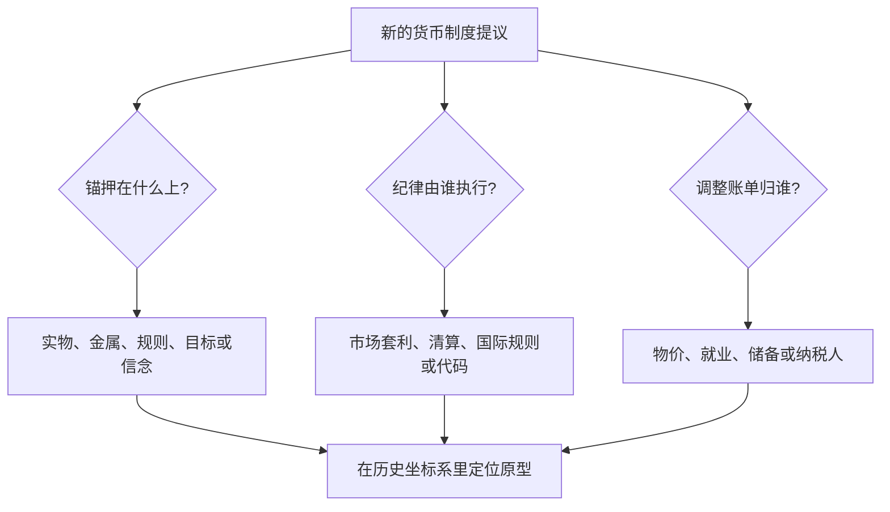

# 货币史收束

货币史读起来不是一串年代，而是同一个问题的反复作答：把承诺押在哪件东西上，押坏了如何退出。

<footer>—— 据 Eichengreen 1992；Reinhart and Rogoff 2009 整理</footer>

[上一课](/econ/mh-digital-comparison)把最新的数字形态放回旧问题的坐标。七课至此走完：实物到铸币、私人券、金本位、战时停兑、恶性通胀、货币联盟、数字对照。本课程到此收束：本课不添新材料，只把这条线收成一张可携带的框架——从实物货币的筛选到链上稳定币，货币史其实是承诺结构的演化史，而每一次演化都在回答同一组问题。

## 问题

把七课连起来看，演化的不是「钱的样子」，而是三件事的组合：承诺押在什么上（实物、金属、兑换规则、通胀目标、算法信念）；纪律由谁执行（市场筛选、回兑套利、清算网络、国际规则、代码）；调整的账单交给谁（商人、债务人、劳工、失业者、纳税人）。金本位课的对称调整、停兑课的通胀税、联盟课的内部贬值、数字课的储备挤兑，是同一张账单的不同付款人。

缺口因此清晰：没有这张收束表，每次读到新制度都会重讲一遍历史；有了它，任何「这次不一样」都能在三问之下现出原型。

### 三角框架

任何货币制度只能在三个目标里取二：**锚的可信性**（币值承诺硬到没人怀疑）、**调整的灵活性**（对冲击有缓冲手段）、**财政的自主空间**（赤字有随时可开的印钞后门）。金本位取可信与财政纪律，牺牲灵活——调整靠通缩，账单压给债务人与劳工。停兑取灵活与财政，牺牲锚——用复本赎回。现代法币取灵活与财政，可信改由规则购买：通胀目标、央行授权与独立，见[通胀目标制](/econ/inflation-targeting)与[央行独立性简史](/econ/cb-independence-history)。联盟取平价的可信，牺牲成员灵活——于是必须有纪律托管或真实转移来付账。数字形态没有逃出三角，只是把历史上的取法重新搬了一遍。

对金本位一直有两种读法：Bordo 与 Kydland 的「作为规则的承诺装置」，与 Eichengreen 的「金束缚」。同一证据，前者读出纪律红利，后者读出非对称枷锁。收束课的要求是两样都拿在手上，而不是选一个当标签。

## 方法

把框架当检验表用。第一问找锚：承诺写在哪件东西上，赎回条件是什么——实物货币的销路、铸币的面额、金点的平价、目标的数值、算法的信念，都是锚的载体。第二问找纪律：没有执行的承诺只是印刷品，回兑套利、清算网络、战后复本的规则、财政不得透支的授权，是历史上真正咬合过的四类执行机制。第三问找账单：稳定从来不是免费的，问不出谁付账的制度描述等于没读懂。三问填完，制度就在历史坐标系里有了原型与风险清单。

## 机制

货币史的方法论价值在于它做完了实验。同一锚之下各国的行为差异给出识别：1930 年代谁先脱离金平价谁先复苏，是教科书级的机制证据，见[金本位与大萧条](/econ/gold-standard-depression)；两种结局对同一份规则的违反，见[银行危机史与模式](/econ/banking-crises-history)里的信贷运动。Sargent 的论点同样可迁移：稳定的到来是制度变迁，不是参数微调——预期换体制的那一天，价格就停了。不这么做会错在哪：把历史当类比库，会抓住表面相似（都叫「印钱」，都叫「脱锚」）而错过承诺结构的不同；通胀税的温和使用与恶性通胀的失控之间隔着一整条拉弗曲线。

## 边界

本课程不写各国币制的编年细节，不写支付技术，也不预测下一次危机；理论纵深在[货币理论收束](/econ/mt-map)与[央行独立性简史](/econ/cb-independence-history)，危机的共同运动在[银行危机史与模式](/econ/banking-crises-history)，铸币税的现代表达在[通胀税与铸币税](/econ/seigniorage)。框架的用途是定位与提问，不是替未来背书。

## 小结

- 七课一条线：承诺结构从实物、金属、兑换规则演化到目标、联盟与代码，问题没变。
- 三角框架：锚的可信性、调整的灵活性、财政的自主空间，任一制度三选二。
- 纪律必须有执行机制：套利、清算、规则或代码，缺执行即空承诺。
- 历史是做过的实验：退出时点的差异给识别，制度变迁给悬崖，不要把历史当类比库。
- 本课程到此收束：下次遇到「这次不一样」，先填三问，再下判断。
- 出处：Eichengreen 1992；Bordo and Kydland 1995；Reinhart and Rogoff 2009；Sargent 1982。
