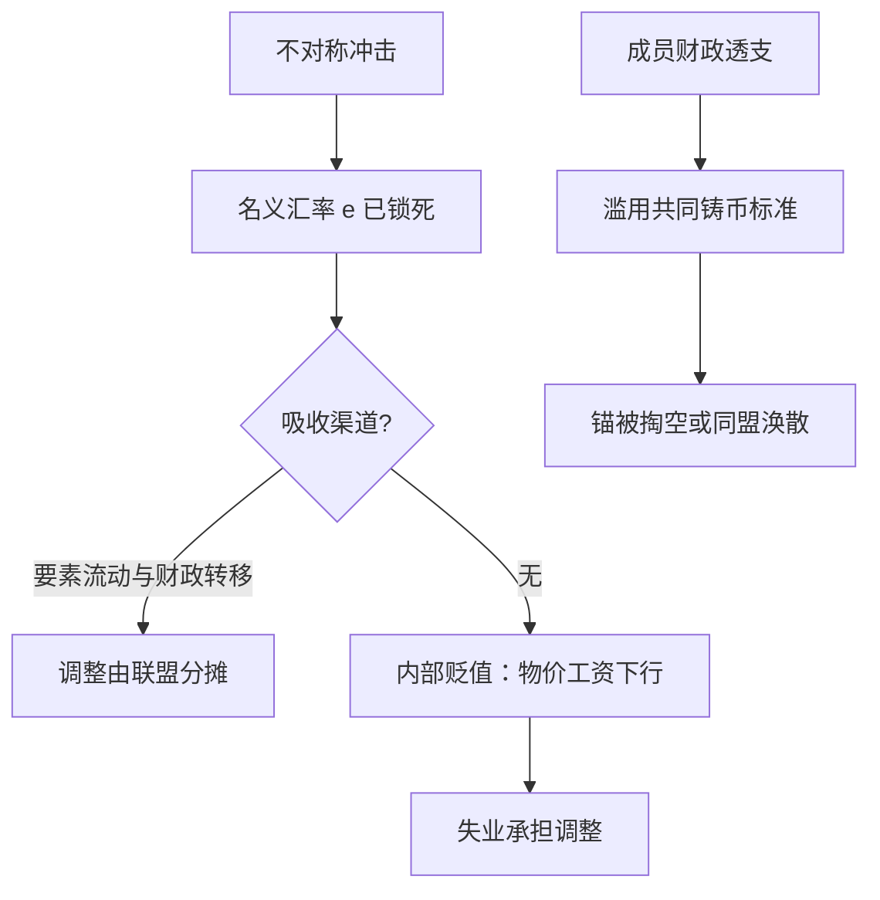

# 货币联盟的代价

把铸币权放进同一个盒子容易，把调整的痛苦也放进去难；联盟的寿命取决于第二件事。

<footer>—— 据 Mundell 1961；De Grauwe 整理</footer>

[上一课](/econ/mh-hyperinflations)以财政结算收束了货币崩溃段；本课转向另一端：不锚金、而是彼此锚死的货币联盟。成员把汇率永久钉在平价一，等于自愿放弃贬值这个最便宜的调整工具。现代案例的危机机制，已有的[欧元区危机](/econ/eurozone-crisis)与[欧债危机](/econ/eurozone-debt-crisis)两课已写透；本课把 19 世纪两桩货币同盟摆进来做对照，看联盟的代价有哪些条款是历史上重复署名的。

## 问题

联盟内部的实际汇率 $q = e + p^{*} - p$，其中 $e$ 是成员间名义汇率。联盟把 $e$ 钉死为零变动，不对称冲击来时，调整只剩两条慢路：实际贬值的分母——成员内部物价与工资的下行——以及跨成员的要素流动与财政转移。Mundell 的最优货币区判据问的就是：要素流动能不能补上汇率工具的空缺。

缺口因此有两层。技术上：冲击吸收渠道够不够。政治上：联盟改变了成员的财政激励——自己的货币不再单独承受贬值与通胀惩罚，搭便车的诱惑随之而来。联盟易结难解，难解的正是第二层。

### 两个 19 世纪标本

拉丁货币同盟（1865）：法国、比利时、意大利、瑞士（希腊 1868 年加入）统一币制标准，五种面额的金银币跨境无限流通。锚是共同的，滥用也是共同的——意大利 1866 年暂停兑换，用不可兑纸券履行对盟友的义务，等于借同盟的铸币标准给自己的财政透支；1870 年代银价坠落又把共同锚掏空，1874 年限制自由铸银、1878 年停铸。斯堪的纳维亚货币同盟（1873–1931）：丹、瑞、挪货币互认平价流通，1905 年瑞典–挪威政治联合解体，货币同盟照常运转——直到 1931 年金本位终点才散伙。

斯堪的纳维亚样本常被误读成「货币一体可以先于政治一体」的成功案例：它确实跨过了 1905 年的政治离婚，但也说明没有财政维度的货币同盟，寿命不会超过它借来的锚——金一停，同盟当日就没了内容。

## 方法

把联盟的存续写成三个条件的合取：共同锚可信、成员财政不搭便车、冲击有吸收渠道。历史样本各缺一角。拉丁同盟缺第二个条件：铸币标准公共化后，成员的赤字可以化作跨境流通的币材，纪律无人执行。斯堪的纳维亚缺第一条件的来源——锚全靠借金，自身无承诺能力。欧元区在头十年缺第二与第三：财政规则形同虚设，转移支付与银行联盟缺席；调整靠内部贬值，失业代付了本该由 $e$ 支付的账——欧债危机课已给出银行–主权回路的完整机制。[货币危机模型](/econ/currency-crisis-models)里的第一代逻辑在联盟内换了靶子：无处可投机的本币钉住消失，被挤兑的是成员的主权债。

## 机制

机制是激励的重新定价：钉住如金本位时，滥发的惩罚是自己货币被挤兑、金储备外流，日日可见；进了联盟，惩罚被推迟并公共化——某成员的超额赤字先是化作联盟内低成本融资，直到市场重新给主权风险定价。联盟因此不是汇率安排，而是一套财政纪律的托管制：要么有真实执行的共同规则，要么有真实的转移支付，二者必居其一。不这么做会错在哪：把拉丁同盟的死因记在银价上，就学不到「成员滥用铸币标准」这条可迁移的教训；把欧元当纯技术工程，就预测不了 2010 年之前那十年的财政搭便车。

## 边界

本课只取联盟的一般机制：Target2、OMT 与银行联盟的细节在欧元区两课，锚的选择史在金本位与布雷顿森林诸课。OCA 理论只取 Mundell 的要素流动判据，McKinnon、Kenen 等扩展不展开。1931 年后浮动时代的锚改由各国自己做——那就是主干[汇率制度](/econ/exchange-regimes)与[通胀目标制](/econ/inflation-targeting)的疆域。

后课默认：「联盟」意味着平价锁定、纪律托管与转移渠道三者至少有其二。

## 小结

- 联盟锁死 $e$，调整只剩内部贬值、要素流动与转移支付三条慢路。
- 拉丁同盟死于成员对共同铸币标准的财政滥用；斯堪的纳维亚的寿命等于它借来的锚。
- 钉住的惩罚从挤兑自己货币变成推迟且公共化的主权风险重定价。
- 联盟是财政纪律的托管：真规则或真转移，必居其一。
- 出处：Mundell 1961；Eichengreen 1992；De Grauwe。
