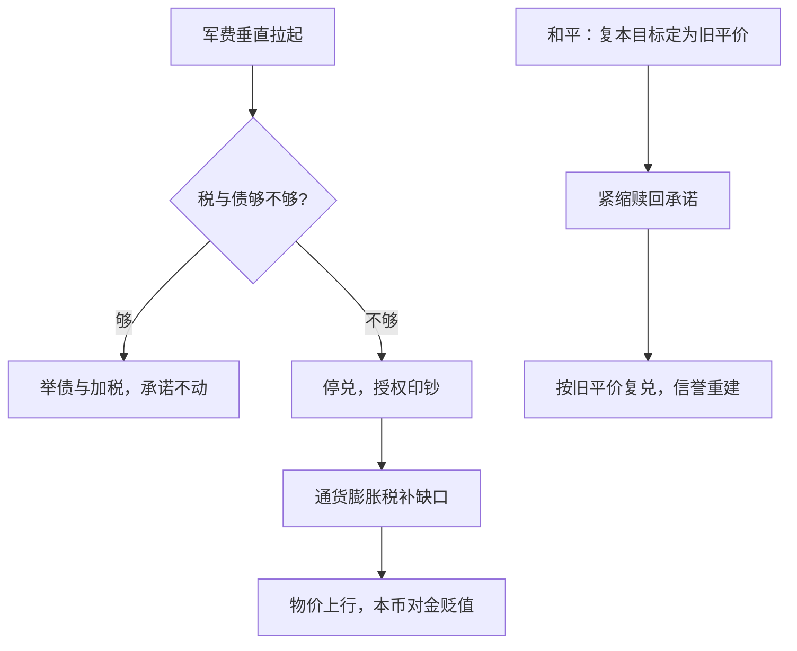
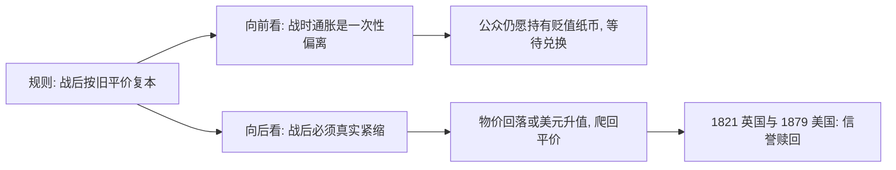

# 战时金融

摧毁一个社会既有秩序最隐蔽、也最难挽回的路径，是败坏它的通货。

<footer>—— 据 Keynes, The Economic Consequences of the Peace, 1919 转述列宁之言整理</footer>

[上一课](/econ/mh-gold-standard-operation)把金本位写成一份「战时停兑、战后按旧平价重返」的规则合同，豁免条款正是为战争预留的。本课写战争如何动用这份豁免：军费瞬间放大，税收按年征收、举债按市场胃口供给，缺口只剩印钞一条腿。停兑授权印钞，印钞改写物价，战后用一代人的紧缩把承诺赎回。本课程由此进入货币史的断裂段：每一块本位都是在这里被撬开的。

## 问题

战争把支出曲线垂直拉起，而财政的另外两根支柱都是慢变量：加税要立法、要征管，发债要有人信你会还在。第三根支柱是铸币：央行资产端吃进国债，负债端吐出货币，即时可得。缺口是把三者的边界写成一条财政约束——当第一、二根柱子撑不住时，货币承诺必然让位。Sargent 与 Wallace 的「不愉快的算术」把这点说尽：财政定了基调，货币在余下的空间里选择时点，而不是选择方向。

直觉类比：战争像一夜刷爆的账单——加税是「自己去加班挣钱」，发债是「找朋友借钱」，都是慢功夫；印钞则是「直接透支未来」，秒到账。停兑就是给这张卡解除额度限制，账单（通胀）稍后才到，但一定到。

### 通货膨胀税的账

印钞的收入不是面额，而是每期按通胀稀释公众实际余额的所得：
$$s \;=\; \frac{\pi}{1+\pi}\cdot\frac{M}{P},$$
$\pi$ 越高、公众持有的实际余额 $\frac{M}{P}$ 越小，税基随税率收缩——这条拉弗曲线在[通胀税与铸币税](/econ/seigniorage)已完整给出，本课只取它在战时的用途：停兑等于把这台机器全功率打开。

美国南北战争两次《法定货币法》（1862–1863）共发行 4.5 亿美元绿背券，无法兑金；1864 年夏 1 绿背美元跌到不足金平价的四成。英国 1797 年限制令停兑 24 年，1815 年战债已超过 GDP 的两倍。

数字实例：月通胀 $\pi=2\%$ 时，$\frac{\pi}{1+\pi}\approx 2\%$，政府每月大约征走公众持币实际价值的 2%；把 $\pi$ 抬到 10%，比例约 9%，但公众会同时把实际余额砍掉一大块——税率翻五倍，税基缩得更狠，收入未必更大。战时财政就是在这条曲线上找一个还坐得住的位置。

## 方法

三个战时标本同构。其一，英国对拿破仑战争：1797 年限制令停止英格兰银行兑付，银行券对金升水流通，战后 1821 年按旧平价恢复兑付——中间是李嘉图参与的「金块论战」。其二，美国内战：绿背券以法定货币身份流通，金价与绿背价的黑市每日报价；1875 年《恢复铸兑法》定下日程，1879 年元旦按战前平价恢复兑付。其三，第一次大战：1914 年 8 月各国几乎同时停止金兑付——不是市场挤兑了金本位，是财政按住了它。

三案的共同工序是：停兑放开印钞 → 通胀税补上军费缺口 → 和平后以旧平价为复本目标 → 用紧缩与承诺赎回信誉。

## 机制

机制是「按旧平价重返」这个目标的双向作用：向前看，它使战时通胀被理解为一次性偏离，公众在贬值的纸币与金之间仍留着转换预期，货币没有当场作废；向后看，它要求战后真实紧缩——1821 年的英国在多年的物价回落里完成复兑，1879 年的美国靠 1870 年代的美元升值爬回平价。复本不是技术操作，是财政对货币的一次性认账。不这么做会错在哪：把停兑写成「金本位又一次失败」，就看不见失败的是财政，金本位只是被按住的承诺；同样，把 1879 年复本当成货币当局的手艺，就漏掉了 Friedman 与 Schwartz 强调的另一半——战后实际产出与价格的路径早已替兑换铺了路。

常见误区：初学者容易把 1821 或 1879 的复本读成「央行终于把汇率修好了」。实际上爬回平价靠的是战后一整代人的物价路径与财政认账，不是某一次精准操作；而且若没有「按旧平价重返」这句事先写好的承诺，战时纸币根本撑不到和平那一天。

## 边界

本课停在「复本成功」的标本；当财政缺口大到无法用温和通胀税覆盖、公众拒绝持有余额时，同一台机器会冲出拉弗曲线的顶点，那是下一课的恶性通胀。一战后的金汇兑本位与 1925 年英国的复本争论，归[金本位与大萧条](/econ/gold-standard-depression)与[布雷顿森林与崩溃](/econ/bretton-woods-collapse)；央行在停兑期的非常规角色见[最后贷款人](/econ/bm-lender-of-last-resort)。战债货币化的现代版本是[央行资产负债表](/econ/central-bank-balance-sheet)的题材，此处不重写。

后课默认：谈「财政主导」，就是这一课的机器转速盖过了货币规则。

## 小结

- 战时财政三支柱里，印钞是唯一即期可得的一根；停兑是它的授权书。
- 通胀税税基随税率收缩：温和时是收入，极端时是通往恶性通胀的斜坡。
- 「按旧平价重返」同时提供战前的持有信心与战后的紧缩义务。
- 停兑不是金本位的失败，是财政对它的使用；复本才是信誉的重新购买。
- 出处：Keynes 1919；Sargent and Wallace 1981；Friedman and Schwartz 1963；Bordo and Kydland 1995。
