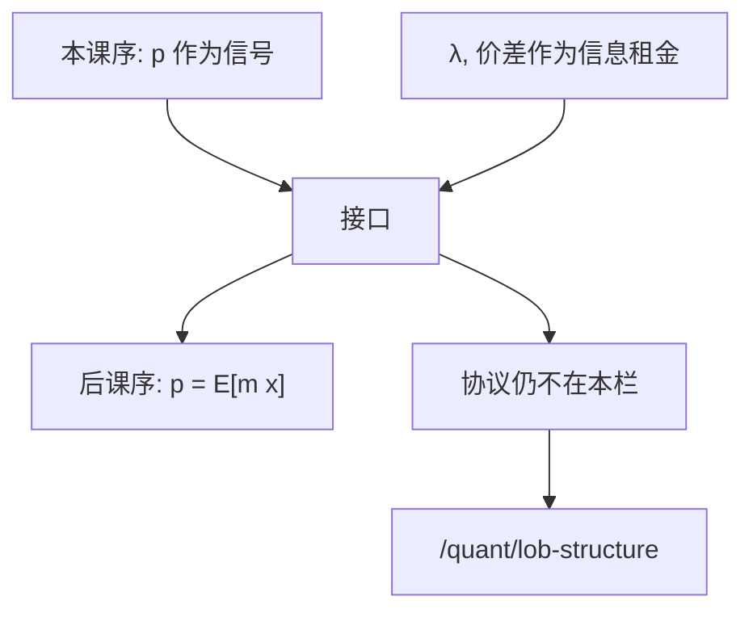

# 微观结构与资产定价的接口

信息均衡给出价格应当携带什么、流动性作为保险费从何而来；限价簿是这些数字被生产出来的协议。接口在此，吞并在两边都错。

<footer>—— 本课序收束；簿的几何仍见 Harris，以及 [/econ/to-limit-order-book](/econ/to-limit-order-book)</footer>

[上一课](/econ/information-intermediaries)把公共 $y$ 交给中介生产。本单元从 Grossman–Stiglitz 走到认证，已经有一套关于**价格作为信号**与**不利选择作为流动性成本**的理论。本课缺口不是再加一个 REE，而是钉与资产定价、与限价簿的两处接口。后半课程改写无套利与 SDF，默认已经读完本课序。

## 问题

本课序的对象是信念与激励：采集、加总、高阶、战略泄漏、披露、中介。产出是：部分揭示的 $p$，以及 $a-b$ 或 $\lambda$ 这类信息租金。资产定价主干的对象是 [状态价格](/econ/state-prices) 与 [SDF](/econ/stochastic-discount-factor)：$p=\mathrm{E}[m x]$。两套 $p$ 同名不同。接口问题是：何时可以把微观结构对象吸进 $m$（流动性作为状态变量），何时必须承认交易协议还没有出现。

[到限价簿](/econ/to-limit-order-book)已经从主干另一头声明：均衡等式在此停，协议从队列起。本课从信息这一头再声明一次，以免后文 FTAP 把 $a$ 与 $b$ 平均成一个无套利价格时，假装价差不存在——也以免把价差写进 $m$ 之后，以为自己已经写过簿。

Amihud–Mendelson 把买卖价差写成持有期的成本，是接口的早期理论。本课承认这条通道，但不做横截面流动性溢价回归——实证在量化栏。

## 方法

三句话分家。第一，无套利与 SDF 面对的是可交易或有支付；若买卖是两张票，严格说有两个价格，[一价定律](/econ/law-of-one-price)下一课才在无摩擦下恢复。第二，若把流动性成本当成外生持有成本，可以折进有效折扣因子，看起来像 $m$ 多了一个状态；这是理论许可，不是对 [CAPM](/econ/capm-theory) 的实证修补。第三，价格如何从订单生成，仍是量化栏：[LOB 结构](/quant/lob-structure) 起笔。Kyle 的 $\lambda$、Glosten–Milgrom 的 $a,b$ 在本栏是条件期望，在量化栏才是估计量。

不要在本课重写 CAPM 的 beta 表，也不要重写限价簿的价格优先。接口是指针，不是综述。

## 机制

机制是时间尺度与对象。信息均衡可以是静态批量或序贯贝叶斯，产出一个或两个数字叫价格。SDF 是跨状态的线性定价泛函，假定这些数字已经存在且（通常）买卖合一。把 $\lambda$ 塞进 $m$，等于说「不利选择风险被定价」——可以，但那是对 $m$ 的形状限制，需要一般均衡里谁持有库存、谁提供流动性。后文中介资产定价会走这条路：约束中介的 SDF 给流动性标价。在那之前，无套利课先在无摩擦世界把骨架钉死，否则摩擦没有对照。

与行为课序的分工：有限注意力、噪声交易者改的是信念或风险承担；本课序改的是信息激励。两边都可以生成「价格对公开信息反应不足」，微观基础不要混用。

O'Hara 强调价格形成是过程。过程的激励约束在本课序；过程的状态机在量化栏。资产定价用过程的结果作为输入。

## 边界

本课不是微观结构教科书的目录。存货、最优做市、开盘拍卖、碎股，全部不写。也不把接口当成「所以 CAPM 要加一个流动性因子」的执照——[CAPM 作为均衡](/econ/capm-theory) 仍是切点加总；加因子是量化栏的投影。下一课从一价定律起笔，摩擦先关掉，为的是让 FTAP 可陈述。读完无套利课序再回来，才知道摩擦破坏的是哪一条假设。

后课默认：信息课序给出部分揭示与不利选择流动性；SDF 课序给出线性定价核。两者在「已经有一个可交易价格」处相切。簿是协议，不在本栏重写。

## 小结

- 信息均衡的 $p$ 与 SDF 的 $p$ 同名；接口允许把流动性成本折进核，但不等于已经写过簿。
- 价差与 $\lambda$ 在本栏是条件期望对象；估计与队列换栏。
- 下一课关掉摩擦，从一价定律写定价骨架。
- 对照：[/econ/to-limit-order-book](/econ/to-limit-order-book)；[/econ/stochastic-discount-factor](/econ/stochastic-discount-factor)。
