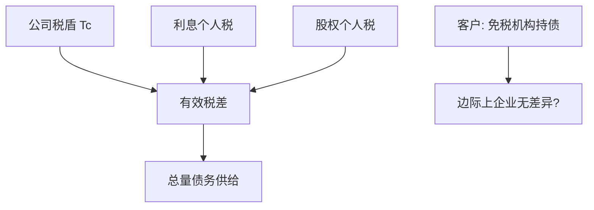

# Miller 均衡与个人税

    
公司税让债务有利，利息的个人所得税让债务有害；加总均衡里可以出现一个使企业无差异的债务供给，个人在税码上自我分类。

    <footer>—— Miller, Debt and Taxes, Journal of Finance 1977</footer>

[上一课](/econ/market-timing-theory)把目标杠杆说成可能被窗口扰乱。本课缺口是更早的税制结构：Miller（1977）把股东与债权人的个人所得税放回去，公司税盾在总量上可以被个人税抵消，单个企业的 $D^\ast$ 不再被 $\tau_c D$ 钉死。不重做 1963 年公司税现金流分解，不重估择时回归。

## 问题

[MM 1963](/econ/mm-corporate-tax) 只有公司税，角点在全债。个人层面：利息通常当普通所得征税，股权回报一部分是资本利得、税率更低或可延迟。债权人要求的税前 $r_D$ 必须补偿个人税，企业看到的债务成本上升，税盾缩小。Miller 问：若投资者税率异质，谁持有债、谁持股？均衡里债务总量可以使边际投资者的税正好抵消 $\tau_c$，此时**任意**企业资本结构无差异——无关性在加总税率上回归。缺口是：权衡与 Leland 用的 $\tau_c$ 应改成有效税差

$$
1-(1-\tau_c)(1-\tau_E)/(1-\tau_D),
$$

而不是把法定公司税率乘上 $D$。

$\tau_E$ 是股权个人税的有效税率，$\tau_D$ 是利息个人税。若 $\tau_D$ 高、$\tau_E$ 低，括号里的增益可以到零。Miller 的供给曲线：企业发债直到边际持债人的税抵消公司税盾。

## 方法

客户效应：高税个人避开利息、持有股权；免税机构（养老金、大学）持有公司债。供给端企业发债直到边际价格使无差异。单个企业若能在客户之间转移，切片仍可能有关；若市场在边际上已经出清到无差异，单个企业改变 $D$ 不改变价值——这是 1958 年无关性的税制版。

与静态权衡：破产成本仍然给出内部 $D^\ast$，但税盾那一项变小，最优杠杆低于「只有 $\tau_c$」的世界。动态权衡的调整带中心下移。资本预算：APV 的税盾用边际有效税率，亏损企业、利息抵扣上限使有效税率更低。

Brealey–Myers：税制改一次，最优切片应改；美国税改是自然实验，但识别被许多同时发生的事件污染——最后一课再提。本课只要：个人税是权衡左边的一等公民，不是脚注。

## 机制

机制仍是家庭不能完全自制的税码不对称，但方向有两层。公司税：企业借债，政府向企业补贴。个人税：债权人纳税重于股东，债权人要更高税前回报，补贴被抵消。客户分类是 Spence 式的自我选择，不过这里的「类型」是税率，不是项目质量。

与租赁课：高税的出租人持有折旧与利息税盾，低税的承租人租入——同一客户逻辑。Miller 均衡是资产与债务市场上的加总版本。

### 角点又回来了吗

若有效税差为正且无破产成本，仍可能全债；Miller 强调加总可以耗尽税差。现实有破产、代理、优序，内部结构由这些摩擦决定，税只改斜率。不要把 1977 年读成「资本结构又无关了，可以结束课程」。

DeAngelo–Masulis（1980）加入非债务税盾（折旧、税损），即使个人税不够抵消，企业层面也会有内部最优。权衡的左边是一篮子税盾，不只利息。

## 边界

不要把本课写成各国税码比较表。对象是有效税差与客户。下一课债务期限：即使税差给定，短期债与长期债的展期风险仍改变切片的时间维度。

后课默认：APV/WACC 里的 $\tau$ 是有效税差，含个人税与非债务税盾；Miller 加总可以缩小公司税盾的价值。择时不改变税码，但改变谁在窗口期成为边际发行者。

## 小结

- 个人税抵消部分公司税盾；有效税差才进入 $V_L-V_U$。
- 异质税率产生债务客户；加总均衡上企业可以再次无差异。
- 权衡与 Leland 必须用有效税率，不是法定 $\tau_c$。
- 出处：Miller, *JF* 1977；DeAngelo and Masulis, *JFE* 1980。
