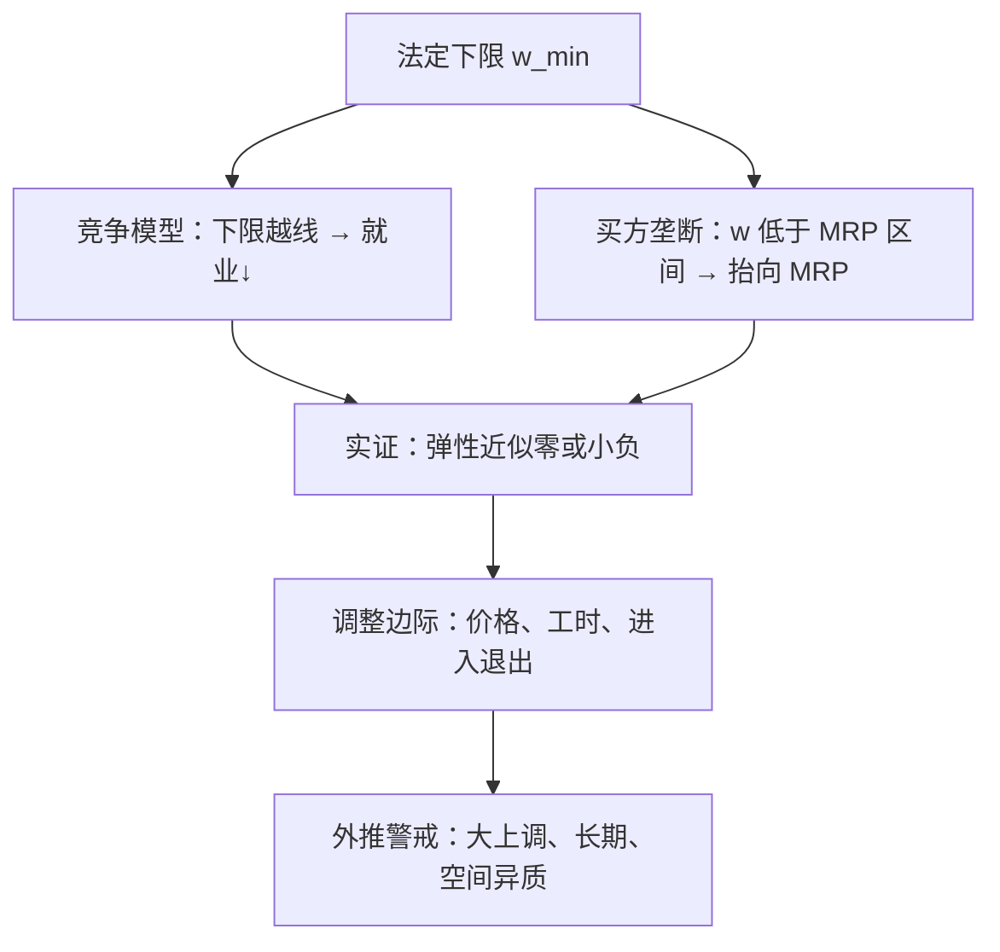

# 最低工资：两代文献

一代文献从竞争模型推出失业，另一代文献去快餐店数人头；分歧不在价值偏好，而在劳动供给曲线到底有多平。

<footer>—— 据 Stigler, The Economics of Minimum Wage Legislation, AER 1946；Card and Krueger, AER 1994 整理</footer>

[上一课](/econ/monopsony-wages)给了本课的地基：摩擦使厂商面对向上的劳动供给，工资压在 MRP 之下，缺口由弹性决定。于是法定下限的效应不再是竞争模型一句话能钉死的。本课是劳动经济学课程的收束：把两代最低工资文献当作这门课的测验题——它同时用上供给需求（MRP 与弹性）、买方垄断、制度与识别。计数工具在[双重差分](/econ/difference-in-differences)已经拆过，Card–Krueger 是那里的教具；本课直接进文献的分野与解释。劳动经济学到此收束：树序下一课转入产业组织的首课[SCP 与新实证 IO](/econ/scp-neio)，从要素市场回到产品市场结构。

## 问题

第一代文献（1946–1992）从竞争模型出发：下限高于均衡工资，需求量收缩、供给量扩张，青少年与非熟练工首当其冲。Stigler 1946 给出经典陈述；时间序列估计把青少年就业对最低工资的弹性收在 $-0.1$ 到 $-0.3$ 之间。第二代文献从 Card–Krueger 1994 开始：新泽西上调最低工资，用隔壁宾州的快餐店做对照，差中差发现就业没有下降，点估计甚至为正。Neumark–Wascher 随后用工资记录数据、青少年子样本与更长的面板给出负效应的反证，两线缠斗至今。缺口不是站队，而是：若竞争模型的预测如此干脆，为什么数据里弹性这么小。

接上一课的算术：若 $w = 0.7\,\mathrm{MRP}$，下限抬升一成仍在 MRP 之下，不必然减员；一旦下限越过 MRP，竞争逻辑立刻回来。买方垄断不是否认就业效应，是给「多小的下限才安全」定了位置。

## 方法

第二代文献的推进主要在设计。Card–Krueger 的两州两组之后：Dube–Lester–Reich 2010 用相邻县做对照，把区域趋势差洗掉；Cengiz–Dube–Lindner–Zipperer 2019 收集一百多次州级上调，把「新下限之上窗口里消失的工作」当作就业变化的读数，发现受影响岗位几乎没有净损失，工资确实涨了。正面证据之外，Neumark–Wascher 2007 的综述仍报出多数研究偏负，并指出对照组选择（全国青少年基线的预趋势问题）是第二代的高发伤。两代读同一份世界，分歧来自对照的构造，而不是道德立场。

错在哪：把 1994 年的一次快餐调查当成普适常数。外推有两条红线：上调幅度大到越过 MRP（大上调与翻倍不是小调的外延）；时间维度拉长（短期工资单没动，不等于资本替代与自动化不发生——那是[有偏技术进步](/econ/directed-technical-change)的通道）。空间异质性同样要紧：低工资地区的就业反应大于高工资都市，用全国平均弹性做政策评估会算错方向。

## 机制

为什么小弹性可能成立，机制清单是这门课的复习：其一，买方垄断（上一课）：压价区间里抬工资沿 MRP 补员，就业不减。其二，[效率工资](/econ/efficiency-wage)：工资本可以钉在出清之上，下限若落在厂商自愿区间内，只是换了一种抬法——那里已经警告过识别必须声明，本课沿用。其三，调整边际的再分配：就业是存量，工资单之外还有价格（Harasztosi–Lindner 2019 的大上调里相当部分由涨价吸收）、工时、佣金、进入退出——盯住「受影响工人有没有被裁」会漏掉全边际。其四，失业率反应温和：下限动的是工资分布下截，流入流出在[存量-流量](/econ/unemployment-stock-flow)的账上大部分抵消。

作为收束，这道题的答案是：两代文献都对，各自在自己的模型区间里。哪一代适用于哪一次上调，要看 markdown 多深（上一课）、调整边际多少（本课）、对照多近（DiD 课）。

## 边界

本课不做各国的法定参数比较，不写生活工资与贫困率的福利核算——最低工资不是精准的贫困工具，受益者不少不在低收入家庭。调查数据与工资记录的口径之争（Card–Krueger 的电话调查对 Neumark–Wascher 的记录）是测量课的案例，这里只记结论对口径敏感。负效应研究并不错，正效应研究也未必对：识别的战场在对照组，永远在。后课默认：读到任何工资下限的证据，先问模型区间、调整边际与对照构造三件事；劳动经济学课程到此收束。

## 小结

- 第一代：竞争模型的时间序列；第二代：Card–Krueger 之后的自然实验。
- 小弹性不推翻竞争模型：买方垄断、效率工资与调整边际都能接住它。
- 外推有红线：越线的大上调、长期弹性、空间异质。
- 两代分歧在对照组的构造，不在价值立场。
- 劳动经济学收束于此；树序下一课是产业组织首课 SCP 与新实证 IO。
- 出处：Stigler 1946；Card and Krueger, AER 1994；Neumark–Wascher 系列；Cengiz et al., QJE 2019；Manning 2003。
