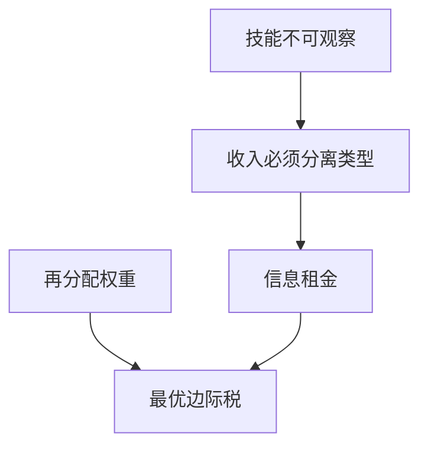

# Mirrlees 最优税原文

技能不可观察时，所得税必须用收入当信号；最优边际税由信息租金与再分配的替换给出，不是对每一技能征总额税。

<footer>—— Mirrlees, An Exploration in the Theory of Optimum Income Taxation, Review of Economic Studies, 1971</footer>

附录对照，不插入主干。[上一课](/econ/gale-shapley-paper)对照的是无货币的稳定匹配。本篇对照 **Mirrlees 1971 原文的问题设定**：技能是私人信息，政府要再分配却不能对人做一次总付。主干[最优所得税](/econ/mirrlees-income)已取激励相容与顶端不扭曲等课序结论；这里对照 *RES* 长文如何把最优控制写进所得税，以及它相对 Ramsey 商品税换的是哪一块不可观察。

## 问题

Ramsey 对代表性消费者征商品税，技能同质。再分配要求承认异质生产能力。若技能可观察，第一最佳是对技能征总额税、边际税率为零。Mirrlees 的缺口是技能不可观察，只能看收入（劳动乘技能）。高技能可以少工作来模仿低技能，于是再分配受激励相容约束。原文要解的是这条约束下的最优非线性所得税，不是四种税率档的赛马。

文章写在最优控制传统里：技能分布是状态的来源，收入–消费束是控制。1971 年没有把「顶端边际税为零」写成口号式政策建议；那是后来对原文一阶条件的解读，而且依赖分布的尾。

Mirrlees, *Review of Economic Studies* 38(2), 1971, 175–208。不要发明 arXiv。Diamond–Mirrlees 1971 的生产效率是并列的商品税论文，不是本篇所得税的引理。

## 方法

连续技能 $\theta$，效用对消费与劳动（或闲暇），产出 $y=\theta\ell$。政府选消费函数 $c(y)$，等价于边际税率。激励相容要求高 $\theta$ 不羡慕低 $\theta$ 的束——单交叉下变成单调与包络。社会目标是功利或先验主义的加权，资源约束是积分后的产出够消费。最优控制给出沿技能的边际税公式：再分配收益（更低技能的福利权重）对激励成本（高技能的信息租金）。

主干课已用显示原理与包络；附录不重推 Spence–Mirrlees 条件，只对照 1971 年把规划写在所得税上，而不是拍卖或匹配。

## 机制

机制是用扭曲换租金。多给某技能一点税后消费，立刻改善该点的效用，但 IC 强迫给所有更高技能多留租金，否则他们向下模仿。最优在这一点上权衡。顶端：若技能有上界且上界处没有「再更高」的人要防，激励成本的积分上限为零，边际税可以是零——这是局部条件，不是「富人税率为零」的政治句子。底端与 Bunching、零收入的参与，原文处理得很谨慎，后文 Saez 等才做成可校准弹性。

与 Gale–Shapley 的对照只在附录链上：都是激励，一个没有货币，一个用收入当货币度量的信号。不要把匹配插进最优税主干。

### 对照主干所得税课，不插入匹配与税之间

主干[最优所得税](/econ/mirrlees-income)已取不可观察技能、IC 与公式结构。本附录对照 *RES* 1971：最优控制、连续类型、以及原文几乎不谈资本所得税与动态。把 1971 插进稳定匹配之后当作连续主干，会让读者以为最优税是匹配理论的附录。

非线性税是工具，不是结果。线性税是后文的简化；1971 年先给一般 $c(y)$。

## 边界

原文没有解决动态资本税、跨国流动性、行政成本。劳动供给若在扩展边际（参与）主导，公式要改。也不要把 1971 写成某国税码的操作手册。

读完回主干所得税课。附录微观链下一篇转到双边交易的不可能定理，不再加税。

技能分布的尾决定顶端税率是否贴近零。原文给出方法，不颁发某一个尾的执照。

劳动若在扩展边际主导，参与弹性进入公式，Bunching 与零收入区间变得重要——那是后文，不是 1971 年控制问题的全部。资本收入、遗产与跨国迁移会让单一劳动所得税不够用。

读完回主干[最优所得税](/econ/mirrlees-income)。不要把这篇当成匹配课序的第 $n$ 课。

## 小结

- 附录对照 Mirrlees 1971：技能不可观察时，最优所得税在再分配与信息租金之间权衡。
- 第一最佳总额税不可用；收入是信号，边际税是激励成本。
- 顶端不扭曲是局部条件，不是政策口号。
- Diamond–Mirrlees 生产效率是并列的商品税论文，不是本篇引理。
- 读完回主干最优所得税课；不插入匹配课序。
- 非线性 $c(y)$ 是工具；线性税是后文简化。
- 出处：Mirrlees, *RES* 1971。
