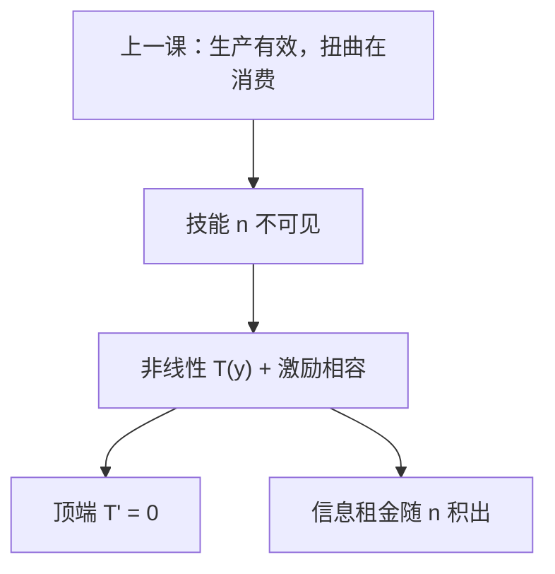

# 最优所得税

技能不可观察时，只能对收入课非线性税；激励相容把高技能的信息租金留下，最优边际税率在顶上为零。

<footer>—— Mirrlees, An Exploration in the Theory of Optimum Income Taxation, Review of Economic Studies, 1971</footer>

[上一课](/econ/diamond-mirrlees)（Diamond–Mirrlees 生产效率）。生产侧保持有效，扭曲留给最终消费。本课不重写中间品不征。缺口是劳动：技能 $n$ 是私有信息，计划者看见的是收入 $y=n\ell$，不是 $\ell$ 本身。一次总付对 $n$ 做不到，Ramsey 商品税也只是粗工具。Mirrlees 用非线性 $T(y)$ 在激励相容下再分配。

## 问题

连续类型 $n$，效用 $u(c,\ell)$，$c=y-T(y)$。个人选劳动使税后最优。计划者最大化加权福利，约束是资源与激励相容（高 $n$ 不愿假装成低 $n$）。IC 的一阶形式是包络：信息租金随 $n$ 积出来，再分配必须留给高技能足够的剩余，否则他们减劳动。缺口不是再写 Ramsey 逆弹性，而是：**非线性所得税怎样把「对技能的总额税」换成「对收入的扭曲」，以及边际税 $T'(y)$ 在两端的形状。**

顶上无扭曲：最高 $n$ 没有人要与他分离，再征边际税只减他的劳动、不改善任何人的 IC，故 $T'(y_{\max})=0$。底端与中间：正边际税用来减少高类型向下模仿的吸引力，并筹再分配。

### 非线性税不是 Ramsey 的另一张表

Ramsey 对观察得到的商品钉线性楔。Mirrlees 对观察得到的收入钉整条 $T(\cdot)$。Atkinson–Stiglitz：若 $c$ 与闲暇弱可分，商品税多余，只留所得税——上一课 Ramsey 边界已点过，本课把它认作工具分工。技能分布、社会福利权，决定中间段 $T'$ 的高低，没有一张永恒的「最优税率 20%」。

Mirrlees 1971 的数值例子对当时的英国校准，中间边际税可以相当高；「顶上为零」是理论边界，不是说最高收入档法定税率应为零——若 $n$ 无上界，末端条件改写成渐近。

## 方法

机制设计：直接机制报类型，显示原理给出 $c(n),y(n)$，再实现为 $T(y)$。一阶 IC：$\frac{\mathrm{d}}{\mathrm{d}n}u=\frac{\partial u}{\partial n}$ 沿真实类型。资源：$\int c\le\int y$（加上政府外生支出）。福利权与技能密度进入「虚拟社会价值」，最优 $T'(y)$ 随该虚拟价值与劳动供给弹性变——Saez 后来写成弹性形式，本课只钉 Mirrlees 的 IC 结构。

Bunching：若虚拟价值在某段不单调，最优会把一段 $n$ 压到同一 $y$，边际税率跳。这是角点，不是计算错误。底端参与约束还可以给出正的平均税、零附近的边际形态，视是否工作这一档的劳动供给而定。

本课仍假定生产有效那一套 $p$ 在。所得税扭曲的是劳动–消费，不回头去征中间品。

## 机制

IC 的机制是单交叉：高技能装低技能更轻松，必须让 $y(n)$ 递增，并用 $c(n)$ 的斜率把模仿的边际利益抵消。扭曲劳动的机制是：降低低档的边际净工资，使高类型觉得「假装低档」更不划算。顶上无扭曲的机制是：没有更高类型需要被阻止模仿他。

与总额税的对照：若 $n$ 可见，对每个 $n$ 征不同 lump-sum，劳动不扭曲，回到第二定理。不可见则信息租金是再分配的代价，最优接受一段 $T'>0$。

弹性形式（后来的写法）：$T'/(1-T')$ 与「再分配的社会价值」成正比，与劳动供给弹性成反比——Ramsey 逆弹性在技能维度上的亲戚。本课不把公式当成税率表：分布在顶上很厚时，顶上为零只是最后一个人的性质，接近顶端的 $T'$ 仍可高。

显示原理把「任意税制」收成直接机制；谎报工资、逃税、家庭联合申报，都会改观察变量，最优 $T$ 跟着改。主干停在 $y$ 可验证、$\ell$ 不可见。

## 边界

技能与偏好同时异质时，还要防偏好伪装，最优 $T$ 更脆。

动态、资本收入、人力资本投资，把 Mirrlees 静态技能模型打开，不在本课。逃税把观察变量从 $y$ 换成申报，最优要叠稽查。政治约束「边际税率不能下降」本身是额外 $g(x)$。下一课[阿罗](/econ/arrow-impossibility)已经写过：这里用的福利权是人际比较，不是序数加总的免费 $W$。市场失灵课序在投票规则上收束。

后课默认：技能私有时最优工具是非线性 $T(y)$；IC 留下信息租金；有界最高技能处边际税为零；生产效率上一课仍适用。

本课不把顶上为零写成法定最高档税率为零。

## 小结

- 看不见 $n$，只能对 $y$ 课税，并受激励相容约束。
- 再分配以信息租金与劳动扭曲为代价。
- 最高类型边际税为零；中间段由虚拟价值与弹性决定。
- 可分偏好下商品税可让位给所得税。
- 出处：Mirrlees, *RES*, 1971。
