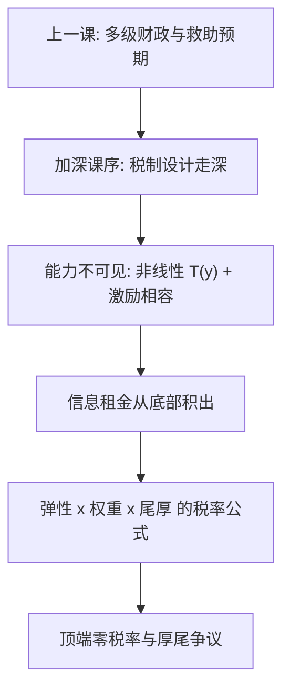

# Mirrlees 最优所得税

政府看不见能力，只看得见收入；最优税率不是伦理口号，而是激励约束下「再分配收益等于行为损失」的一阶条件。

<footer>—— Mirrlees, An Exploration in the Theory of Optimum Income Taxation, RES 1971；Saez, Using Elasticities to Derive Optimal Income Tax Rates, RES 2001；Stern, Welfare Weights and the Elasticity of the Marginal Valuation of Income, 1977</footer>

[上一课](/econ/local-fiscal-transfers)把多级政府写成代理与承诺问题：飞纸与软预算是激励失败，地方隐性债最后并入主权 $b$。「政府做什么」课序收在那里；本课起进入加深课序，税制的设计问题往深处走一层。[所得税与激励](/econ/income-tax-incentives)已给出充分统计的弹性语言，微观主干[最优所得税](/econ/mirrlees-income)已立激励相容的结构。本课把两者接上：从弹性直接推出最优税率，并把顶端零税率的直觉与争议讲清。后三课沿归宿、无谓损失、碳定价走完这条加深线。

## 问题

能力 $n$ 私有信息，收入 $y=nl$，只观察得到 $y$。对 $n$ 征总额税做不到，对 $y$ 征税必然扭曲劳动——缺口是：扭曲应放在哪些收入段、放多深。把 $T(y)$ 读成机制：高类型可以压低劳动去模仿低类型的 $y$，激励相容迫使计划者给高类型留信息租金；租金随类型从底部积出来，再分配的每一分钱都在「租金」与「扭曲」之间定价。主干课已经说了答案是弹性、密度、权重三个词；加深要问的是三者怎么精确组装成一个税率，以及每个部件在什么方向上移动它。

### 从三个词到一个公式

在收入 $z$ 处把边际税率提高 $\mathrm{d}\tau$：高于 $z$ 的人各多缴约 $z\,\mathrm{d}\tau$，这是机械收入；他们的应税收入按补偿弹性收缩，行为损失随弹性走；福利上，一元对高收入者的价值低于对社会（权重差）。三项相抵，一阶条件给出 Saez 2001 的形式：

$$
\frac{\tau(z)}{1-\tau(z)}=\frac{1+e}{e}\,\bigl(1-g(z)\bigr)\,\frac{1-F(z)}{z\,f(z)} .
$$

$e$ 是应税收入的补偿弹性，$g(z)$ 是 $z$ 处一美元的社会边际价值（归一到国库一元），$(1-F)/zf$ 是局部 Pareto 风险率的倒数——顶端还有多厚。顶端段收敛为 $\tau/(1-\tau)=\frac{1+e}{e}(1-g)/a$，$a$ 是 Pareto 参数。

## 方法

公式先过一遍代入检验。功利基准 $g=1$：右边为零，最优边际税为零——再分配全部来自 $g(z)\lt 1$ 的段落，权重不是装饰。弹性：$e$ 越大楔子越贵，这是 [Ramsey 商品税](/econ/ramsey-optimal-commodity-tax)逆弹性在技能维度上的亲戚，但这里的「税基」是收入分布本身。密度：尾越厚，楔子上方的机械税基越大，越值得在那一带压税率。权重：Stern 1977 把 $g(z)$ 参数化成边际评价对收入的弹性，规范立场从形容词变成可争论的数字——[再分配与效率代价](/econ/redistribution-efficiency)说「权重与弹性是两件东西」，公式正是两件东西的乘法。生产侧不另设楔子：所得税扭曲留在消费与劳动，生产效率由 Diamond–Mirrlees 1971 保证，[商品税课](/econ/ramsey-optimal-commodity-tax)已用其一半。

## 机制

零顶端税率是 Mirrlees 1971 的边界结果：若最高类型有界，对最后一人征边际税只扭曲他的劳动、没有任何模仿需要阻止，故 $T'(y_{\max})=0$；在 Saez 公式里它就是 $F\to 1$ 时右边趋零。争议在于现实分布：顶端收入近似 Pareto 且无清楚上界，$F\to 1$ 只在渐近意义成立，厚尾把 $(1-F)/zf$ 顶在 $1/a$ 附近，于是接近顶端的 $\tau$ 可以显著为正。把「顶端零税率」读成最高档法定税率应为零，是拿有限支撑的构造对无限厚尾的政策——主干课的警告在此落成机制。

信息租金的反面是扭曲：底部参与弹性大，最优安排常在低收入段给低边际税甚至补贴，把租金付在「让人进场」上，而在中高收入段收楔子。两端的税率形状由不同的弹性驱动，不能共用一个数字。

## 边界

公式里的 $e$ 是应税收入弹性，避税、申报时点、收入定义都算进行为，工时弹性会低估税基反应、高估最优税；extensive 边际另写一阶条件。bunching、动态与资本收入不在此。$g$ 是规范输入，弹性估计搬不走制度。后课默认：谈最优税率先指认公式三件套的数值来源；下一课把楔子的另一层——法定开票与经济承担——分开。

## 小结

- 能力私有信息下，所得税是激励相容机制；信息租金是再分配的影子价格。
- 最优边际税率 = 行为损失与再分配收益的一阶条件：弹性、福利权重、局部尾厚三件套。
- 顶端零税率来自 $F\to 1$；厚 Pareto 尾让接近顶端的税率仍高，争议在支撑假设。
- 公式的弹性是应税收入弹性，避税通道必须算进行为。
- 出处：Mirrlees 1971；Saez 2001；Stern 1977；Ramsey 1927；Diamond and Mirrlees 1971。
