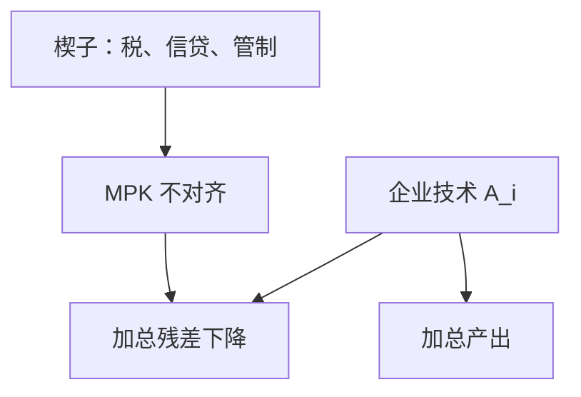

# 错配与 TFP

要素若没按边际产出对齐，加总生产率会掉一截；残差里写着的不一定是不会生产，而可能是不让资源过去。

<footer>—— Hsieh and Klenow, Misallocation and Manufacturing TFP in China and India, QJE 2009</footer>

[上一课](/econ/malthus-to-modern)（马尔萨斯到现代增长）。把内生 $g$ 分成 AK、种类与创造性破坏，对象仍是「技术如何被生产」。索洛残差课已经警告：$A$ 含错配。本课的缺口是把这句话做成可计算的楔子：企业面对不同的资本与产出扭曲时，加总 TFP 如何表现为残差，即使每家的技术不变。收敛与发展核算下一课用截面分解；本课提供「$A$ 的一块是配置」的微观来源。

## 问题

增长核算把 $\Delta\ln A$ 当剩余。若高生产率企业雇不到资本与劳动，低生产率企业却得到补贴或廉价信贷，加总产出低于要素有效配置时的产出。缺口不是再选一种内生技术故事，而是：如何用可观测的企业产出与投入，把**配置效率**从「技术」里分开。Hsieh 与 Klenow（2009）用垄断竞争与楔子，把中国、印度制造业相对美国的 TFP 缺口拆出很大一块错配。

楔子可以是产出税、资本税、信贷配给、规模管制。本课不识别是哪一项政策，只说明它们在账户上长得像 $A$。

## 方法

企业 $i$ 有 $Y_i=A_i K_i^{\alpha}L_i^{1-\alpha}$，面对资本楔子与产出楔子时，一阶条件不再使 $MPK$、$MPL$ 在企业间相等。有效配置要求同要素的边际产出对齐（再加垄断加成若共同）。错配的度量是：观测配置下的加总 $Y$，相对把要素按有效规则重分后的 $Y$。差额进入加总 TFP。

Hsieh–Klenow 用收入生产率（TFPR）的离散度代理楔子：若扭曲为零且技术仅差一个共同乘数，TFPR 应更集中。离散度大，则错配严重。具体识别依赖 CES 需求、要素弹性与测量误差假设；本课用其逻辑，不把某一百分比写成不变事实。

### 残差的两次命名

索洛残差是时间上的加总剩余。Hsieh–Klenow 的错配是截面企业间的配置剩余。两者都叫 TFP，政策含义相反：一种要研发与模仿，一种要去掉楔子。把制造业改革写成「提高 $A$」而不说是哪种 $A$，会把两种按钮焊在一起。

## 机制

扭曲使要素的影子价格在企业间分叉。资本卡在低 $A_i$ 或高楔子企业，加总生产函数看起来像更低的 $A$，即便蓝图没变。这与种类/熊彼特兼容：创新改变 $A_i$ 的分布，错配改变给定分布下的权重。周期中的信贷收紧可以暂时加大错配，残差亲周期又多了一个非技术通道。

测量误差、质量差异、市场力量也会表现为 TFPR 离散。因此「离散度=错配」不是恒等。本课主张的是方向：不要把加总残差全部命名为技术或制度文化。

错配与熊彼特可以互相加强：信贷偏向在位者，会减慢创造性破坏，加总 $A$ 的增长既慢在创新、也慢在配置。反过来，去掉楔子而不增加 $A_i$，仍能抬加总 TFP——这是对「必须先有研发才能发展」的核算纠正，不是发展政策的充分条件。Hsieh–Klenow 用制造业数据，服务业与农业的楔子可能不同，本课不把制造业离散度抄到整国 $A$ 上。

资本与劳动的楔子不必对称。资本错配在金融压抑经济里往往更刺眼；劳动错配可以来自户籍、行业准入与工会。加总核算看不出是哪一种，除非回到企业一阶条件。

发展核算里 $A$ 的大份额，部分可能是错配而非「不会用机器」。Hall–Jones 的剩余与 Hsieh–Klenow 的楔子要一起读，公式仍同源。

## 边界

本课不估计中国或印度的某个百分点，不把企业微观数据写成量化栏的限价簿。加总方法依赖垄断竞争与规模报酬设定，换函数形式会改数量。金融摩擦可以是楔子的来源，但公司金融的优序融资不是这里的 $A_i$。CIP 与汇率不是错配检验。

发展核算下一课会把截面 $A$ 的大份额再拆一次：其中一块可以是本课的楔子，一块才是蓝图。增长核算的时间残差同样可以来自去扭曲。索洛残差课已经警告过命名；本课给出微观来源。AK/种类/熊彼特改变的是 $A_i$ 的生产，不自动对齐企业间的边际产出。

若所有企业面对同一楔子，相对边际产出仍对齐，加总 TFP 的错配项为零——扭曲像一层共同税，进的是要素供给，不是配置。Hsieh–Klenow 要的是**企业间不同的**楔子。政策含义：统一税率与针对特定企业的信贷配给，对残差的影响不是同一条。测量误差会使 TFPR 离散偏大，识别要把这一块当警告，不当成已经量出的错配。

后课默认：加总 $A$ 至少含技术与配置；谈 TFP 缺口要问楔子是否对齐了边际产出。下一课把时间上的增长核算与截面上的发展核算对起来写。收敛回归仍是第三句，不在本课重做。

统一楔子改变要素供给，异质楔子才进入加总残差。把「减税」写成去错配，要先问税是否因企业而异。

## 小结

- 内生增长讲技术如何被生产；错配讲既定技术如何被用错。
- 边际产出不对齐时，加总 TFP 下降，残差不必是发明。
- TFPR 离散是楔子的代理，识别依赖假设。
- 提高 $A$ 的政策要区分研发按钮与去扭曲按钮。
- 资本楔子与劳动楔子不必对称，加总账看不出是哪一种。
- 出处：Hsieh and Klenow, QJE 2009；对照 Solow 1957 的残差。
