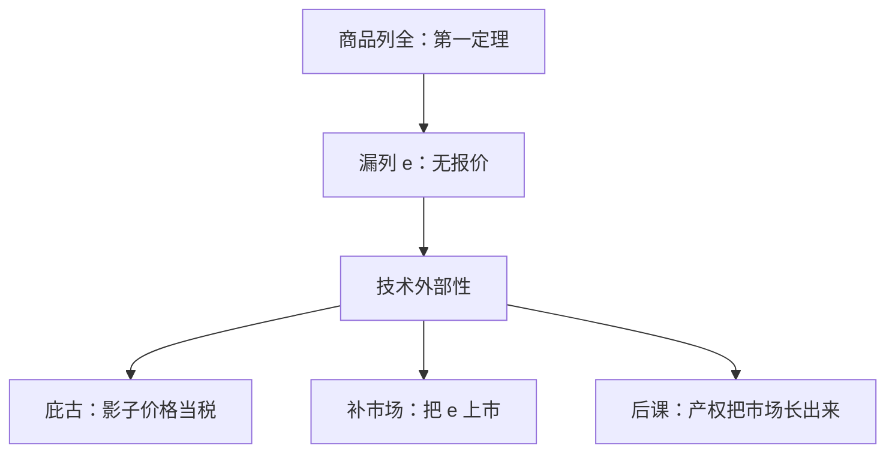

# 缺失市场

外部性之所以使竞争失灵，是因为影响别人的那一维商品根本没有被拿到市场上定价。

<footer>—— 据 Arrow, The Organization of Economic Activity, 1969；Mas-Colell, Whinston and Green, Microeconomic Theory, 第 11 章 整理</footer>

[上一课](/econ/externality-pigou)把外部性写成私人边际与社会边际分叉，并用庇古税把 $\mathrm{MD}(q^*)$ 塞回一阶条件。缺口是商品空间语言：为什么会有这项看不见的边际？Arrow 的诊断是缺了一列市场。本课把「市场失灵」收成「列表不全」，不重写 $\mathrm{MD}$ 曲线，也不预支科斯谈判。

## 问题

[第一福利定理](/econ/welfare-theorems)的会计用到：凡进入别人效用或生产的东西，都进了某个人的预算。若排放 $e$ 被写成带价格 $p_e$ 的商品，竞争均衡再次有效——问题退回完整市场。缺这个市场，不是 $p_e=0$ 的均衡，而是根本没有报价：$e$ 不在可行交易集里。私人决策的一阶条件少一项，正是上一课的分叉。

金钱外部性只改价格，已经在瓦尔拉斯会计里，第一定理仍成立。技术外部性才是漏列：别人的行动作为自变量出现，却不作为商品出现。Meade 的养蜂与果园，是同一句话的教具：蜜与花粉若能按单位交易，就不是外部性。

### 缺市场不是「市场太少」的口号

完整与否相对于事先写好的商品空间。或有商品按状态列全，是[状态依存](/econ/state-contingent)的完全；排放按地点、时间列全，是另一份清单。清单漏了，核同样说不清「联盟走开时污染跟不跟」。庇古税、可交易许可、产权，都是事后给漏列的那一维指定影子价格或可转让禀赋。

MWG 把技术外部性定义为：某个决策者的选择直接进入另一人的目标或约束，且没有对应的价格。诊断在商品空间，治疗可以是税、配额或把该维补进市场。三者在完全信息、凸性下对准同一影子价格。

## 方法

对象：把上一课的 $e$ 明确写成未上市商品。对照三种补法——扩维开市场、从量税、数量配额——完全信息下对准同一 $q^*$。本课钉诊断：失灵写在「哪一列不存在」，不钉税率公式。

缺失市场也覆盖公共品的极限：非竞争使「每人买自己的那一份」没有定义，市场不是漏一列，是漏了一种加总方式。那一课再写；这里只要记住：私人品漏列与公共品漏列，都是商品空间的病，不是偏好的病。

## 机制

为什么漏列会拆有效性：帕累托改进可以只改那一维未定价的行动，加总财富不必上升，第一定理的「更好则更贵」戳不破。竞争均衡仍可以存在，只是有效性掉了。存在性与有效性本来就不是同一句话：[存在](/econ/ge-existence)不保证清单齐全。

与[不完全市场 GEI](/econ/incomplete-markets-gei)的差别：GEI 是或有证券张成不足，商品名字还在，只是不能自由组合；本课是名字根本没列。太阳黑子是外在信念钻进未保险的方向；外部性是别人的烟钻进效用。不要并成一句「市场不完全」。

配额与税在完全信息下对准同一影子价格，并不取消「列缺了」这一诊断：工具改变的是私人一阶条件，不是把 $e$ 写进商品空间。科斯谈判若成功，才真的把那一列补进可转让禀赋。

### 补列与征税在信息上同构

计划者要知道有效点上的 $\mathrm{MD}$，开市场的人要知道需求，都是同一信息。缺市场理论不自动给出可观察的税基。后课科斯把信息问题换成谈判成本：若权利清晰、人少，市场可以「长出来」，不必先算出 $t$。人多、非排他，市场长不出来，公共品接手。

金钱外部性（某商品涨价伤害买方）已经通过预算进入每人的问题，再征一笔「涨价税」是叠扭曲。漏列诊断只针对技术外部性。股价、工资变动默认走价格，不走本课。

## 边界

非凸、不可分、不完全信息，都可以在市场列全时仍失灵；缺市场不是失灵的全集。公共品、逆向选择是后课的另一些缺口。也不要把缺市场写成限价簿「某合约未挂牌」——本栏是商品空间，不是订单队列。科斯将问：权利清晰时，漏列的那一维能不能由私人谈判补上。

Arrow–Debreu 把商品写成（物理、时间、地点、事件）。漏列可以发生在任何一维：没有「明天下雨的伞」是或缺有状态，没有「邻居的安静」是或缺有事件上的权利。清单写全，第一定理的假设才齐；写不全，税与产权都是补清单的办法。

后课默认：技术外部性 = 漏列的或有（或实物）商品；一阶纠正是给那一列一个影子价格。产权能否把该列变成可交易禀赋，是下一课。

## 小结

- 第一定理要求影响别人的那一维进入预算；漏列即技术外部性。
- 缺市场是诊断；税、配额、开盘是对准同一影子价格的补法。
- 金钱外部性已在价格里，不是漏列。
- GEI 是张成不足；本课是名字未列。
- 出处：Arrow, 1969；Meade, 1952；Mas-Colell, Whinston and Green, 第 11 章。
