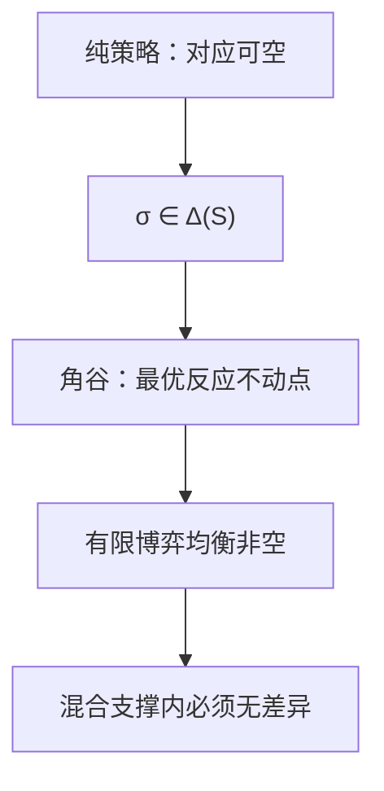

# 混合策略与存在性

每个有限策略式博弈至少有一个混合策略均衡点。

<footer>—— Nash, Equilibrium Points in n-Person Games, PNAS, 1950</footer>

[上一课](/econ/nash-equilibrium)把解写成相互最优反应，并指出纯策略可以空。猜硬币、点球左右、监察与偷税，最优反应是「别让对方猜中」，任何纯招都被针对。缺口是存在性：给有限博弈一个一定非空的均衡集，并把混合解释成对手必须无差异。本课钉这一点，不进入扩展式。

## 问题

有限集 $S_i$ 上的纯策略，最优反应对应在边界上跳动，乘积对应可以没有不动点。混合策略 $\sigma_i\in\Delta(S_i)$ 把行动空间做成单纯形，期望效用

$$
u_i(\sigma)=\sum_{s\in S}\Bigl(\prod_j\sigma_j(s_j)\Bigr)u_i(s)
$$

对 $\sigma_i$ 线性。最优反应变成「把概率只放在纯策略最佳应答上」，对应凸值、上半连续。角谷给出不动点：这就是纳什存在定理。

混合不是「喜欢随机」。均衡里，被混合的那些纯策略必须给出相同的期望支付，否则应把概率全部挪到更好的那一个。随机化的功能是让对手无差异，从而对手也愿意随机。

### 存在不是唯一，混合不是可观测的行动

存在定理不挑哪一个均衡，也不说局中人真的掷骰子。等价解释：群体里不同人抽到不同纯策略，宏观频率等于 $\sigma$。实验里能否把混合读成频率，是后话；定义仍是 $\Delta(S_i)$ 上的纳什。

两人零和有限博弈，von Neumann 的极小极大值等于混合纳什支付。Nash 把存在性从零和推广到一般 $n$ 人。证明骨架与[竞争均衡存在性](/econ/ge-existence)同属角谷，定义域是策略单纯形的乘积。

## 方法

有限博弈：每个 $S_i$ 有限。混合策略空间 $\Sigma=\prod_i\Delta(S_i)$ 是紧凸集。最优反应对应 $r:\Sigma\rightrightarrows\Sigma$ 非空、凸值、上半连续，故存在 $\sigma^*\in r(\sigma^*)$。

检查混合纳什的操作：对每一 $i$，支撑集 $\mathrm{supp}(\sigma_i^*)$ 里每个纯策略都是对 $\sigma_{-i}^*$ 的最佳应答，支撑外的纯策略不更好。这比「对所有混合偏离都不亏」更便于手算。

连续行动（古诺产量）可以在纯策略上存在，靠的是拟凹与紧凸，不必混合。本课的存在性针对有限行动；两种技术不要混成一句「博弈都有均衡」。

## 机制

为什么无差异是关键：若对手的混合还让某一纯策略严格更好，自己应退回纯策略，均衡瓦解。故巡逻必须以使小偷在偷与不偷之间无差异的概率进行——不是因为警察喜欢掷硬币，而是因为只有无差异才能让小偷也停在混合里。支付差决定混合概率，概率本身往往不是目标。

这与[期望效用](/econ/expected-utility)课序衔接：策略式里的 $u_i$ 已经是 vNM 效用，混合上的线性来自独立性。若放弃独立性，混合均衡的含义要重写，主干不走。存在性本身也不挑均衡：猜硬币的两个纯策略各 1/2 是唯一混合纳什，但协调博弈可以有两个纯和一个混合，混合往往风险更差，本课不把它当选择规则。

## 边界

无限（可数）纯策略集，均衡可以空。不连续支付（伯川德加整数定价的某些写法）也会空。存在性不给选择：多个混合均衡时，哪一个被玩，要靠精炼或制度。扩展式里，混合可以在信息集上，也可以在行为策略上，Kuhn 定理在完美回忆下把两者接通——下一课要用到树，不在本课展开。

后课默认：有限策略式均衡集非空；谈到随机化，先检查无差异条件。

## 小结

- 纯策略纳什可空；混合把行动做成单纯形，角谷给出存在。
- 均衡混合要求支撑内纯策略无差异。
- 随机化是为了让对手无差异，不是偏好随机。
- 连续行动另靠拟凹，不自动等于混合。
- 出处：Nash, *PNAS* 1950；von Neumann, 1928 极小极大。
