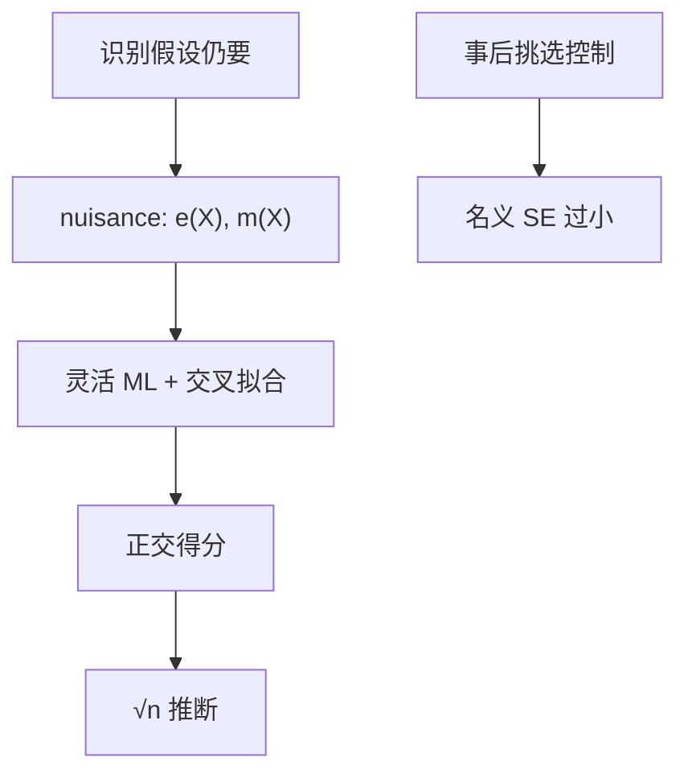

# 机器学习与因果

预测好不等于处理效应对；用交叉拟合把 nuisance 估准，正交化之后，ATE 的推断才能回到 $\sqrt{n}$，而不被随机森林的正则偏误拖死。

<footer>—— Chernozhukov et al., Double/Debiased Machine Learning, Econometrics Journal 2018；Athey and Imbens 机器学习与因果综述；Belloni, Chernozhukov and Hansen 高维选择</footer>

[上一课](/econ/inference-robust-cluster)把三明治与聚类钉在低维回归上。本课缺口是高维 $X$、灵活 nuisance：机器学习进因果。计量课程到此结束；下一课程宏观核算从 [GDP](/econ/gdp-accounts) 起。不把本课写成大模型栏的 Transformer，也不写限价簿预测竞赛。

## 问题

条件平均 $\mathbb{E}[Y\mid D,X]$ 与倾向 $e(X)$ 可以很弯曲，$X$ 可以几百个。逐步回归、事后挑选显著控制，会把选择噪声喂进 $\hat\beta$，标准误太小（Leeb–Pötscher）。Belloni–Chernozhukov–Hansen：对结果方程与处理方程分别做惩罚选择，再把并集放进回归（post-double-selection），在稀疏下恢复 $\sqrt{n}$。Chernozhukov 等的 DML：交叉拟合估 $\hat m(X)$、$\hat e(X)$，用 Neyman 正交得分估 ATE / LATE，使 nuisance 的一阶误差消掉。缺口是：CIA 或 IV 排除**仍然要**，ML 只处理 nuisance 的函数形式，不创造外生。

Athey–Wager 因果森林：估 $\mathbb{E}[\tau\mid X=x]$ 的异质。诚实分割（样本切成切树与估叶）避免用同一数据既找分割又报效应。这是条件效应，不是新的 ATE 定义。

## 方法

DML 步骤：样本切 $K$ 折；在补集上训 $\hat e,\hat m$；在折内算正交化残差 $\hat u=Y-\hat m(X)$、$\hat v=D-\hat e(X)$，回归 $\hat u$ 对 $\hat v$（或部分线性、IV 版本）。报告对折数、算法（lasso、随机森林、boosting）的敏感。高维 IV：对第一阶段与结果的控制同样正交化，弱工具诊断还在。

预测竞赛（哪只股票下周涨）优化的是 $\mathbb{E}[Y\mid X]$，可以把 $D$ 当普通特征；因果禁止把中介、碰撞当 $X$，也禁止用处理后再测变量。目标函数不同。

## 机制

机制是正交：ATE 的得分对 nuisance 的一阶扰动导数为零，于是 $\hat e$ 收敛得比 $n^{-1/4}$ 快就够，不必 $n^{-1/2}$。交叉拟合切断「用同一观测既拟合 nuisance 又估目标」的过拟合。没有正交，lasso 的正则偏误会污染 $\hat\tau$ 的中心极限。

与[异质处理效应](/econ/heterogeneous-effects)：因果森林给出 $\hat\tau(x)$，加总方式仍要声明（对处理分布还是对目标政策分布）。与[卢卡斯批判](/econ/lucas-critique)：更好的预测方程在规则改变时同样可以垮；DML 不是结构。

本栏不写注意力头、不写 token。机器学习在这里是 nuisance 估计器的统称。大模型栏的训练目标是下一个 token，与 ATE 正交得分不是同一对象。

## 边界

本课不保证随机森林在你的 $N=300$ 州面板上优于线性。重叠仍要：$\hat e$ 贴 0 或 1 时 IPW 爆炸，ML 可以把预测做得更贴，从而更危险。下一单元结构模型问的是均衡与反事实政策，不是更灵活的 CIA。拍卖、离散选择有自己的似然，不要默认 DML 替代。

后课默认：高维控制用双选择或 DML，不要逐步回归；识别假设单独写。预测优不等于因果对。下一课结构对约化：Lucas 的句子在灵活 nuisance 之后仍然成立。

## 小结

- ML 估 nuisance，不创造外生；CIA / IV 仍要。
- 正交 + 交叉拟合让 ATE 回到 $\sqrt{n}$。
- 事后挑选控制会低估标准误。
- 因果森林给 $\tau(x)$，加总规则仍要声明。
- 出处：Belloni, Chernozhukov and Hansen；Chernozhukov et al., *Econometrics Journal* 2018；Athey and Imbens；Wager and Athey。
