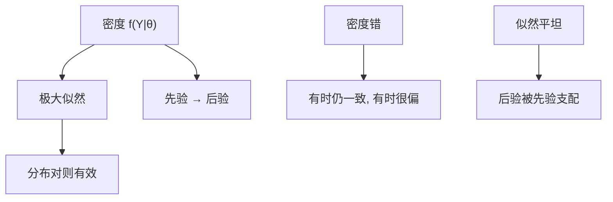

# 极大似然与贝叶斯

似然把模型写成观测的密度；极大似然找使密度最大的参数，贝叶斯把参数当随机、用先验更新。两者都比 GMM 更吃分布假设，也都能把上一课的预报密度变成决策。

<footer>—— Fisher 似然传统；Wald 与 Cramér–Rao；Sims 宏观贝叶斯；Geweke 后验模拟</footer>

[上一课](/econ/forecast-evaluation-dm)用损失比较预报。本课收束「结构与预测」：极大似然（MLE）与贝叶斯作为估计原则，而不是又一种识别设计。下一课[固定效应](/econ/fe-re)才把时不变异质吸进组内；计量课程尚未结束。后课默认已经读完：设计给支撑内因果，结构给反事实，似然 / 贝叶斯给在模型内的估计与密度预报。

## 问题

GMM 用有限矩，分布可以错很多仍一致（矩对的话）。MLE 要整条密度 $f(Y\mid\theta)$。对了：有效（达到信息界）、不变性、嵌套检验（LR / Wald / LM 三位一体）。错了：准极大似然在某些族（正态、泊松）对均值参数仍一致，否则可以既偏且「很显著」。缺口是：离散选择、DSGE、状态空间，似然自然；因果设计课的 LATE 不必有密度。贝叶斯：先验 $\pi(\theta)$，后验 $\propto L(\theta)\pi(\theta)$。有限样本陈述是概率的，不是「$N\to\infty$ 覆盖」。先验在宏观小样本里不是装饰——Sims 强调这一点。

识别：似然平坦则 MLE 乱跳、后验跟着先验走。上一单元 BLP、拍卖的识别问题不会因为改用 MCMC 消失。贝叶斯把识别弱写成先验敏感，这是优点若你报告，是缺点若你藏。

## 方法

MLE：写出 $L$，数值最大化，信息矩阵给标准误；QMLE 用三明治（又接到[稳健推断](/econ/inference-robust-cluster)）。LR 检验嵌套约束。贝叶斯：共轭时手算；否则 MCMC（Metropolis–Hastings、Gibbs）、SMC。报告先验、后验区间、边际似然（模型比较）。预报：后验预测分布直接给密度预报，log score 与上一课衔接。

与 GMM：矩是似然得分的子集。过度识别 $J$ 对应先验之外的检验。宏观 DSGE 常用贝叶斯，因为似然难、先验把弱识别按住——必须把先验当研究设计的一部分公开。

## 机制

机制是概率模型。MLE 把样本当成密度的重复；依赖（时间序列）要写成条件似然，不能假装 i.i.d.。贝叶斯把未知 $\theta$ 送进联合分布，学习规则是 Bayes 定理。渐近上，正则情况下后验收缩到 MLE 附近（Bernstein–von Mises），于是大样本两者说话接近；识别弱或先验强时不接近。

与卢卡斯：似然若是简化式 VAR，政策分析仍犯批判。结构似然（均衡已经解过）才把规则放进 $f$。贝叶斯 DSGE 不是自动结构正确，只是结构加上先验。

Lancaster、Rossi 的微观贝叶斯：分层模型把异质 $\beta_i$ 写成分布，这是随机系数，与因果森林的 $\tau(x)$ 目标不同，但都承认异质。声明目标。

## 边界

本课不教软件平台。不把 MCMC 诊断写成课的主体。计量课程到此结束：下一课李嘉图比较优势换对象——交换为何发生，不是 $\theta$ 如何估。不要用本课去重写大模型的训练损失，那是另一栏的下一 token。

后课默认：写出密度就要接受错分布的代价；贝叶斯必须报告先验敏感。识别不来自计算。预报密度用后验预测 + 上一课的 log score。因果 LATE 仍用设计，不必强迫似然。

## 小结

- MLE：密度对则有效；错则可能偏。QMLE 三明治管部分错误。
- 贝叶斯：后验 = 似然 × 先验；弱识别时先验支配。
- 大样本正则时两者靠近；小样本与平坦似然时分道。
- 结构似然才服务政策；VAR 似然仍是约化形式。
- 出处：Fisher；Wald；Sims 贝叶斯宏观；Geweke；Bernstein–von Mises 传统。
