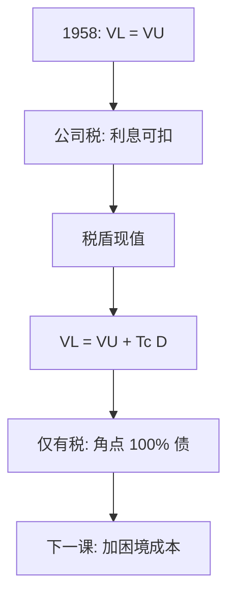

# MM 与公司税盾

利息在公司税前扣除，股利不；家庭不能自制这一不对称，切片开始改变饼的大小。

<footer>—— Modigliani and Miller, Corporate Income Taxes and the Cost of Capital: A Correction, American Economic Review 1963</footer>

定位：[上一课](/econ/modigliani-miller)。1958 年的套利已经证明：无税、无破产成本时，总价值与债股切片无关，$r_A$ 才是资金成本。本课缺口是把公司所得税放回去——1963 年更正的那一块。不重做家庭自制杠杆，不把破产成本提前写成内部最优。

## 问题

1958 年论文把税对债与股当作对称，或干脆抽掉。美国（以及多数）公司税允许利息在应税所得里扣除，股利在公司层面不扣。多一单位永久债务，每期少交 $\tau_c r_D$，若折现率就是 $r_D$，税盾现值是 $\tau_c D$。杠杆企业价值变成

$$
V_L = V_U + \tau_c D.
$$

若只有这一块摩擦，最优是角点：百分之百债务。这与观察到的内部股权冲突，也与银行资本监管冲突。缺口是先把税盾的会计写对，并标明角点；抵消项是下一课[权衡](/econ/tradeoff-capital)的工作。

家庭自制杠杆复制的是资产收益流，复制不了「企业少交的那笔税」。税盾是付给企业的转移，不是付给自制杠杆的家庭。

## 方法

1963 年的论证仍是套利加税法，不是问卷调查。无杠杆企业的现金流在税后是 $(1-\tau_c)X$；杠杆企业是 $(1-\tau_c)(X-r_D D)+r_D D = (1-\tau_c)X + \tau_c r_D D$。多出来的 $\tau_c r_D D$ 是政府少收的。若债务无风险且永久滚动、税率不变，其现值即 $\tau_c D$，加在 $V_U$ 上。

命题 II 随之改写：股权成本仍随杠杆上升，但加权平均资本成本随债务下降，因为权重里有一块税后债务成本 $r_D(1-\tau_c)$。1958 年「不要用 $r_E>r_D$ 去论证应当借债」仍然成立；1963 年允许的是另一句：**税后** WACC 可以随 $D$ 下降。下降来自税，不是来自「债务便宜」。

个人所得税若对利息课得比对股权收益更重，会吃掉公司税盾。Miller（1977）后来把这写成客户与加总税率。本课停在公司税这一层，以免把更正写成完整的税制史。

## 机制

机制是复制失败的第一块。完全市场上投资者能自制杠杆，不能自制法人所得税的扣除项。企业多发行债务，等于把政府对利息的补贴写进证券；这块补贴随切片变，所以 $V$ 随切片变。Arrow–Debreu 价格仍给状态定价，但可交易的支付已经包含税后转移，税后支付的集合随资本结构变。

银行版本刺耳之处依旧：存款利息也可扣，税盾偏向杠杆；[存款保险](/econ/deposit-insurance)再降低私人看到的下行。税盾不是监管资本的反对理由，它只说明：无摩擦基准一旦加入税法，私人最优就会往债的方向走。监管切一刀是因为外部性，不是因为税务局算错了。

### $\tau_c D$ 不是不可错的公式

亏损无法立即抵扣、利息抵扣上限、债务并非无风险永久，都会使税盾现值小于 $\tau_c D$。1963 年更正给的是基准会计，不是估税软件。把某家企业的法定税率乘上账面债务，当成已经实现的 $V$ 增量，会把后课权衡的左边估大。

股利税与资本利得税在股东层面还会再切一刀。本课对象是公司税不对称。Miller–Modigliani 1961 的股利无关性是另一篇，不要在这里重开派息。

## 边界

不要把 1963 年读成「应当尽量借债」的政策结论：缺了破产与代理，角点只是逻辑提示——还必须有抵消项。也不要把 1958 年命题 I 说成已被更正推翻：无税世界的无关性仍在；有税世界换了一条加法。

本课不估计破产成本，不写 Kraus–Litzenberger 的状态偏好权衡。下一课才把税盾对困境成本收成内部 $D^\ast$。也不要把 $\tau_c D$ 当成银行资本「昂贵」的完整解释：保险、流动性服务同样破坏复制。

后课默认：公司税使 $V_L=V_U+\mathrm{PV}(\text{税盾})$，仅有税则角点在全债。权衡从这里起步。不要在权衡课里再推一遍 1963 年的税后现金流分解。

WACC 随杠杆下降，下降来自 $\tau_c$，不是来自「债务要求回报低」。命题 II 的斜率仍在。

家庭不能自制税盾。这是 1958 年复制条件里最先被拿掉的一块。

## 小结

- 1963 年更正：利息可扣，税盾进入 $V$；仅有税则全债最优。
- 税后 WACC 可随 $D$ 下降；「债务便宜所以加杠杆」仍不是 1958 年的逻辑。
- 复制失败因为家庭造不出公司税。
- 出处：Modigliani and Miller, *AER* 1963。
