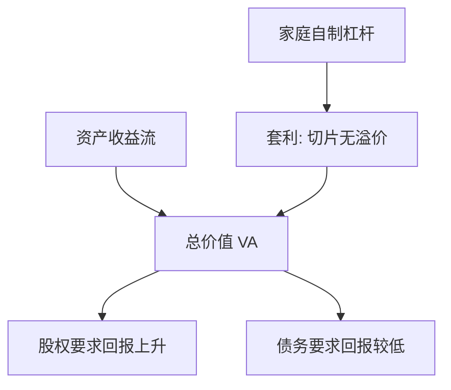

# 莫迪利亚尼–米勒

在无摩擦市场上，企业的总价值由资产的收益流决定，与把该收益流切成债还是股无关。

<footer>—— Modigliani and Miller, The Cost of Capital, Corporation Finance and the Theory of Investment, American Economic Review 1958</footer>

定位：[资本监管与巴塞尔](/econ/basel-capital)。监管把银行股本写成稀缺约束，好像股权「贵」、存款「便宜」。本课缺口是先给出无摩擦基准：若市场完全，资本结构不改变总价值，贵的不是股，是资产风险。后课的税、破产、信息不对称都是对这一基准的偏离。公司金融从这里开始，不再写准备金。

## 问题

上一课把资本比率当成硬约束，容易滑向「股本成本高于债务成本，所以银行应当尽量少持有股本」。若这句话成立，任意企业都应当把杠杆加到极限。Modigliani 与 Miller（1958）指出：这句话把**负债的要求回报**和**加权平均资本成本**搅在一起。债务要求回报低，是因为它先于股权受偿、风险更小；多借债会把剩余股权变得更险，股权要求回报上升。两边加总，对企业资产的要求回报可以不变。

缺口因此不是估计某个行业的「最优负债率」，而是：在哪一组假设下，切片方式不改变饼的大小。没有这组假设，后课的权衡与优序没有对照系。

命题 I：杠杆企业与无杠杆企业总价值相等。命题 II：股权成本随杠杆线性上升，正好抵消便宜债务的权重。两者是同一套利的两种写法。

## 方法

1958 年的论证是套利，不是问卷调查。考虑两家企业，资产收益流相同，一家全股权，一家有债。若杠杆企业总价值更高，投资者可以卖掉杠杆企业的股票、按同一比例自行借贷去买无杠杆企业，复制收益并套出差额；反向亦可。家庭能自制杠杆，企业杠杆就没有溢价。这要求：无交易成本、无税收（或税对债与股对称）、无破产成本、信息对称、个人与企业借贷利率相同。

用符号：资产要求回报 $r_A$ 由资产风险决定；债务 $r_D$、股权 $r_E$，杠杆 $D/E$。命题 II 是

$$
r_E = r_A + \frac{D}{E}(r_A - r_D).
$$

加权平均 $r_A = \frac{E}{E+D}r_E + \frac{D}{E+D}r_D$ 不随 $D/E$ 变。巴塞尔若只是把 $D$ 换成存款、$E$ 换成普通股，无摩擦时提高 $E$ 并不提高 $r_A$——提高的是更安全的股权、更少的存款风险。

MM 不否认 $r_E > r_D$。它否认的是「因此应当用债务替换股权来降低资金成本」。资金成本是 $r_A$，不是 $r_E$ 或 $r_D$ 单独。

## 机制

机制是市场替代企业的资产负债表。完全市场上，投资者能复制任何切片；企业多发行一单位债、少发行一单位股，只是把同一状态依存现金流在投资者之间重切。[或有要求权](/econ/state-contingent)语言下，这是 Modigliani–Miller 与 Arrow–Debreu 的交汇：证券结构不扩张可行集时，价格只取决于状态的影子价格，不取决于哪家企业发行哪种券。

银行应用的刺耳之处在此。若存款因为保险和支付服务而**不是**普通债务——它带流动性服务、受担保——则家庭不能无成本地自制「银行存款」，MM 的复制破了。本课先把破口标出来，不在这里写存款保险溢价；权衡课写税收与破产，优序课写信息。监管把股权当成贵的，等于已经站在摩擦世界；先要承认基准。

### 命题 II 不是「股权更贵所以少发股」

实务语言常说股权成本 12%、债务成本 4%，因此应当借债。命题 II 说：12% 已经包含杠杆；再借债，12% 会变成更高的数，加权仍是 $r_A$。正确的比较是项目的 $r_A$ 对资产风险，不是拿 $r_E$ 与 $r_D$ 比大小。加权平均资本成本（WACC）在无摩擦时不随 $D/E$ 变，正是命题 I 的对偶。后课一旦引入税盾，WACC 会随杠杆下降——那是摩擦，必须单独声明。

套利要求个人能按与企业相同的利率借贷。若家庭借贷更贵，企业代为加杠杆可以有溢价，无关性失败。这是另一种摩擦，本课不展开。

## 边界

1958 年论文没有公司所得税；1963 年的更正引入税盾，那是下一课的第一块摩擦，不是本课的结论。也不要把 MM 读成「资本结构在现实中无关」：它是无关性定理，用来定位有关性从哪来。实证里的负债率分布、评级门槛，全部是对假设的违反，不是对套利逻辑的否证。

本课不估计 beta，不写 CAPM 的均衡溢价——那是[作为均衡的 CAPM](/econ/capm-theory)。$r_A$ 在这里只是资产风险的占位符。股利政策的无关性是 1961 年另一篇，放到[股利](/econ/dividend-fcf)。

也不要把 1958 年论文读成「债务无风险」。命题允许 $r_D$ 随杠杆上升，只要上升被 $r_E$ 的进一步上升所匹配、且没有破产的资源损耗。破产一旦消耗真资源，就离开本课，进入权衡。

## 小结

- 无摩擦时总价值由资产决定，与债股切片无关。
- 股权成本随杠杆上升，抵消「便宜」债务；加权成本是资产成本。
- 银行股本显得贵，说明保险、税或信息已破坏复制。
- 出处：Modigliani and Miller, *AER* 1958。
